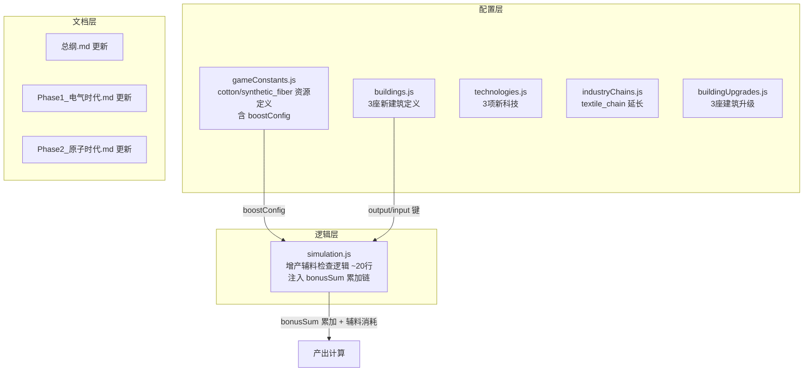

## 用户需求

将棉花(cotton)和化纤(synthetic_fiber)加入游戏的时代扩展V2方案中，作为人类历史上重要的里程碑性产物。

## 产品概述

在现有纺织产业链（cloth/fine_clothes）的基础上，新增棉花和化纤两种资源、3座新建筑，并引入通用的**"增产辅料（boostInput）"**机制。棉花作为大航海时代的种植园经济产物，投入后被消耗以增产布料；化纤作为石油化工时代的标志产品，投入后被消耗以增产华服。该机制可推广到任何"辅料→增产"场景（如工具加速采矿、钢铁加速建材等）。同时更新时代扩展V2策划文档。

## 核心功能

1. **新增2种资源**：cotton（棉花，epoch 4）和 synthetic_fiber（化纤，epoch 7）
2. **新增3座建筑**：棉花种植园（epoch 4）、化纤厂（epoch 7）、电气纺织厂（epoch 7）
3. **新增"增产辅料（boostInput）"机制**：cotton 作为增产辅料投入到所有产出 cloth 的建筑中，每tick被明确消耗，换取产出增加（+最高50%）；synthetic_fiber 同理增产 fine_clothes（+最高60%）。辅料被消耗而非保留——与化学催化剂不同，这是真正的"投入原料换取更多产出"。
4. **纺织链延长**：从 epoch 6 断链延伸到 epoch 7+，cotton 同时作为电气纺织厂的直接原料
5. **策划文档更新**：同步更新总纲、Phase1、Phase2文档中的资源体系、产业链和建筑配置
6. **通用可扩展**：该机制设计为通用系统，未来可轻松为其他资源添加 boostInput 配置（如 tools 增产采矿建筑、steel 增产建材建筑等）

## 技术栈

- 前端框架：React 19 + Vite + Tailwind CSS（现有）
- 核心逻辑：纯JavaScript，配置驱动的游戏模拟引擎
- 本次改动：99%配置数据 + 约20行核心逻辑

## 实现方案

### 核心策略：数据驱动的增产辅料系统（boostInput）

在现有 `simulation.js` 的 `bonusSum` 累加链中，注入一个通用的"增产辅料"检查逻辑。增产关系完全在 `gameConstants.js` 的资源配置中声明（`boostConfig` 字段），逻辑层只需约20行通用代码，不硬编码任何资源ID。

**工作原理**：

1. 资源定义中新增 `boostConfig` 字段，声明该资源可以增产哪种产出
2. simulation.js 的每建筑产出计算阶段，遍历所有带 `boostConfig` 的资源
3. 如果增产目标匹配当前建筑的 output，且该建筑的 input 中没有该资源（避免和直接原料重复），则：

- 计算本建筑可消耗的辅料量：`consumed = min(库存, consumePerBuilding * 建筑数量)`
- 根据实际消耗量计算加成：`boost = min(consumed * boostPerUnit, maxBoost)`
- `bonusSum += boost`

4. 辅料被**明确消耗**（每tick从库存中扣除），而非自然衰减——投入多少棉花，就消耗多少棉花

**核心语义：这不是化学催化剂（不消耗），而是增产原料（被消耗换取更多产出）**

**选择此方案的原因**：

- 避免修改旧建筑的 input/output 定义（增产辅料是独立系统，不干扰旧数据）
- 配置驱动，未来任何资源都可通过添加 `boostConfig` 成为增产辅料（如 tools→采矿、steel→建材）
- 辅料被明确消耗，创造真正的供需循环，不是"白嫖加成"
- 有上限(maxBoost)和单建筑消耗量(consumePerBuilding)，防止经济失衡
- 与现有 bonusSum 累加逻辑完美兼容，不破坏任何现有加成计算

### 关键技术决策

1. **注入点**：在 `simulation.js` 第2197行（建筑特定科技加成之后）和第2201行（应用加成之前）之间新增。这是所有 bonusSum 累加完成后、最终乘数计算前的最佳位置。

2. **辅料消耗方式**：每座匹配建筑每tick消耗固定量辅料（`consumePerBuilding`，如每座 textile_mill 每tick消耗 0.5 单位 cotton）。总消耗量 = consumePerBuilding × 建筑数量。如果库存不足，按比例减少加成（不是全有或全无）。这意味着玩家需要持续生产棉花来维持增产效果。

3. **棉花的双重角色**：cotton 同时作为增产辅料（加速旧纺织建筑的 cloth 产出）和电气纺织厂的直接 input。系统自动排除已将该资源作为 input 的建筑（电气纺织厂已经在 input 中消耗 cotton，不会再被增产系统重复消耗）。

4. **电气纺织厂定位**：作为 textile_mill 的升级替代（epoch 7），直接消耗 cotton + electricity + dye，产出 cloth + fine_clothes。因为它的 input 中已包含 cotton，所以不会被 cotton 的增产系统重复加成。

## 实现要点

### 性能

- 增产辅料检查每tick每建筑类型只执行一次，遍历增产资源列表（目前仅2种），O(n*m)其中n=建筑类型数、m=增产资源数，性能影响可忽略
- 增产资源列表在 tick 开始时预计算并缓存，避免每建筑重复查找

### 兼容性

- 旧存档兼容：新资源默认库存为0，增产加成自然为0，不影响已有经济
- 不修改任何旧建筑的 input/output/baseCost
- 增产机制通过 `boostConfig` 字段是否存在来判断，旧资源无此字段不受影响

### 数值平衡

- cotton 增产 cloth：consumePerBuilding=0.5/tick，boostPerUnit=0.06，maxBoost=0.50（需消耗约8.3单位/tick达上限，即3-4座种植园持续供给）
- synthetic_fiber 增产 fine_clothes：consumePerBuilding=0.3/tick，boostPerUnit=0.08，maxBoost=0.60（需消耗约7.5单位/tick达上限）
- 辅料不足时按比例减少加成（如只能供给50%辅料需求，则只获得50%的增产效果），不是全有或全无

## 架构设计



## 目录结构

```
src/config/
├── gameConstants.js     # [MODIFY] RESOURCES 新增 cotton、synthetic_fiber（含 boostConfig 字段）
├── buildings.js         # [MODIFY] 新增 cotton_plantation、synthetic_fiber_plant、electric_textile_mill
├── technologies.js      # [MODIFY] 新增 cotton_cultivation(ep4)、synthetic_fibers(ep7)、electric_weaving(ep7)
├── industryChains.js    # [MODIFY] textile_chain 新增 cotton_farming、synthetic_fiber、electric_textile 三个 stage
├── buildingUpgrades.js  # [MODIFY] 新增 3 座建筑的升级配置（各2级）

src/logic/
├── simulation.js        # [MODIFY] 在 bonusSum 累加链（~第2197行后）新增约20行增产辅料检查与消耗逻辑

ai_reports/
├── 时代扩展V2_总纲.md          # [MODIFY] 更新资源体系（14→16种）、纺织链延长、增产辅料机制说明
├── 时代扩展V2_Phase1_电气时代.md  # [MODIFY] 新增 synthetic_fiber_plant + electric_textile_mill 的完整配置
├── 时代扩展V2_Phase2_原子时代.md  # [MODIFY] 新增高级化纤工厂（advanced_synthetic_fiber_plant）配置
```

## 关键代码结构

### boostConfig 接口定义（在 gameConstants.js RESOURCES 中）

```javascript
// 增产辅料配置接口
// boostConfig: {
//     targetOutput: string,       // 增产目标：匹配建筑 output 键名（如 'cloth'）
//     boostPerUnit: number,       // 每单位消耗提供的加成（如 0.06 = 6%/单位）
//     maxBoost: number,           // 加成上限（如 0.50 = 最高+50%）
//     consumePerBuilding: number, // 每座匹配建筑每tick消耗的辅料量（如 0.5）
// }
```

### simulation.js 增产辅料检查伪代码

```javascript
// 在 bonusSum 累加完成后、multiplier 计算前（约第2198行）
// 6. 增产辅料加成（消耗辅料资源换取产出提升）
if (effectiveOps.output) {
    for (const [boostRes, boostDef] of boostInputResources) {
        const config = boostDef.boostConfig;
        // 匹配产出且该资源不是本建筑的直接input（避免双重消耗）
        if (effectiveOps.output[config.targetOutput] && !(effectiveOps.input && effectiveOps.input[boostRes])) {
            const stock = res[boostRes] || 0;
            const wantConsume = config.consumePerBuilding * buildingCount;
            const actualConsume = Math.min(stock, wantConsume);
            if (actualConsume > 0) {
                const ratio = actualConsume / wantConsume; // 供给率
                const boost = Math.min(ratio * config.maxBoost, config.maxBoost);
                bonusSum += boost;
                res[boostRes] -= actualConsume; // 明确消耗辅料
            }
        }
    }
}
```

## Agent Extensions

### SubAgent

- **code-explorer**
- 用途：在实现阶段深入探索 simulation.js 的完整产出计算流程、增产辅料消耗逻辑的最佳注入点、以及 industryChains.js textile_chain 的完整 stages 结构
- 预期结果：精确定位所有代码插入点的行号和上下文

### Skill

- **civ-grounded-development**
- 用途：确保所有配置改动（资源定义、建筑数值、科技前置）与现有项目架构完全一致，遵循"read-first, understand-first"原则
- 预期结果：配置格式与现有资源/建筑/科技定义模式100%一致，数值平衡合理