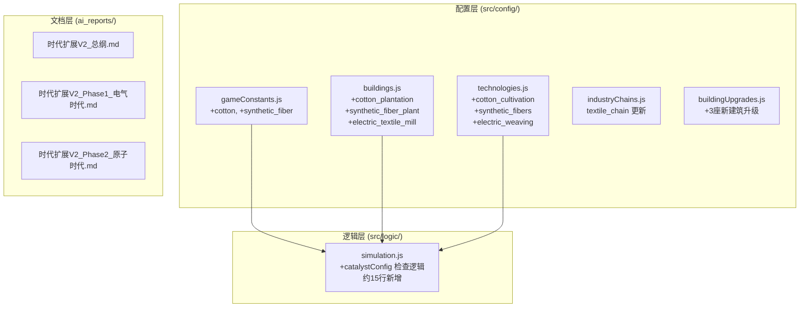

## 用户需求

用户要求在时代扩展V2策划方案的纺织产业链中加入**棉花(cotton)**和**化纤(synthetic_fiber)**两种历史上极为重要的资源。

## 核心特性

1. **棉花(cotton)**：epoch 4（探索时代）解锁，由棉花种植园产出。作为 cloth（布料）的增产加速器 -- 拥有棉花库存时，所有产出 cloth 的建筑获得产出加成
2. **化纤(synthetic_fiber)**：跨 epoch 7（电气时代）和 epoch 8（原子时代），由化纤厂产出。作为 fine_clothes（华服）的增产加速器 -- 拥有化纤库存时，所有产出 fine_clothes 的建筑获得产出加成
3. **3座新建筑**：

- 棉花种植园（epoch 4）-- 产出 cotton
- 化纤厂（epoch 7）-- 消耗 chemicals 产出 synthetic_fiber
- 电气纺织厂（epoch 7）-- 消耗 cotton + electricity 产出 cloth + fine_clothes

4. **催化剂机制**：新增"资源催化剂"系统，当库存中拥有催化剂资源时，自动消耗少量并增强目标资源的产出建筑
5. **策划文档同步更新**：总纲、Phase1（电气时代）、Phase2（原子时代）文档需反映棉花和化纤的加入

## 技术栈

- 前端框架：React 19 + Vite + Tailwind CSS（现有项目）
- 核心逻辑：纯 JavaScript 模拟引擎（simulation.js）
- 配置驱动：所有资源/建筑/科技定义在 src/config/ 下

## 实现方案

### 核心设计决策：催化剂机制的实现策略

项目中**完全不存在**"某资源增强某建筑产出"的条件性加成机制。现有产出计算（simulation.js 第2126-2201行）全部是无条件百分比叠加。需要新增一套**轻量级的资源催化剂系统**。

**选择方案：建筑定义中声明 `catalystConfig` 字段，simulation.js 产出循环中检查并应用**

理由：

- 与现有的 `buildingBonuses` 加成体系完全兼容（叠加到同一个 bonusSum）
- 配置驱动，无需硬编码资源名称
- 催化剂消耗量可配置，避免经济失衡
- 侵入性最小：只在 simulation.js 的 bonusSum 计算区域（第2126-2201行间）新增约15行代码

**催化剂机制工作流程**：

1. 建筑定义中声明 `catalystConfig: { resource: 'cotton', boostOutputs: ['cloth'], boostPercent: 0.25, consumeRate: 0.1 }`
2. simulation.js 产出计算时：检查建筑是否有 catalystConfig -> 检查库存中是否有足够的催化剂资源 -> 如果有，消耗 consumeRate 数量，并将 boostPercent 叠加到对应产出资源的乘数中
3. 如果库存不足，不消耗也不加成，建筑正常运行（优雅降级）

### 资源价格定位

参考现有资源价格体系：

- cotton: basePrice 3.0（与 stone 同级，原材料层）
- synthetic_fiber: basePrice 20.0（chemicals:18 的下游加工品，中间品层）

### 科技前置设计

- epoch 4 新增科技 `cotton_cultivation`（棉花种植）：解锁棉花种植园
- epoch 7 新增科技 `synthetic_fibers`（合成纤维）：解锁化纤厂
- epoch 7 新增科技 `electric_weaving`（电气纺织）：解锁电气纺织厂

### 不改动旧建筑原则

- loom_house / textile_mill / garment_factory 的 input/output **不修改**
- 通过催化剂机制间接增强，玩家需要主动建造棉花种植园才能获得 cloth 产出加成
- 这保持了"旧建筑零改动"的设计原则

## 实现注意事项

1. **simulation.js 改动最小化**：催化剂检查逻辑插入在 bonusSum 计算区域（第2194-2198行之后，第2201行 `multiplier *= (1 + bonusSum)` 之前），约15行代码
2. **催化剂消耗的经济影响**：consumeRate 设为每tick每建筑消耗 0.05-0.1 单位，不会导致棉花/化纤被瞬间耗尽
3. **催化剂加成上限**：boostPercent 设为 0.20-0.25（+20%~+25%），与现有科技加成（通常 0.10-0.25）保持一致
4. **存档兼容性**：新资源/建筑只是数据新增，不影响旧存档加载
5. **catalystConfig 只对产出中包含目标资源的建筑生效**：例如 cotton 的 boostOutputs: ['cloth'] 只会加成产出中含 cloth 的建筑（loom_house, textile_mill, 电气纺织厂等），不会影响其他建筑

## 架构设计



## 目录结构

```
src/config/
├── gameConstants.js        # [MODIFY] RESOURCES 对象新增 cotton（epoch 4, basePrice 3.0）和 synthetic_fiber（epoch 7, basePrice 20.0）两种资源定义，包含完整的 marketConfig 配置
├── buildings.js            # [MODIFY] 新增3座建筑：cotton_plantation（epoch 4, 采集类, 产出cotton）、synthetic_fiber_plant（epoch 7, 工业类, chemicals→synthetic_fiber）、electric_textile_mill（epoch 7, 工业类, cotton+electricity→cloth+fine_clothes, 含catalystConfig）。同时为 textile_mill 和 garment_factory 添加 catalystConfig 字段声明催化剂关系
├── technologies.js         # [MODIFY] epoch 4 新增 cotton_cultivation 科技，epoch 7 新增 synthetic_fibers 和 electric_weaving 科技，含前置依赖关系和建筑解锁效果
├── industryChains.js       # [MODIFY] textile_chain 新增 cotton_extraction 和 synthetic_processing 两个 stage，并在 upgrades 中新增化纤升级条目
├── buildingUpgrades.js     # [MODIFY] 新增 cotton_plantation、synthetic_fiber_plant、electric_textile_mill 三座建筑各2级升级配置（遵循现有1.3x/2.25x递进模式）
src/logic/
├── simulation.js           # [MODIFY] 在产出计算的 bonusSum 区域（约第2198行后）新增约15行催化剂检查逻辑：遍历建筑的 catalystConfig，检查库存是否充足，消耗催化剂资源并叠加产出加成到 bonusSum。需要处理多催化剂叠加和库存不足时的优雅降级
ai_reports/
├── 时代扩展V2_总纲.md        # [MODIFY] 资源体系章节新增 cotton 和 synthetic_fiber 说明；砍掉的资源表中移除 cotton/synthetic_fiber；纺织链延长说明更新；新增催化剂机制说明段落
├── 时代扩展V2_Phase1_电气时代.md  # [MODIFY] 新增 synthetic_fiber 资源定义、synthetic_fiber_plant 和 electric_textile_mill 建筑定义、synthetic_fibers 和 electric_weaving 科技定义、对应的建筑升级和产业链更新
├── 时代扩展V2_Phase2_原子时代.md  # [MODIFY] 如有化纤高级工厂相关内容则更新（epoch 8 的高级化纤工厂可在现有 plastics_factory 的催化剂配置中体现）
```

## 关键数据结构

```typescript
// 建筑定义中新增的催化剂配置字段
interface CatalystConfig {
    resource: string;        // 催化剂资源ID，如 'cotton'
    boostOutputs: string[];  // 被加成的产出资源列表，如 ['cloth']
    boostPercent: number;    // 加成百分比，如 0.25 表示 +25%
    consumeRate: number;     // 每tick每座建筑消耗的催化剂数量
}

// 在建筑定义中的使用示例（不改旧建筑的 input/output，只加声明）
// textile_mill 新增:
catalystConfig: {
    resource: 'cotton',
    boostOutputs: ['cloth'],
    boostPercent: 0.25,
    consumeRate: 0.08
}

// garment_factory 新增:
catalystConfig: {
    resource: 'synthetic_fiber',
    boostOutputs: ['fine_clothes'],
    boostPercent: 0.20,
    consumeRate: 0.10
}
```

## Agent Extensions

### Skill

- **civ-grounded-development**
- Purpose: 在实施过程中遵循 civ-game 的 grounding 工作流，确保先读后改，复用现有系统，新子系统（催化剂机制）最小化侵入
- Expected outcome: 所有改动精确嵌入现有代码结构，simulation.js 改动控制在15行以内，不引入不必要的架构变更

### SubAgent

- **code-explorer**
- Purpose: 实施前深入验证 simulation.js 产出计算循环的精确插入点、buildingUpgrades.js 的现有模式、technologies.js 的前置依赖写法
- Expected outcome: 确保催化剂逻辑的插入位置正确，升级配置格式与现有84条配置一致，科技定义与现有格式完全匹配