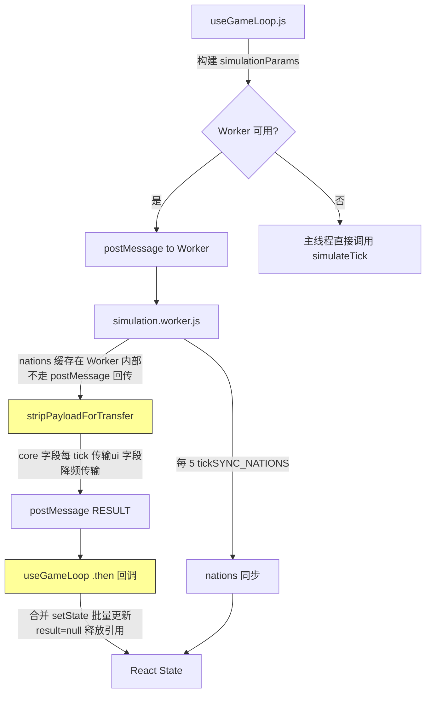

## 产品概述

游戏运行两个游戏年后堆内存从 441MB 增长到 825MB，且持续线性增长。已修复的 PerformanceMeasure/console 泄漏仅占 3%，核心问题是每 tick 产生的数百万 Object/Number/String 对象无法被 GC 回收。需要一个深层的、系统性的内存优化方案。

## 核心特征

- heap number 从 760 万暴增到 2314 万（+204%，265MB），Object 从 235 万暴增到 554 万（+135%，248MB）
- 数值字符串如 "0.25" 从 88K 增长到 213K（+141%），说明大量 Object.entries/keys 产生的临时键值对未被回收
- 每 tick 增量约 2 万个 Object 和 6 万个 heap number，需从 simulation 返回对象瘦身、Worker 传输优化、React state 更新减负、nation 对象复用四个层面系统解决

## 技术栈

- 框架：React 19 + Vite + Tailwind CSS（现有项目）
- 计算架构：Web Worker（simulation.worker.js）+ 主线程回退
- 状态管理：React useState/useRef + 巨型 useGameLoop hook（8221 行）

## 实施策略

### 总体方向

采用**四层递进优化**策略：从最外层（Worker 传输）到最内层（simulation 临时对象），逐层减少每 tick 的对象创建和引用泄漏。每层独立可验证，不互相依赖。

**预期效果**：

- 第 1 层（Worker 传输剥离）：减少 ~40% postMessage 克隆体积，消除主线程侧的 nations 副本
- 第 2 层（simulation 返回瘦身）：减少 ~30% 返回对象字段数，消除每 tick 创建的 modifiers.sources 等纯 UI 对象
- 第 3 层（nations 就地修改）：消除每 tick 20+ 个 nation 浅拷贝（每个含 ~50 个 inventory key）
- 第 4 层（React setState 合并）：减少 ~60% 的 setState 调用次数，切断闭包对 result 的长期引用
- **总体目标**：2 游戏年后堆大小从 825MB 降至 200-300MB

### 关键技术决策

#### 1. Worker 传输：nations 不走 postMessage 回传

- **问题**：nations 数组是最大的传输对象（20+ 个 nation，每个含 inventory/nationPrices/socialStructure/economyTraits/foreignRelations），每 tick 结构化克隆 2 次（去程 + 回程）
- **方案**：nations 在 Worker 内部缓存，仅首次和变更时通过 postMessage 同步。Worker 内 simulateTick 返回的 nations 直接存入 Worker 缓存，主线程通过新增 `SYNC_NATIONS` 消息类型低频拉取（每 5 tick 同步一次）
- **权衡**：主线程 nations 会有最多 5 tick 延迟，但 nations 数据仅用于 UI 展示和下一次 simulation 输入，延迟可接受
- **回退**：主线程模式下（非 Worker）直接引用不复制

#### 2. simulation 返回对象：拆分为 core + ui 两部分

- **问题**：simulateTick 返回 ~190 个字段，其中约 40% 仅用于 UI 展示（modifiers.sources、buildingFinancialData、approvalBreakdown、classFinancialData 等）
- **方案**：返回对象拆分为 `{ core, ui }` 两部分。core 包含下一 tick 必需的状态（resources、popStructure、market.prices/demand/supply、stability 等），ui 包含纯展示字段。Worker 的 stripPayloadForTransfer 直接对 ui 部分操作
- **权衡**：需要修改 useGameLoop 中所有 `result.xxx` 的访问路径。但这是一次性改动，且通过 `const { core, ui } = result` 解构可以最小化变更

#### 3. nations 就地修改（mutate-in-place）

- **问题**：updateNations 中 `nations.map(n => ({...n}))` 每 tick 为每个 nation 创建新对象，updateNationEconomyData 中 `{...nation}` + `{...nationInventories}` + `{...nationPrices}` 三次浅拷贝
- **方案**：将 updateNations 改为就地修改模式，不再 `.map()` 创建新数组。在 nation 对象上直接赋值属性。syncNationInventoryMirror 改为直接修改而非创建新对象
- **权衡**：这打破了 React 的不可变性原则，但 nations 已经通过 useRef 和 stateRef 管理，且 setNations 只在 UI 同步时调用。simulation 内部的 mutation 不触发 React 渲染
- **安全措施**：在 setNations 调用点做浅拷贝（`[...nations]`），确保 React 检测到变更

#### 4. useGameLoop 的 setState 合并

- **问题**：`.then(result => {...})` 闭包中有 40+ 个独立 setState 调用，每个都会导致 React 排队更新并持有旧 state 引用
- **方案**：将纯数值/标量更新合并到单个 `batchedUpdates` 块中，将大型对象更新（market、nations）改为每 N tick 同步一次（利用已有的 `_shouldUpdateUI` 机制扩大覆盖范围），将 result 对象在使用完毕后主动 nullify 切断引用
- **关键**：在 `.then()` 回调末尾添加 `result = null;` 释放闭包对 simulation 结果的引用

## 实施要点

### 性能关键点

- simulation.js 第 9050-9097 行的 modifiers.sources 每 tick 创建大量临时对象（Object.entries + map + Object.fromEntries），改为仅在 _shouldUpdateUI 时计算
- nations.js 第 241-252 行 syncNationInventoryMirror 每次创建 3 个新对象（nation + nationInventories + inventory），改为就地赋值
- useGameLoop.js 第 2750-2760 行 adjustedMarket 每 tick 创建包含 6+ 个引用的新对象，改为复用 market 对象并追加字段

### 向后兼容

- 存档格式不变（nations 结构不变）
- simulation 返回值的字段名不变，仅在 Worker 传输层做结构调整
- 主线程回退模式下行为完全不变

### 监控手段

- 在 simulation.worker.js 中添加每 100 tick 一次的内存采样日志（`performance.memory?.usedJSHeapSize`），输出到主线程用于监控
- 在 useGameLoop 末尾添加 `__MEMORY_STATS` 全局变量，记录关键 ref 的估算大小

## 架构设计



## 目录结构

```
src/
├── workers/
│   └── simulation.worker.js     # [MODIFY] 新增 nations 缓存机制，扩展 stripPayloadForTransfer 剥离范围，新增 SYNC_NATIONS 消息类型，添加内存监控
├── hooks/
│   ├── useSimulationWorker.js   # [MODIFY] 新增 syncNations 方法，支持低频 nations 同步回传
│   └── useGameLoop.js           # [MODIFY] 合并 setState 调用，扩大 _shouldUpdateUI 覆盖范围，result=null 释放闭包引用，nations 低频同步
├── logic/
│   ├── simulation.js            # [MODIFY] 返回对象瘦身：modifiers.sources 仅调试模式返回，_auditLog 默认不返回，diplomacyOrganizations 不展开 diplomacyState
│   └── diplomacy/
│       └── nations.js           # [MODIFY] updateNations 改为就地修改，syncNationInventoryMirror 改为 mutate-in-place，updateNationEconomyData 减少浅拷贝
└── config/
    └── gameConstants.js         # [MODIFY] 新增 WORKER_NATIONS_SYNC_INTERVAL 常量（默认 5）
```

- **`src/workers/simulation.worker.js`** [MODIFY]: 核心修改文件。实现 nations 缓存（Worker 内部维护最新 nations 引用，每次 simulateTick 后更