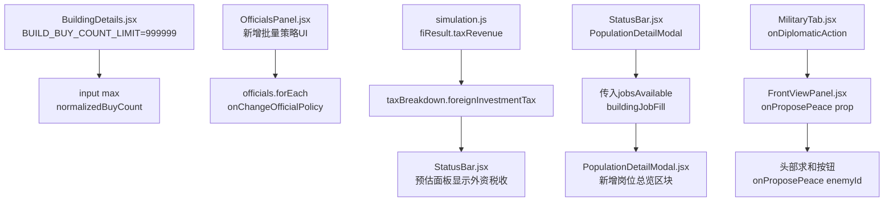

## 用户需求

基于对游戏"哈耶克的文明：市场经济"的五项功能改进需求：

## 产品概览

对现有游戏进行五处功能增强，涵盖建筑建造上限扩充、官员批量管理、财政数据展示修复、人口就业详情以及战争操作便捷性提升。

## 核心功能

### 功能1：建筑建造数量上限大幅提升

- 将建筑自定义建造数量上限从 9999 大幅提升（如 999999），同时同步修改军事招募上限
- 修改位置：`BuildingDetails.jsx` 的 `BUILD_BUY_COUNT_LIMIT` 和 `MilitaryTab.jsx` 的 `RECRUIT_COUNT_LIMIT`

### 功能2：官员面板一键批量调整产业政策

- 在行政-官员面板（`OfficialsPanel.jsx`）中新增"批量设置产业政策"UI区块
- 提供三个政策选项（私有/高薪/国有）的批量操作按钮，点击后对当前所有在职官员统一应用该政策
- 需要新增 `onBatchChangeOfficialPolicy(policyKey)` 回调，在 `useGameActions.js` 中实现批量修改逻辑

### 功能3：外资税收显示在财政收支明细中

- 修复 `simulation.js` 中外资税收未写入 `taxBreakdown` 的 bug
- 在处理 `fiResult.taxRevenue` 时，同步写入 `taxBreakdown.foreignInvestmentTax`
- 在 `StatusBar.jsx` 的预估收支面板中新增"外资税收"显示项（当 `taxes.breakdown.foreignInvestmentTax > 0` 时显示）

### 功能4：人口详情面板显示岗位到岗率与缺口

- 扩展 `PopulationDetailModal.jsx` 的 Props，增加 `jobsAvailable`（各阶层提供岗位总数）和 `buildingJobFill`（各建筑实际填充）
- 在面板中新增"岗位就业总览"区块，按阶层列出：岗位提供数、实际在岗数、到岗率百分比、缺口人数
- 从 `StatusBar.jsx`（触发弹窗处）传入相关数据

### 功能5：战线详情快速发起求和按钮

- 在 `FrontViewPanel.jsx` 中新增 `onProposePeace` prop
- 在战线详情头部区域增加"发起求和"按钮，点击后直接触发与该战线敌方国家的和谈流程
- 修改 `MilitaryTab.jsx` 中两处 `FrontViewPanel` 渲染，传入 `onProposePeace` 回调（复用已有的外交动作调用链）

## 技术栈

- React 19 + Vite + Tailwind CSS（现有项目栈，不引入新依赖）
- 全部修改基于现有组件体系，不新建文件

## 实现思路

### 功能1：建造数量上限

直接将两处常量从 `9999` 改为 `999999`，同时调整 input 框的 `step` 提示（可以设置为 100 方便快速填写大数）。注意格式化显示时已有 `formatNumberShortCN` 可用，不会有显示异常。

### 功能2：官员批量产业政策

在 `OfficialsPanel.jsx` 中已有官员列表和 `onChangeOfficialPolicy` 回调，批量操作只需在 UI 中增加三个策略按钮，循环调用 `onChangeOfficialPolicy(official.id, policyKey)` 或新增一个 `onBatchChangeOfficialPolicy`。
考虑到现有调用链中 `changeOfficialPropertyPolicy` 是单次修改（`useGameActions.js` 接受 `(id, policy)` 参数），最优方案：在 `OfficialsPanel.jsx` 内部直接通过 `officials.forEach(o => onChangeOfficialPolicy(o.id, policy))` 实现批量；无需修改 `useGameActions.js` 逻辑，避免扩大改动范围。

### 功能3：外资税收 Bug 修复

根源：`simulation.js` 中 `fiResult.taxRevenue` 只调用了 `applySilverChange`（写入 silverChangeLog），但没有写入 `taxBreakdown`。而 `StatusBar.jsx` 的"预估"模式读取的是 `taxes.breakdown`；"实际"模式读取 `treasuryChangeLog`（由 `applySilverChange` 间接填写）。
修复：在 `simulation.js:8611` 之后补充 `taxBreakdown.foreignInvestmentTax = (taxBreakdown.foreignInvestmentTax || 0) + fiResult.taxRevenue;`，让预估面板也能显示外资税收。同时在 `StatusBar.jsx` 预估收支面板中添加外资税收展示行。

### 功能4：人口详情岗位数据

`PopulationDetailModal` 当前 Props 不含岗位数据。需要：

1. 在触发弹窗处（`StatusBar.jsx` 内的 `PopulationDetailModal` 渲染）传入 `jobsAvailable` 和 `buildingJobFill`
2. 在 `PopulationDetailModal.jsx` 中用 `useMemo` 计算每个阶层的岗位总数/实际填充/缺口，展示为进度条+数字表格

岗位总数 = `Object.values(buildingJobFill[buildingId] || {}).sum` 按阶层聚合；`jobsAvailable[stratum]` 已存在于 gameState，可直接传入。

### 功能5：战线详情求和

`FrontViewPanel` 已知道 `enemyId`（第521行），只需增加 `onProposePeace` prop，在头部操作区添加按钮调用 `onProposePeace(enemyId)`。
`MilitaryTab.jsx` 已有 `onDiplomaticAction` prop 传入（需确认），将其包装为 `(enemyId) => onDiplomaticAction(enemyId, 'peace')` 传给 `FrontViewPanel`。

## 实现注意事项

- **功能2批量操作**：需增加确认提示（或至少 tooltip 说明），避免误触。可复用现有 `window.confirm` 或直接使用带 disabled 样式的二次确认状态。
- **功能3**：`taxBreakdown` 在结算批次（每20 tick）时才更新，故预估面板的外资税收是上次批量结算的缓存值，需在 UI 上加"约"字或注释说明非实时，避免玩家困惑。
- **功能4**：`buildingJobFill` 是 `{buildingId: {stratum: count}}` 结构，需要按阶层聚合而非按建筑聚合。`jobsAvailable` 已是 `{stratum: count}` 结构，可直接对比。
- **功能5**：FrontViewPanel 中 `enemyId` 已在第521行计算好，传 prop 时无需重复计算。注意桌面端和移动端（BottomSheet）两处都要补充 prop，避免遗漏。

## 架构设计



## 目录结构

```
src/
├── components/
│   ├── tabs/
│   │   ├── BuildingDetails.jsx        # [MODIFY] BUILD_BUY_COUNT_LIMIT: 9999 → 999999
│   │   └── MilitaryTab.jsx            # [MODIFY] RECRUIT_COUNT_LIMIT: 9999 → 999999；新增 onDiplomaticAction prop 传给 FrontViewPanel
│   ├── panels/
│   │   ├── FrontViewPanel.jsx         # [MODIFY] 新增 onProposePeace prop；在头部 section 增加求和按钮
│   │   └── officials/
│   │       └── OfficialsPanel.jsx     # [MODIFY] 新增批量产业政策 UI 区块（三个策略按钮+确认逻辑）
│   ├── modals/
│   │   └── PopulationDetailModal.jsx  # [MODIFY] 新增 jobsAvailable/buildingJobFill props；新增岗位总览区块
│   └── layout/
│       └── StatusBar.jsx              # [MODIFY] PopulationDetailModal 传入岗位数据；预估收支面板补充外资税收显示行
└── logic/
    └── simulation.js                  # [MODIFY] fiResult.taxRevenue 同步写入 taxBreakdown.foreignInvestmentTax
```

## 使用的 Agent 扩展

### Skill

- **civ-grounded-development**
- 用途：在实施所有五项修改前，强制进行"先读后改"流程，确保对现有数据流（尤其是 taxBreakdown、buildingJobFill 的数据结构）和组件传参链路有精确理解，避免破坏现有逻辑
- 预期结果：生成的代码完全符合项目现有命名规范、数据结构和组件模式，无需二次修正