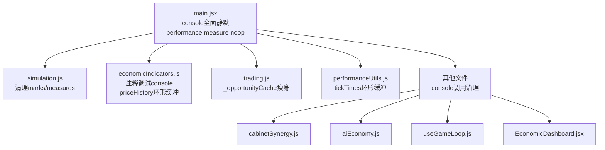

## 产品概述

对游戏运行两个游戏年后抓取的堆快照 (1.26GB, 20,181,442节点) 进行科学分析，定位所有内存泄漏和内存膨胀源，并给出可落地的修复方案。

## 堆快照分析诊断报告

### 基础数据

| 指标 | 数值 | 评估 |
| --- | --- | --- |
| 快照大小 | 1.26 GB | 严重偏大（同类游戏预期 100-300MB） |
| 节点数 | 20,181,442 | 严重偏大（2游戏年不应超过500万） |
| 边数(引用) | 54,479,072 | 引用关系过密 |
| self_size | 441 MB | 偏高 |


### 问题清单（按严重程度排序）

1. **PerformanceMeasure 泄漏** — 89,040个对象 (10.22MB)，附带 StackFrameInfo 150,940个 + CallSiteInfo 99,804个，合计约15MB。simulation.js 和 React DevTools 每tick创建 measure/mark 对象堆积不清理。
2. **console.group 未静默** — economicIndicators.js 第247-287行每tick 调用 console.group/console.log/console.groupEnd，main.jsx 只 mute 了 console.log/warn，遗漏了 group/groupEnd/groupCollapsed/info/debug/table。每tick创建的分组对象和传入的参数对象被浏览器控制台持有不释放。
3. **散落的未注释 console 调用** — cabinetSynergy.js (7处)、aiEconomy.js (4处)、useGameLoop.js 中 _fiscalDebug 分支内的 console.group (3处)、EconomicDashboard.jsx (1处) 等。
4. **数值对象膨胀** — heap number 760万个 (87MB)，Object 235万个 (82MB)，每tick大量短生命周期临时对象（trade计算、demand/supply breakdown 等）导致 GC 压力极大。
5. **_opportunityCache 持有完整 partner 引用** — 缓存的 opportunity 对象包含完整 nation 引用和闭包函数引用，阻止 GC 回收过期国家数据。
6. **priceHistory 数组分配模式低效** — 每tick 对每种资源执行 `[...arr.slice(), price]`，约50种资源每tick创建50个新数组。
7. **_fpsMonitor.tickTimes.shift() 性能** — 每tick对固定30元素数组执行 shift()，虽然内存影响小但模式不佳。

## 核心修复目标

- 消除所有内存泄漏源（performance.measure、console 对象驻留）
- 减少每tick的临时对象分配量
- 清理模块级缓存中的强引用
- 全面静默非调试模式下的所有 console 方法
- 将2游戏年后的堆大小控制在 200-300MB 以内

## 技术栈

- 现有项目：React 19 + Vite + Tailwind CSS
- 运行环境：浏览器主线程 + Web Worker（simulation.worker.js）
- 调试体系：debugFlags.js 提供 `isDebugEnabled(flag)` 分flag控制

## 实现方案

### 方案总览

本次修复分为三个层次：**泄漏修复（P0）**、**console 全面治理（P1）**、**内存分配优化（P2）**。

### P0：泄漏修复（预期减少 25-30MB，消除持续增长源）

#### 1. PerformanceMeasure 泄漏修复

**问题根因**：`simulation.js` 第569-590行的 perfMarkStart/perfMarkEnd 在 `window.__PERF_USER_TIMING === true` 时创建 mark/measure 对象。虽然 perfMarkStart 中有 `clearMeasures`，但 React DevTools 和浏览器内部也会创建 PerformanceMeasure。`main.jsx` 第36-48行的 monkey-patch 只捕获了 DataCloneError 但仍然执行了 measure 创建。

**修复方案**：

- 在 `main.jsx` 中将 Performance.prototype.measure 和 Performance.prototype.mark 在非调试模式下替换为 noop（完全不创建对象）
- 在 `simulation.js` 的 perfMarkEnd 中添加 `performance.clearMarks(startMark); performance.clearMarks(endMark);` 在 measure 创建后立即清理
- 在每个 simulateTick 结束时调用 `performance.clearMeasures('simulateTick')` 和 `performance.clearMarks()`

#### 2. _opportunityCache 引用泄漏修复

**问题根因**：`trading.js` 第1140-1148行将完整的 `{partner, partnerBatch, candidate, getPartnerImportTaxRate, getPartnerExportTaxRate, tradeEfficiencyMultiplier}` 对象存入缓存。其中 `partner` 是完整 nation 对象引用，`getPartnerImportTaxRate` / `getPartnerExportTaxRate` 是闭包函数持有外部作用域变量。

**修复方案**：

- 缓存 opportunity 时只存储轻量数据（partnerId、candidate score/type/resourceKey/prices、tariffMult、tradeEfficiency）
- 执行时从 nations 数组实时解析 partner 引用（executeCachedTrades 已有此逻辑在第1407行）
- 删除缓存中的闭包函数引用，执行时重新计算

### P1：console 全面治理（预期减少 5-15MB + 消除持续增长）

#### 3. main.jsx 完善 console 静默

**问题根因**：只 mute 了 `console.log` 和 `console.warn`，遗漏了 `console.group`、`console.groupEnd`、`console.groupCollapsed`、`console.info`、`console.debug`、`console.table` 等方法。

**修复方案**：在 `muteConsoleNoise()` 中一次性 mute 所有非错误级别的 console 方法：`log, warn, info, debug, group, groupEnd, groupCollapsed, table, time, timeEnd, timeLog, count, countReset, dir, dirxml, trace, clear, profile, profileEnd`。保留 `console.error` 和 `console.assert`。

#### 4. economicIndicators.js 清理未注释的调试代码

**问题根因**：第247-287行的 `console.group('NET EXPORTS DEBUG')` 等6行调试代码未被注释，每tick 执行时创建对象和字符串。

**修复方案**：将这6行用 `// ` 注释或包裹在 `if (isDebugEnabled('fiscal')) {}` 保护中，与同文件第650-661行的注释风格保持一致。

#### 5. 批量清理其他散落 console 调用

- `cabinetSynergy.js`：7处 `console.log('[DOMINANCE DEBUG]'...)` 和 `console.log('[FREE MARKET]'...)` — 包裹到 `debugLog('simulation', ...)` 或注释
- `aiEconomy.js`：4处未注释的 `console.log` / `console.warn` — 替换为 `debugLog`
- `useGameLoop.js`：第1749-1761行 console.group 军队维护 + 第1775-1785行 console.group 资源短缺 — 应在 `_fiscalDebug` 守卫内但直接调用了 console.group，需改为 debugLog
- `EconomicDashboard.jsx`：第61-69行 console.group — 包裹在 `isDebugEnabled('fiscal')` 中

### P2：内存分配优化（预期减少 GC 压力 40-60%）

#### 6. priceHistory 数组更新改用环形缓冲

**问题根因**：`economicIndicators.js` 第122-124行每次调用为每种资源创建新数组 `[...arr.slice(), price]`。约50种资源每tick创建50个临时数组。

**修复方案**：改用 index-pointer 环形缓冲模式：维护一个 `{data: Float64Array(maxLength), pointer: number, length: number}` 结构，push 时只写入 `data[pointer % maxLength]` 并递增 pointer。只在需要读取历史时才 slice 出数组。

#### 7. _fpsMonitor.tickTimes 改用环形缓冲

**问题根因**：第531-535行每tick push + shift，shift() 对数组首元素删除导致所有元素前移。

**修复方案**：改为固定长度 Float64Array + pointer 模式，O(1) 写入。

## 实现注意事项

### 性能

- P0/P1 修复为零开销或负开销（减少了对象创建和函数调用）
- P2 的环形缓冲需要修改 `calculateEquilibriumPrices` 的读取逻辑，需确保向后兼容（存档加载时可能传入普通数组）
- _opportunityCache 瘦身后，executeCachedTrades 中需要重新解析 partner 对象和重新计算税率，但这些已有现成逻辑

### 向后兼容

- console 静默不影响 `isDebugEnabled('console')` 为 true 时的调试能力
- priceHistory 环形缓冲需要在存档加载时处理旧格式（普通数组）到新格式的迁移
- performance.measure noop 在 `window.__PERF_USER_TIMING === true` 时应保留原始行为

### 日志

- 复用现有 `debugLog(flag, ...)` 体系，不引入新的日志模式
- `console.error` 和 `console.assert` 始终保留

## 架构设计

本次修改不引入新的架构模式，全部基于现有代码结构进行精准修复：



## 目录结构

```
src/
├── main.jsx                              # [MODIFY] 完善console静默 + performance.measure noop化
├── logic/
│   ├── simulation.js                     # [MODIFY] perfMarkEnd后清理marks，tick结束清理全部measures
│   ├── economy/
│   │   ├── economicIndicators.js         # [MODIFY] 注释console.group调试代码 + priceHistory环形缓冲
│   │   └── trading.js                    # [MODIFY] _opportunityCache存储瘦身，去除partner/闭包引用
│   ├── officials/
│   │   └── cabinetSynergy.js             # [MODIFY] console.log替换为debugLog
│   ├── diplomacy/
│   │   └── aiEconomy.js                  # [MODIFY] console.log/warn替换为debugLog
│   └── utils/
│       └── performanceUtils.js           # [MODIFY] _fpsMonitor.tickTimes改为环形缓冲
├── hooks/
│   └── useGameLoop.js                    # [MODIFY] console.group改为debugLog条件输出
├── components/
│   └── modals/
│       └── EconomicDashboard.jsx         # [MODIFY] console.group包裹debugEnabled守卫
└── utils/
    └── debugFlags.js                     # [NO CHANGE] 现有debugLog体系无需修改
```

## 关键代码结构

```typescript
// economicIndicators.js 环形缓冲接口
interface RingBuffer {
  data: number[];     // 固定长度数组（maxLength）
  head: number;       // 写入指针 (0..maxLength-1)
  count: number;      // 有效元素数量 (0..maxLength)
}

// trading.js 瘦身后的缓存 opportunity 结构
interface CachedOpportunity {
  partnerId: string;
  candidate: {
    type: 'import' | 'export';
    resourceKey: string;
    score: number;
    localPrice: number;
    foreignPrice: number;
  };
  treatyTariffMult: number;
  tradeEfficiencyMultiplier: number;
}
```

## Agent Extensions

### Skill

- **civ-grounded-development**
- Purpose: 在修改 simulation.js、trading.js、economicIndicators.js 等核心玩法逻辑文件时，确保遵循 read-first、understand-first 的工作流，复用现有 debugFlags 体系和性能优化模式
- Expected outcome: 所有修改均基于已验证的现有代码模式，不引入新的子系统或架构变更

### SubAgent

- **code-explorer**
- Purpose: 在实施批量 console 清理时，搜索所有文件中的未注释 console 调用，确保无遗漏
- Expected outcome: 生成完整的需要修改的 console 调用清单，覆盖 src/ 下所有 .js/.jsx 文件