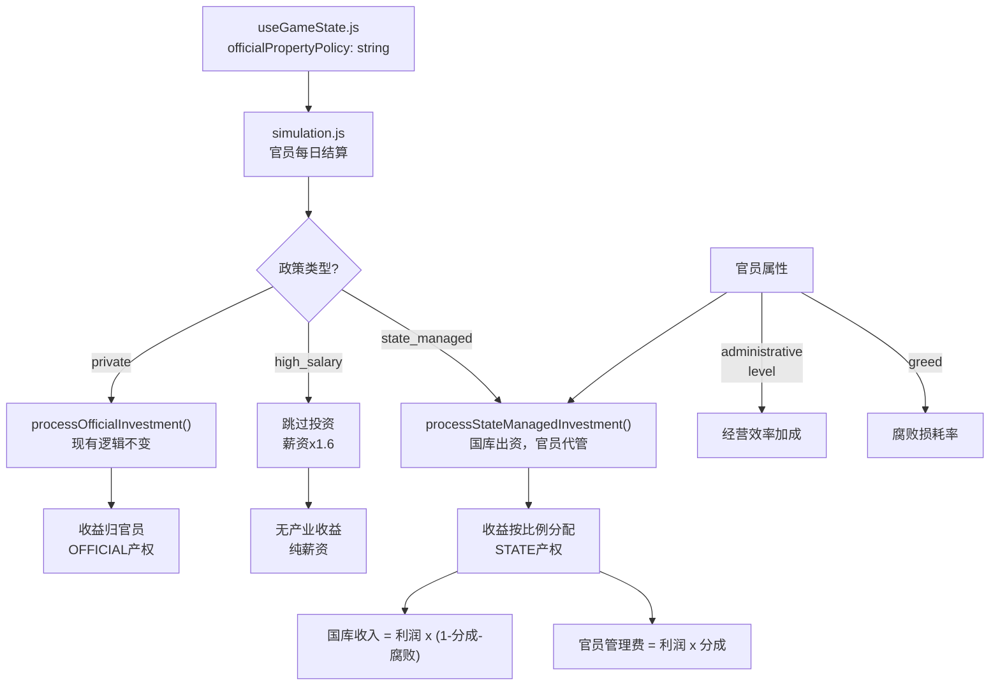
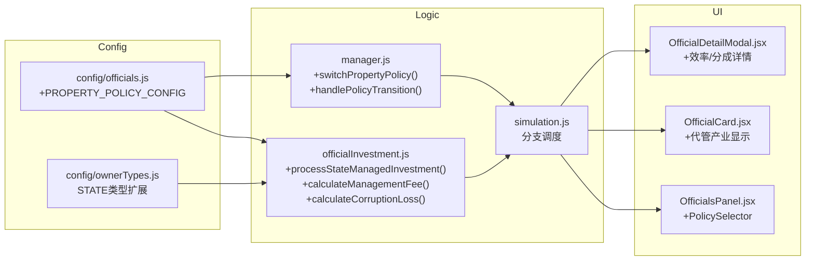

## 产品概述

为官员系统新增**产业政策**机制，玩家可在三种产业管理模式之间切换，每种模式有不同的经济效果、政治后果和管理复杂度，形成有意义的战略抉择。

## 核心功能

### 1. 三种产业政策模式（全局设置，可随时切换）

- **私产制（private）**：现有默认行为。官员用个人财富投资建筑，利润归官员个人，建筑产权为 OFFICIAL 类型。官员有强烈的经营动力，但容易形成利益集团，忠诚度受财富驱动，处置时资产处理复杂。
- **高薪养廉（high_salary）**：禁止官员置办任何产业。薪水自动提升至基础的 1.5~2.0 倍作为补偿。官员不积累产业财富，忠诚度更多受薪资满足驱动，腐败风险低，但国库开支大。
- **代经营制（state_managed）**：官员可以被指派经营建筑，但产业所有权属于国家（STATE 类型）。利润大部分归国库，官员按行政能力获得管理费分成（10%~25%）。官员属性直接影响经营效率（行政能力加成产出，贪婪增加腐败损耗）。

### 2. 官员属性影响经营效率

- 官员的 `stats.administrative` 属性值影响其管辖产业的产出效率加成（0~+20%）
- 官员等级（level）提供额外的效率加成（每级+2%，最高+20%）
- 官员贪婪度（greed）在代经营制下影响腐败损耗（greed 越高，国库实际收到的利润越少）
- 代经营制下，官员的管理费分成 = 基础10% + administrative/500 + level*1%，上限25%

### 3. 政策切换的政治后果

- 从私产制切换到其他模式：已有官员产业处理（没收/补偿），右派官员忠诚度下降，右派阶层满意度下降
- 从高薪养廉切换到其他模式：左派官员忠诚度下降，国库开支下降
- 每次切换附带90天冷却期，防止频繁变更

### 4. 联动系统

- 忠诚度系统：不同政策模式下忠诚度变化因子调整（私产制下财务驱动更强，高薪制下薪资驱动更强）
- 腐败系统：私产制腐败来自官员自利，代经营制腐败来自管理损耗，高薪制腐败最低
- 处置系统：不同政策下处置官员的资产处理逻辑不同
- 内阁派系联动：左派内阁倾向高薪养廉/代经营，右派内阁倾向私产制

## 技术栈

- 前端框架：React 19 + Vite + Tailwind CSS（现有项目栈）
- 状态管理：useState hooks（useGameState.js 现有模式）
- 逻辑层：src/logic/officials/ 目录下的纯函数模块

## 实现方案

### 核心策略

在现有官员投资系统（`officialInvestment.js`）的基础上，通过新增"产业政策"全局状态来分流处理逻辑。三种模式共用现有的建筑利润计算、财务状态判定、忠诚度等基础设施，仅在"投资决策入口"和"收益分配出口"处做分支。这是改动最小、风险最低的方案。

### 关键技术决策

**1. 政策状态存储位置**
在 `useGameState.js` 中新增 `officialPropertyPolicy` 状态字段（字符串枚举），与 `taxPolicies` 同级。存档时自动持久化，加载时默认兼容为 `'private'`。

**2. 逻辑分流而非重写**
`simulation.js` 中的官员每日结算区块（约4270-4500行）已经有完整的投资/收益管线。关键改动点：

- 在 `processOfficialInvestment()` 调用前插入政策检查：`high_salary` 模式直接跳过，`state_managed` 模式走不同的投资路径
- 在产业收益结算区块中：`private` 保持现有逻辑，`state_managed` 将收益按分成比例分配给国库和官员

**3. STATE 产权类型激活**
`ownerTypes.js` 已定义 `STATE` 类型但未使用。代经营制的建筑使用 `STATE` 产权类型，`buildOwnershipListFromLegacy()` 需要扩展以支持代经营建筑的统计。新增 `managedBy` 字段标记哪个官员在经营。

**4. 属性影响效率的计算公式**

```
经营效率 = 基础效率 * (1 + adminBonus + levelBonus)
adminBonus = official.stats.administrative / 500  // 0~0.20
levelBonus = official.level * 0.02                 // 0~0.20
腐败损耗率 = official.greed * 0.05                // 0~0.15（greed范围0~3）
管理费分成 = min(0.25, 0.10 + adminBonus + official.level * 0.01)
```

**5. 政策切换的过渡处理**
切换政策时需要处理存量产业：

- 私产制 -> 高薪养廉：弹出确认弹窗，官员现有产业可选择"补偿没收"（按购入价50%补偿官员）或"强制没收"（无补偿，忠诚度大降）
- 私产制 -> 代经营制：官员现有产业产权从 OFFICIAL 转为 STATE，官员改为"代管人"
- 高薪养廉 -> 其他模式：无存量问题，直接切换
- 切换冷却期90天，存储在 `lastPolicyChangeDay` 中

## 实现要点

### 性能注意

- 产业收益计算已有 `actualProfitCache` 缓存机制，代经营制的效率修正应在缓存层之后应用（乘法修正），不影响缓存命中率
- 政策状态是全局单值，不增加 per-official 的计算开销
- 高薪养廉模式下完全跳过投资/升级逻辑，实际上减少了计算量

### 存档兼容

- `migration.js` 中新增迁移函数：旧存档加载时 `officialPropertyPolicy` 默认为 `'private'`，保持完全向后兼容
- 代经营制新增的 `managedBy` 字段，旧存档不存在时视为无代管

### 数值平衡

- 高薪养廉的薪资倍率 1.6x 作为起始值，使其日薪开支与私产制下"官员产业利润+普通薪资"的总产出大致持平
- 代经营制的管理费分成上限 25% 确保国库始终获得大部分收益
- 腐败损耗率上限约 15%（greed=3时），加上分成25%，国库最少收到利润的 60%

## 架构设计

### 数据流



### 模块关系



## 目录结构

```
src/
├── config/
│   ├── officials.js           # [MODIFY] 新增 PROPERTY_POLICY_CONFIG 配置块，定义三种政策的参数
│   └── ownerTypes.js          # [MODIFY] 扩展 STATE 类型支持，新增 managedBy 字段处理函数，扩展 buildOwnershipListFromLegacy() 统计代经营建筑
├── logic/
│   └── officials/
│       ├── officialInvestment.js  # [MODIFY] 核心改动文件。新增 processStateManagedInvestment() 处理代经营投资决策（国库出资），新增 calculateManagementFee() 计算官员管理费分成，新增 calculateCorruptionLoss() 计算腐败损耗，新增 calculateEfficiencyBonus() 根据官员属性/等级计算经营效率加成，修改 calculateOfficialPropertyProfit() 支持效率加成参数
│       ├── manager.js             # [MODIFY] 新增 switchPropertyPolicy() 处理政策切换逻辑及过渡效果（产业转移/忠诚度变化），修改 disposeOfficial() 在代经营制下的资产处理（STATE产权建筑不随官员处置而消失），修改 getAggregatedOfficialEffects() 在高薪制下应用薪资倍率
│       └── migration.js           # [MODIFY] 新增迁移函数，旧存档默认 policy='private'，补充代经营相关字段
├── hooks/
│   ├── useGameState.js            # [MODIFY] 新增 officialPropertyPolicy 和 lastPolicyChangeDay 状态字段，在存档保存/加载中包含这两个字段
│   └── useGameActions.js          # [MODIFY] 新增 changeOfficialPropertyPolicy() 操作函数，调用 switchPropertyPolicy() 并更新状态
├── logic/
│   └── simulation.js              # [MODIFY] 在官员每日结算区块（~4270-4500行）插入政策分支：private走现有路径，high_salary跳过投资并应用薪资倍率，state_managed走代经营结算路径（利润分配给国库+官员管理费，扣除腐败损耗）
└── components/
    └── panels/
        └── officials/
            └── OfficialsPanel.jsx  # [MODIFY] 在面板顶部新增产业政策选择器（三个按钮/标签切换），显示当前政策、冷却状态、切换后果预览
    └── panels/
        └── officials/
            └── OfficialCard.jsx    # [MODIFY] 根据当前政策模式调整产业区域显示：私产制显示"持有产业"，代经营制显示"代管产业"及效率/分成信息，高薪制隐藏产业区域并显示"高薪补贴"标记
    └── modals/
        └── OfficialDetailModal.jsx # [MODIFY] 新增"经营能力"详情区块，展示 administrative 带来的效率加成、等级加成、贪婪导致的腐败率、预计管理费分成比例
```

## 关键代码结构

```typescript
// PROPERTY_POLICY_CONFIG（新增于 config/officials.js）
export const PROPERTY_POLICY_CONFIG = {
    private: {
        id: 'private',
        name: '私产制',
        description: '官员可自由置办产业，利润归个人所有',
        salaryMultiplier: 1.0,      // 薪资倍率
        investmentAllowed: true,     // 是否允许投资
        profitToState: 0,           // 利润归国比例
        corruptionBase: 0,          // 基础腐败率（通过FINANCIAL_STATUS现有机制）
        loyaltyMod: { financialWeight: 1.5 },  // 财务因素对忠诚度影响加权
        switchCooldown: 90,
    },
    high_salary: {
        id: 'high_salary',
        name: '高薪养廉',
        description: '禁止官员置办产业，以高薪补偿',
        salaryMultiplier: 1.6,
        investmentAllowed: false,
        profitToState: 0,
        corruptionBase: -0.02,      // 降低腐败
        loyaltyMod: { salaryWeight: 2.0 },
        switchCooldown: 90,
    },
    state_managed: {
        id: 'state_managed',
        name: '代经营制',
        description: '官员代为经营国有产业，按能力获取管理费',
        salaryMultiplier: 1.0,
        investmentAllowed: true,    // 国库出资，官员经营
        profitToState: 1.0,        // 利润全归国库（减去管理费和腐败）
        corruptionBase: 0.02,      // 代经营有基础腐败
        loyaltyMod: { administrativeWeight: 1.5 },
        switchCooldown: 90,
    },
};
```

## 使用的扩展

### Skill

- **civ-grounded-development**
- 用途：在每个实现步骤中强制执行"先读后写"的开发流程，确保所有改动都基于现有代码架构，避免引入不必要的新系统
- 预期结果：每步实现前先输出 grounding note（已读文件、现有机制摘要、复用优先计划），实现后输出 alignment note（复用了哪些系统、数值一致性检查）

### SubAgent

- **code-explorer**
- 用途：在实现过程中对 simulation.js 的 8000+ 行代码进行精确定位，找到官员结算区块的所有边界条件和依赖项
- 预期结果：精确定位所有需要修改的代码行和上下文依赖