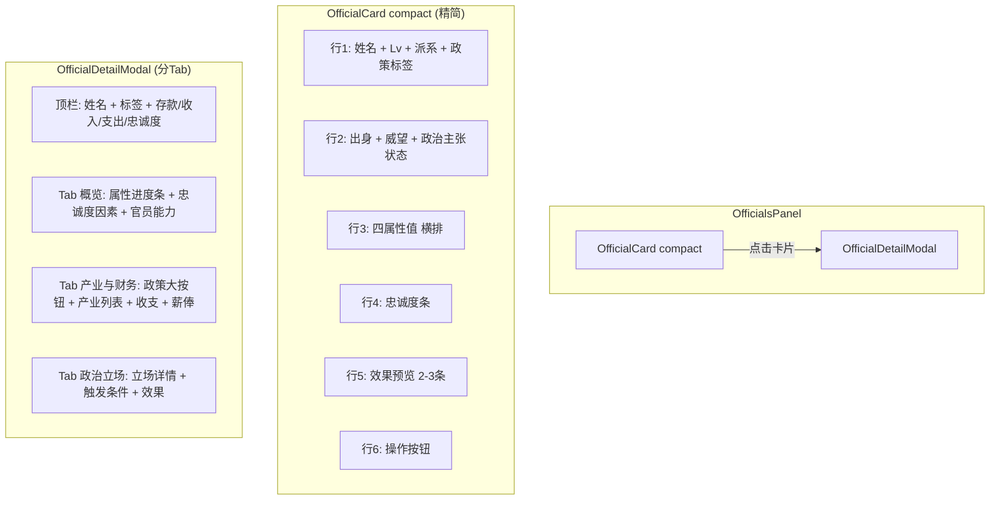

## 用户需求

官员面板UI重构，解决三个核心问题：

1. 产业政策切换按钮在详情弹窗中被埋没，用户找不到
2. 官员卡片(compact模式)信息过密，布局拥挤不美观
3. 数据展示不够直观，数值缺少可视化

## 产品概述

对官员系统的两个核心UI组件进行重构：将列表中的OfficialCard精简为清晰的摘要卡片，将OfficialDetailModal改为分Tab布局的详情面板，使产业政策切换按钮突出可见。

## 核心功能

1. **OfficialCard 精简为摘要卡片**：只展示姓名、等级、派系、出身、四属性、忠诚度条、2-3条效果预览、政治主张触发状态标签（仅显示已触发/未触发图标，不展示细节）、操作按钮；移除政治主张详情区块、产业列表、展开/收起按钮
2. **OfficialDetailModal 分Tab重构**：Tab1「概览」展示属性进度条+忠诚度变化因素+官员能力效果列表；Tab2「产业与财务」置顶突出产业政策三选一大按钮+持有/代管产业列表+收支明细+薪俸设置；Tab3「政治立场」展示立场详情+触发条件+满足/未满足效果
3. **数据可视化增强**：四属性使用带颜色进度条替代纯数字；产业政策按钮改为带图标的大按钮组，激活态明显高亮

## 技术栈

- 前端框架：React 19 + Vite
- 样式方案：Tailwind CSS
- 现有组件库：`src/components/common/UnifiedUI.jsx`（含 Modal、Tabs、ProgressBar、Badge、Icon 等）
- 样式配置：`src/config/unifiedStyles.js`（含 TAB_STYLES、PROGRESS_STYLES 等）

## 实现方案

### 策略概述

对 OfficialCard 的 compact 模式进行瘦身重写，移除政治主张详情区块和产业列表，只保留摘要信息；对 OfficialDetailModal 引入 Tab 分组，将原有平铺内容按「概览」「产业与财务」「政治立场」三个维度组织，产业政策按钮在 Tab2 置顶突出展示。

### 核心技术决策

1. **复用现有 Tabs 组件**：项目 `UnifiedUI.jsx` 已有 `Tabs` 组件（第224行），且 `StratumDetailModal` 中已有成熟的 Tab 模式用法（`useState('overview')` + 条件渲染），直接沿用该模式，无需引入新模式。

2. **OfficialCard compact 模式重构**：保留现有 props 接口不变（`official`, `isCandidate`, `onAction`, `onDispose`, `canAfford`, `actionDisabled`, `currentDay`, `isStanceSatisfied`, `onViewDetail`, `compact`, `generals`），仅重写 `if (compact)` 分支的 JSX 结构，移除 `isExpanded` 状态和展开/收起逻辑。

3. **OfficialDetailModal 分 Tab**：新增 `const [activeTab, setActiveTab] = useState('overview')` 状态，将原有8个信息块（存款/收益/支出/忠诚度四格、属性、忠诚度因素、政治立场、官员能力、产业政策、薪俸、开销）重新分配到3个 Tab 中。

4. **属性进度条**：用 Tailwind 内联样式的 `div` 实现简单彩色条形图（0-100范围），不引入外部图表库。每个属性用对应颜色（行政蓝/军事红/外交绿/威望紫）。

5. **产业政策大按钮组**：将原有小按钮（每个 `flex-1 py-1.5 px-2 text-xs`）改为更大更突出的按钮（`py-3 px-4 text-sm`），添加图标（私产用 Building、高薪用 DollarSign、国企用 Building2），激活态增加边框高亮和背景色对比。

## 实现注意事项

### 性能

- OfficialCard 的 `memo` 比较函数 `officialCardPropsAreEqual`（第1110行）需保持不变，确保重构后不引入多余渲染。
- 由于移除了 `isExpanded` 状态和展开/收起按钮，compact 模式下 OfficialCard 变为完全无状态（除 `showDisposalMenu`），有利于减少渲染开销。

### 向后兼容

- 所有 props 接口保持不变，OfficialsPanel 不需要修改。
- OfficialCard 的 full 模式（非 compact）暂不修改，仅重构 compact 分支。
- OfficialDetailModal 的 props 接口不变（`isOpen`, `onClose`, `official`, `onUpdateSalary`, `onUpdateName`, `currentDay`, `isStanceSatisfied`, `stability`, `officialsPaid`, `buildingCounts`, `buildingFinancialData`, `onChangePolicy`）。

### 避免回归

- 保留 OfficialDetailModal 中所有 useMemo 计算（propertySummary、propertyRows、propertyProfitRows、expenseRows、displayEffects、loyaltyReasons），只改变渲染位置（从平铺改为按 Tab 条件渲染）。
- 保留 salaryDraft / isEditingSalary / nameDraft / isEditingName 等编辑状态和 useEffect 同步逻辑。

## 架构设计



## 目录结构

```
src/components/
├── panels/officials/
│   └── OfficialCard.jsx          # [MODIFY] 重写 compact 分支，精简为摘要卡片
├── modals/
│   └── OfficialDetailModal.jsx   # [MODIFY] 引入 Tab 分组，重组信息布局
```

仅修改2个文件，不新增文件，不修改 OfficialsPanel.jsx 和任何 props 传递链路。

## Agent Extensions

### Skill

- **civ-grounded-development**
- Purpose: 确保重构过程遵循项目现有架构约定，复用已有组件（Tabs、ProgressBar、Modal、Icon、Badge），不引入新的子系统
- Expected outcome: 重构代码风格与现有项目一致，通过 lint 检查，不破坏已有功能

### SubAgent

- **code-explorer**
- Purpose: 在实施阶段验证修改后的组件 props 传递是否完整，确认 memo 比较函数覆盖所有渲染依赖
- Expected outcome: 确认无遗漏的 prop 传递和无多余的渲染触发