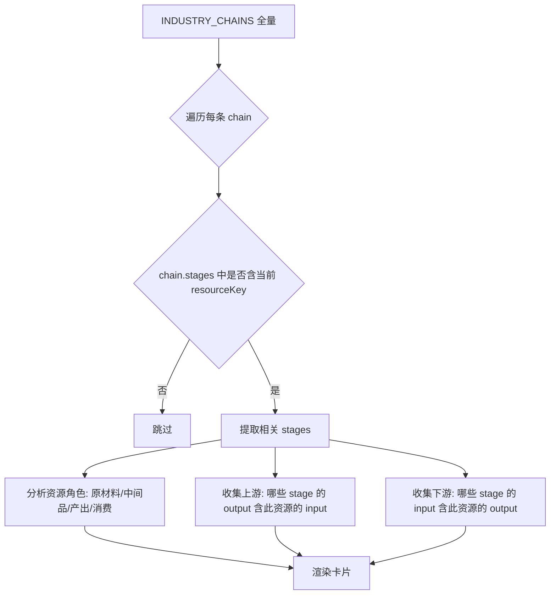
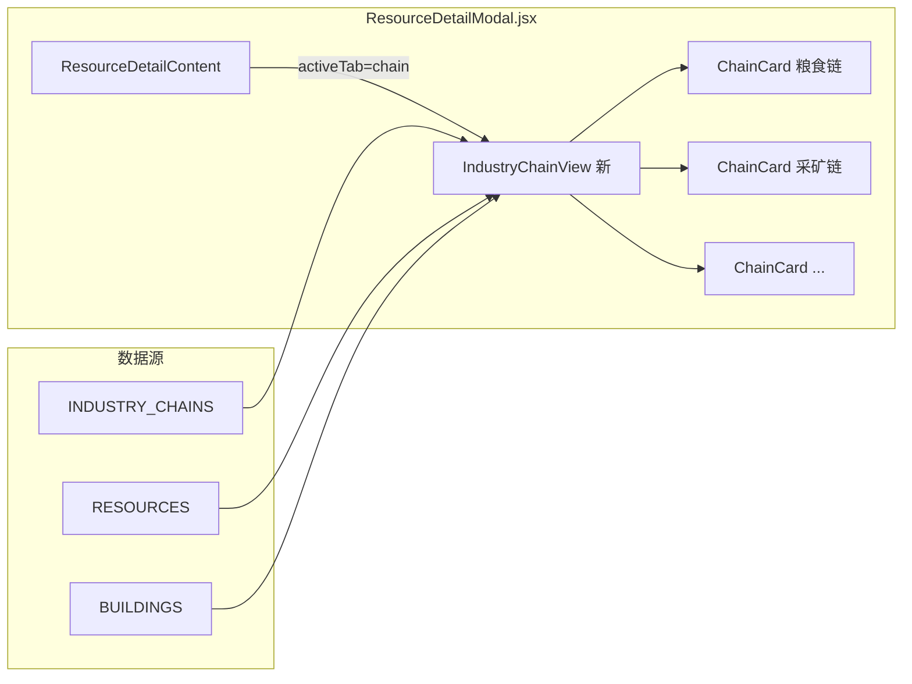

## 用户需求

重构资源详情弹窗中"产业链"标签页的显示，解决当前产业链视图混乱、无法快速看出资源在哪些产业链中的位置和上下游关系、排版丑陋且手机端体验差的问题。

## 产品概述

在资源详情弹窗的"产业链"Tab中，彻底重写产业链可视化组件，使玩家能一目了然地看到：当前资源参与了哪些已解锁/可见的产业链、在每条链中扮演什么角色（原材料/中间品/最终消费品）、直接上游和下游分别是什么。

## 核心功能

1. **产业链卡片列表**：每条涉及当前资源的产业链显示为一张紧凑卡片，卡片头部标注产业链名称和资源角色标签（如"原材料""中间品""最终产品""消耗品"）
2. **三段式上下游展示**：卡片内以"上游资源/建筑 -> [当前资源高亮] -> 下游资源/建筑"的简洁三段结构展示，只展示与该资源直接相关的一层上下游关系，不展开完整的DFS路径
3. **建筑信息收敛**：相关建筑默认只显示名称和拥有数量，不铺开所有详情，保持界面简洁
4. **时代过滤**：未解锁时代的产业链阶段以半透明/灰色标注，已解锁阶段正常显示
5. **响应式布局**：垂直堆叠的卡片布局，手机端和桌面端均自然适配，无需横向滚动
6. **空状态处理**：当前资源不在任何产业链中时显示友好提示

## 技术栈

- React 19 + Vite（现有项目）
- Tailwind CSS（样式，复用现有 ancient-* 主题色系）
- framer-motion（已引入，可选用于卡片入场动画）
- 数据源：`src/config/industryChains.js` 中的 `INDUSTRY_CHAINS`
- UI 基础组件：`Icon`（来自 UIComponents）、`RESOURCES`、`BUILDINGS`、`STRATA`（来自 config）

## 实现方案

### 整体策略

彻底替换 `ResourceDetailModal.jsx` 中现有的 `DynamicChainView`、`ChainFlowDiagram`、`buildChainPaths`、`SimpleBuildingChain` 四个组件/函数，用一个新的 `IndustryChainView` 组件替代。核心设计思路是：**抛弃 DFS 全路径遍历，改为以"当前资源"为锚点，只提取直接相关的上下游一层关系**。

### 关键技术决策

1. **抛弃 buildChainPaths 的 DFS 算法**：当前 DFS 从根遍历到叶生成所有路径，导致一条产业链产生大量重复路线（如粮食产业链有7个stage会产生多条交叉路径）。新方案不做路径遍历，而是直接在每条 chain 的 stages 中找出包含当前资源的 stage，然后向上回溯一层 input、向下追踪一层 output，时间复杂度从 O(n!) 降到 O(n)。

2. **资源角色分类算法**：遍历每个 stage，根据资源出现在 input/output/consumers 中的位置，确定角色：

- 仅在 output 中且 stage 为 extraction → "原材料"
- 在 output 中且 stage 为 processing/advanced → "产出品"
- 在 input 中且有对应 output → "原料/中间品"
- 在 input 中且 stage 为 consumption → "被消费"
取最高优先级的角色作为该链中的主要角色标签。

3. **垂直布局替代横向滚动**：每张卡片内部使用垂直流式布局：上游区（flex-wrap）→ 箭头 → 当前资源（高亮居中）→ 箭头 → 下游区（flex-wrap），自然换行，无需 overflow-x-auto。

4. **epochRange 过滤**：stage 有 epochRange 时，只在当前 epoch 范围内才显示为活跃状态，范围外显示为灰色半透明，使玩家清楚哪些环节已可用。

### 数据处理流程



## 实现要点

### 性能

- 所有数据处理使用 `useMemo` 缓存，依赖 `[resourceKey, epoch]`，避免每次渲染重算
- 卡片数量有限（同一资源最多涉及3-4条产业链），不需要虚拟滚动

### 向后兼容

- 只替换 `activeTab === 'chain'` 分支渲染的组件
- `DynamicChainView` 的 props 接口保持不变：`{ resourceKey, buildings, epoch }`
- `TAG_MAP` 保留复用
- `ensureArray` 工具函数保留复用

### 代码组织

- 新组件直接写在 `ResourceDetailModal.jsx` 中（与现有模式一致，该文件内所有子组件都是就地定义的）
- 删除旧的 `buildChainPaths`、`ChainFlowDiagram`、`SimpleBuildingChain`、旧版 `DynamicChainView`
- 新增 `IndustryChainView`（主容器）和 `ChainCard`（单条产业链卡片）两个内部组件

## 架构设计

替换范围仅限 `ResourceDetailModal.jsx` 内部的产业链相关组件（Line 170-525），不影响其他 Tab 和外部组件。



## 目录结构

```
src/components/modals/
└── ResourceDetailModal.jsx  # [MODIFY] 替换产业链Tab的全部可视化组件
                              # 删除: buildChainPaths, ChainFlowDiagram, SimpleBuildingChain, 旧DynamicChainView (Line 170-525)
                              # 新增: IndustryChainView (主容器组件, 负责筛选相关产业链并渲染卡片列表)
                              #       ChainCard (单条产业链卡片, 三段式上下游展示)
                              #       getResourceRole (工具函数, 分析资源在产业链中的角色)
                              #       getDirectRelations (工具函数, 提取资源的直接上下游一层关系)
                              # 保留: TAG_MAP, ensureArray, MarketTrendChart, TAB_OPTIONS 等不变
                              # 调用入口不变: Line 1932-1933 的 activeTab === 'chain' 渲染
```

## Agent Extensions

### Skill

- **civ-grounded-development**
- Purpose: 遵循仓库的 grounded development 流程，确保在修改前充分理解现有产业链数据结构、UI 绑定路径和组件模式，复用现有系统而非引入新模式
- Expected outcome: 实现前输出 grounding note 确认已读取的相关文件和现有机制；实现后输出 alignment note 确认复用了哪些现有系统、未引入不必要的新抽象