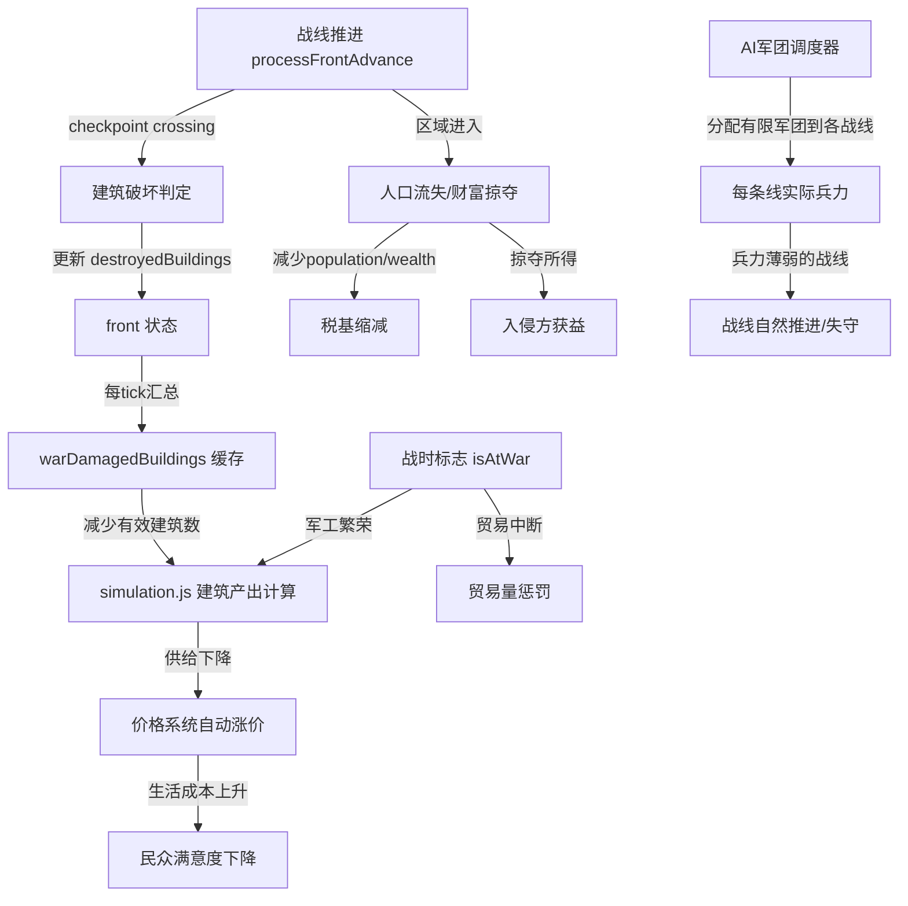
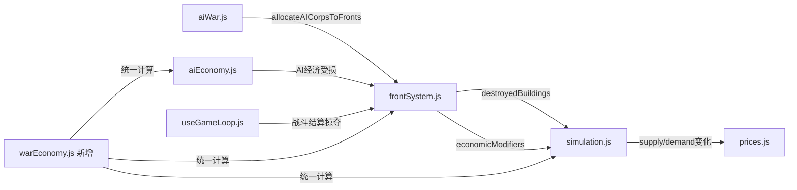

## 产品概述

在现有战线系统基础上，建立深度战争-经济联动机制，使战争成为经济系统的有机组成部分而非独立模块。战争的核心影响应体现在经济数据上（产能下降、资源变动、税收波动），玩家的主要精力放在经济和内政管理上，战争是"斗蛐蛐"式的半自动化经济博弈手段。

## 核心特性

### 1. AI军团调度与多战线兵力分配（非debuff）

- **核心理念**：多战线劣势不通过debuff实现，而是通过"有限军团在多条战线间分配"自然产生
- 玩家已有军团系统，自己编军团自己分配到战线，不需要额外机制
- **AI需要军团调度器**：AI拥有持久化的军团池（已有 `syncAINationMilitary`），新增跨战线分配调度逻辑
- **军团数量**：`targetCorps` 保持现有公式（`Math.round(pop/180) + warBonus`，1-5个），不加经济因子——因为经济影响已经体现在军团的**人数和装备质量**上（见下方）
- **军团规模和装备由真实造价决定（重构 wealthConstraint）**：每个兵种都有 `recruitCost`（如线列步兵需要 food×900 + iron×350 + rifles×10 + silver×550），每种资源都有市场价格（AI国家有 `nationPrices`）。**军队规模 = 军费预算 ÷ 单兵真实成本**，而非硬编码的人均财富阈值。物价便宜的国家同样的预算能养更多兵，物价昂贵的国家兵力自然少
- **兵种选择由性价比决定（替代 affordableEpoch 硬编码）**：不再用"人均财富<5→降级2个时代"的硬编码，而是计算每个可用兵种的实际造价（recruitCost × 当地物价），在预算约束下选择**性价比最优**的兵种组合。穷国自然选不起高级兵种，因为同样的钱买10个线列步兵不如买50个长枪兵
- **群殴优势**：多国同时打一个AI，AI军团被迫分散到每条战线，单线兵力薄弱→群殴比单打更容易
- AI调度器考虑：战线紧急度（核心区受威胁优先）、军团战力、学说偏好

### 1.5. 基于市场物价的军费预算制（重构 generateNationArmy）

- **现状问题**：
- `wealthConstraint` 用硬编码阈值（人均财富<0.5→5%，<5→10-50%...）决定军队规模，忽略了各国物价差异
- 兵种选择完全随机（`Math.random()`），与经济脱钩。穷国可能满编最先进兵种
- **新机制：军费预算制**
- 新增辅助函数 `calculateUnitCost(unitId, nationPrices)`：用兵种的 `recruitCost` × 当地 `nationPrices` 算出单兵**实际银币造价**
- 例如民兵在物价低的国家可能只要 200 银币/人，线列步兵要 5000 银币/人
- **军费预算** = `nation.wealth × 军费比例`（军费比例：和平时 0.15，战时 0.25），代表国家能承受的总军事开支
- **兵种选择**：每个类别内，从 `getAvailableUnitsForEpoch` 返回的当前时代可用兵种中筛选。**如果该类别在当前时代无可用兵种，则跳过该类别不出兵**（如石器时代无骑兵/攻城→不出），多余预算重新分配给有兵种的类别。有可用兵种的类别内，按 epoch 降序排列，从最先进的开始尝试：如果该兵种单兵成本 ≤ 预算/最低编制人数（保证至少能招到一定数量），就选它；否则降级到下一个更便宜的兵种
- **兵力数量** = `min(人口上限, 军费预算 ÷ 选定兵种的加权平均成本)`，自然地：物价低→同预算买更多兵；物价高→兵少
- **保底**：极端情况下保底10人步兵（当前时代最便宜的infantry），确保不会出现0兵力军团
- **效果**：
- 物价便宜的国家：同样wealth能养更多兵，且可能负担得起较先进的兵种 → 低物价是军事优势
- 物价昂贵的国家：预算吃紧，只能用便宜的旧兵种、且数量少 → 高物价是军事劣势
- 战争导致物价飞涨 → 补员时成本暴增 → 军队自然缩编 → 形成经济-军事螺旋
- AI国家有 `nationPrices`（由 `updateNationEconomyData` 维护），玩家用 `market.prices`，机制对双方一致
- 修改位置：`src/config/militaryUnits.js` 的 `generateNationArmy()` 函数，替换现有 `wealthConstraint` 和随机选兵逻辑

### 2. 战争破坏建筑与产能

- **玩家侧**：战线推进至经济区/核心区时，按概率实际摧毁玩家的建筑（如铜矿、铁矿、农场），已有的 `destroyedBuildings` 数据被主模拟循环消费，被摧毁建筑的产出从supply中扣除
- **AI侧**：AI没有真实建筑系统，战线推进时直接按比例扣减AI的 `wealth`（对应产能损毁）和 `militaryStrength`（对应军工设施损毁），经济效果对等于玩家丢建筑
- 特定资源产能下降触发价格波动，可能引发连锁经济危机（如粮食产能被毁 -> 粮价飙升 -> 民众不满）
- 玩家的建筑破坏需要战后花费资源修复（非自动恢复）；AI的经济数值在战后按恢复系数缓慢回升

### 2.5. 腹地沦陷经济惩罚升级

- **现状问题**：战线推到5或95（腹地沦陷）与推到16或84的经济惩罚完全一样，核心区被打穿没有额外后果
- **修正**：在 `getFrontlineEconomicModifiers` 中新增"腹地沦陷"层级（linePos <= 8 或 >= 92）：
- 产出惩罚额外 +20%（从核心区的25%累加到45%）
- 收入惩罚额外 +30% 银币（从核心区的35%累加到65%）
- **总产出惩罚上限从35%提高到55%**（修改 `Math.min(0.35, ...)` → `Math.min(0.55, ...)`）
- 实现方式：在现有的区域惩罚阶梯中追加一级判定，修改位置在 `frontSystem.js` 的 `getFrontlineEconomicModifiers()`
- 这意味着腹地沦陷的国家经济几乎瘫痪（产出减半+收入大幅缩水），但不会完全归零，仍有翻盘可能

### 3. 战争破坏税基

- 战区人口流失：战线深入导致平民伤亡和难民出逃，直接减少人口
- 财富掠夺：敌方推进至经济区/核心区时，定期从对方国库中掠走银币和资源
- 商业中断：战争期间与交战国的贸易路线自动中断，对外贸易总量下降
- 建筑损毁减少就业岗位和产出，间接缩减税收来源

### 4. 战争获利机制（发战争财）

- 战胜方在战斗结束后获得掠夺资源（已有基础 plunderResourceNode，需强化正向反馈）
- 战线推进至敌方区域时，可持续从敌方经济区"抽税"获取银币和物资
- 军工产业在战争中可能获益：战时对军事资源（铁、武器、火药）需求激增，相关建筑的产出和利润上升
- AI国家的资源储备在战败时成为赔偿来源

### 5. AI国家受同等军事与经济约束

- AI国家拥有持久化军团池，军团数量由人口决定（1-5个），与玩家一样是有限资源
- **军团规模和装备由市场造价决定**：`generateNationArmy()` 重构为军费预算制——军费预算(wealth×军费比例) ÷ 兵种实际造价(recruitCost×nationPrices) = 军队规模。物价便宜的国家同预算养更多兵，物价贵的国家兵少且只能用廉价兵种
- AI通过 `allocateAICorpsToFronts()` 调度器将军团分配到各活跃战线，多线作战时每线分到的军团自然减少
- AI国家的经济增长（processAIIndependentGrowth）在战争中受到与玩家相同的产能惩罚
- AI没有真实建筑，但 wealth/population/militaryStrength 在战线推进时实际受损，效果等同于玩家丢建筑
- **经济→军事的传导链**：战争破坏经济→wealth下降→军费预算缩水→下次补员时**兵少+只能选便宜兵种**→战力下降；同时战争推高物价→单兵成本上涨→同预算能养的兵更少→形成经济-军事螺旋

## 技术栈

- 前端框架：React 19 + Vite + Tailwind CSS（维持现有）
- 逻辑层：src/logic 下纯函数模块
- 状态管理：useGameState + useGameLoop hooks
- 配置驱动：src/config 常量与配置文件

## 实现策略

### 核心思路

**扩展现有机制而非新建系统**。当前代码已有 `destroyedBuildings`、`economicDamageBreakdown`、`getFrontlineEconomicModifiers`、`plunderResourceNode` 等未充分利用的框架。本方案的核心是打通这些已有但断裂的数据管道，让战争经济影响在现有架构中自然流动。

### 关键技术决策

**1. AI军团多战线调度器 — 在aiWar.js中新增 `allocateAICorpsToFronts()`**

- 原因：AI已有持久化军团（syncAINationMilitary维护），但缺少跨战线分配决策
- **targetCorps 不改**：现有公式 `Math.round(pop/180) + warBonus`（1-5个）已合理，经济影响不体现在军团数量上，而是体现在每个军团的**人数和装备质量**上（由 `generateNationArmy` 新的军费预算制决定——军费预算÷兵种真实造价=兵力）
- 算法：遍历AI参与的所有活跃战线，按优先级分配军团：
- 优先级评分 = 核心区威胁权重(×3) + 经济区威胁(×2) + 战线得分差(×1) + 学说偏好修正
- 军团按优先级从高到低分配到各战线，直到军团池耗尽
- 剩余战线获得0个军团（该战线AI方无兵可用，战线自然推进）
- 玩家侧：无需任何修改，玩家已自行管理军团分配
- 效果：3条战线的AI如果只有3个军团，每线只有1个军团；而玩家如果集中8个军团打一条线，该线必然碾压。且穷国的军团人少装备差，即使有3个军团也打不过富国的1个精锐军团

**1.5. 军费预算制重构 — 在 `generateNationArmy()` 中用真实造价替代硬编码**

- 现有问题：
- `wealthConstraint` 用硬编码阈值（人均财富<0.5→5%...），无视物价差异
- 兵种选择 `Math.random()` 完全随机
- **新增辅助函数 `calculateUnitCost(unitId, prices)`**：

```javascript
// 计算一个兵种的实际银币造价（基于当地物价）
export const calculateUnitCost = (unitId, prices = {}) => {
    const unit = UNIT_TYPES[unitId];
    if (!unit?.recruitCost) return Infinity;
    let totalCost = 0;
    Object.entries(unit.recruitCost).forEach(([resource, amount]) => {
        // 用当地物价；silver=1（货币本身）；没有价格数据时用basePrice
        const price = resource === 'silver' ? 1 : (prices[resource] ?? RESOURCES[resource]?.basePrice ?? 1);
        totalCost += amount * price;
    });
    return totalCost;
};
```

- **重构 `generateNationArmy()` 核心逻辑**：

```javascript
// 1. 军费预算 = wealth × 军费比例
const warBudgetRatio = nation?.isAtWar ? 0.25 : 0.15;
const militaryBudget = (nation?.wealth || 500) * warBudgetRatio;

// 2. 获取当地物价（AI用nationPrices，玩家用market.prices）
const localPrices = nation?.nationPrices || nation?.market?.prices || {};

// 3. 每个兵种类别内：如果该类别有可用兵种，按epoch降序选预算内最先进的
// 如果该类别无可用兵种（如石器时代无骑兵），返回null，跳过该类别
const selectBestAffordableUnit = (categoryUnits, budgetForCategory, minCount) => {
    if (categoryUnits.length === 0) return null; // 当前时代该类别无兵种，不出兵
    
    // 按时代降序排（最先进的在前）
    const sorted = [...categoryUnits].sort((a, b) => 
        (UNIT_TYPES[b]?.epoch || 0) - (UNIT_TYPES[a]?.epoch || 0)
    );
    for (const unitId of sorted) {
        const cost = calculateUnitCost(unitId, localPrices);
        if (budgetForCategory / cost >= minCount) {
            return { unitId, cost };
        }
    }
    // 都太贵？选该类别内最便宜的（不会跨类别凑）
    const cheapest = sorted.reduce((best, id) => {
        const c = calculateUnitCost(id, localPrices);
        return c < best.cost ? { unitId: id, cost: c } : best;
    }, { unitId: sorted[sorted.length - 1], cost: Infinity });
    return cheapest;
};

// 4. 遍历各类别分配预算，跳过无兵种的类别，多余预算回流
// 军队规模 = min(人口动员上限, 各类别实际招兵数之和)
// 无兵种的类别（如石器时代的cavalry/siege）预算回流给infantry等有兵种的类别
```

- **删除旧 wealthConstraint 硬编码**：不再需要 `if (wealthPerCapita < 0.5)...` 的阶梯式削减
- **删除旧随机兵种选择**：不再 `Math.floor(Math.random() * units.length)`
- 人口上限仍然保留（`population × manpowerRatio × difficultyMultiplier`），确保不会出现小国有无限兵的情况
- 预算上限和人口上限取**较小值**，两个约束同时生效

- **效果示例**：
- 国家A：wealth=10000，当地food价=1，iron价=6 → 线列步兵造价≈4000银 → 预算2500（战时）→ 只够0.6个线列步兵 → 降级选长枪兵造价≈2000 → 够1.25个 → 再降选民兵造价≈245 → 够10个
- 国家B：wealth=100000，当地food价=0.5，iron价=3 → 线列步兵造价≈2000 → 预算25000 → 够12.5个线列步兵
- 同时代同人口，国家B因为**更富+物价更低**，军队规模和装备碾压国家A

**1.8. 腹地沦陷经济惩罚升级 — 修改 `getFrontlineEconomicModifiers()`**

- 现有：`frontSystem.js` 第1110-1137行的区域惩罚只有三级（中线/经济区/核心区），产出惩罚上限 `Math.min(0.35, ...)`
- **修正**：新增第四级"腹地沦陷"判定（attacker侧 linePos < 8，defender侧 linePos > 92）：

```javascript
// 新增腹地沦陷层级
if (linePos < 8) {  // attacker腹地沦陷
zoneProductionPenalty += 0.20;
zoneIncomePenalty += silverIncome * 0.30;
}
```

同理处理 defender 侧（linePos > 92）

- 总产出惩罚上限从 `Math.min(0.35, ...)` 改为 `Math.min(0.55, ...)`
- **无需新增函数**：仅在现有 `getFrontlineEconomicModifiers` 的 if-else 链中追加一级判定
- AI和玩家双方均受此惩罚（该函数已有 `side` 参数，双向生效）

**2. 建筑实际破坏 — 扩展 `processFrontAdvance()` 中的 checkpoint 处理**

- 现有：checkpoint crossing 已生成 zone resources，但不修改玩家实际 buildings
- **玩家侧**：当战线进入经济区(35/65)或核心区(15/85)时，按概率从玩家 buildings 中随机移除1-2座该区域类型的建筑
- **AI侧**：AI没有真实建筑，改为直接扣减 `wealth`（经济区每次checkpoint扣减wealth×2%，核心区×4%）和 `militaryStrength`（核心区每次扣减0.05，代表军工设施损毁）
- 破坏概率（玩家侧）：`0.15 * raidMod`（基础15%每次checkpoint crossing），raid姿态时更高
- 修复机制：玩家侧战后生成"重建任务"需花资源手动修复；AI侧战后wealth按每tick 0.1%缓慢恢复
- **关键约束**：单次最多破坏2座建筑，且同一建筑类型存量<=1时不可被破坏（防止彻底清零）

**3. destroyedBuildings 数据消费 — 在 simulation.js 的建筑产出循环中扣减**

- 现有：simulation.js 第1267-1377行遍历 buildings 计算产出，`front.destroyedBuildings` 字段已存在但未被读取
- 方案：在建筑遍历循环前，汇总所有活跃战线的 destroyedBuildings，生成 `warDamagedBuildings: { buildingId: count }`
- 建筑实际产出数量 = `Math.max(0, builds[bId] - warDamagedBuildings[bId])`
- 无需修改建筑数据结构，仅在产出计算时做减法

**4. 人口流失与财富掠夺 — 在 `processFrontFriction()` 和战斗结算中增加经济伤害**

- 人口流失：战线每进入新区域（checkpoint crossing），被侵入方人口损失 `population * 0.01~0.03`
- 财富掠夺：经济区掠夺 `wealth * 0.02/tick`，核心区 `wealth * 0.04/tick`
- 掠夺所得：入侵方获得掠夺银币的60%（40%消耗于战争本身），实现"发战争财"
- AI同等受损：getFrontlineEconomicModifiers 已有nationId参数，改为同时为AI计算并应用

**5. 战时经济调节 — 军工繁荣与贸易中断**

- 军工繁荣：在建筑产出计算中，`isPlayerAtWar` 时军事类建筑（cat:'military'）产出+20%，采矿类（如iron/copper/coal）产出+10%
- 贸易中断：与交战国的所有贸易路线暂停，总贸易量penalty = `activeWarCount * 0.15`（最高45%）
- 价格冲击：被摧毁建筑对应资源的供给突然下降，价格系统的供需计算自然产生涨价效果（无需额外干预，利用现有价格机制）

## 实现注意事项

### 性能

- 建筑破坏检查仅在 checkpoint crossing 时执行（低频事件），不影响每tick性能
- `warDamagedBuildings` 汇总在每tick开始时执行一次，缓存结果供整个tick使用
- AI经济惩罚复用 `getFrontlineEconomicModifiers`，无额外O(n)遍历

### 向后兼容

- 新增字段（warDamagedBuildings、AI军团assignedFrontId等）均有默认值，旧存档无缝兼容
- `destroyedBuildings` 数据结构不变，仅新增消费端
- 所有新增函数都是纯函数或可选参数扩展，不破坏现有调用

### 数值平衡

- 建筑破坏概率设置较低（15%基础），且保底不会清零任一建筑类型
- 人口流失每次checkpoint最多3%，长期战争约导致总人口下降10-20%
- 财富掠夺有上限（经济区2%/tick，核心区4%/tick），防止瞬间清空
- 多战线兵力分配纯自然机制：AI有N个军团分配到M条战线，无任何人为debuff
- 经济→军事传导链由**真实市场造价**驱动：军费预算(wealth×比例) ÷ 兵种造价(recruitCost×nationPrices) = 兵力。物价便宜的国家同预算养更多兵（低物价=军事优势）；战争推高物价→单兵成本涨→兵力自动缩减。极端情况保底10人民兵，不会完全归零
- 腹地沦陷（linePos <=8 或 >=92）时经济惩罚大幅升级：产出惩罚最高55%、收入损失最高65%银币，但不会完全归零，保留翻盘可能

## 架构设计

### 数据流



### 模块交互



## 目录结构

```
src/logic/diplomacy/
├── warEconomy.js          # [NEW] 战争经济联动核心模块。包含：aggregateWarDamagedBuildings（汇总所有战线的建筑损毁）、calculateWarBuildingDamage（建筑破坏判定）、calculateWarPopulationLoss（人口流失）、calculateWarPlunder（财富掠夺与获益）、calculateWartimeTradeDisruption（贸易中断惩罚）、calculateMilitaryIndustryBoost（军工繁荣加成）。所有函数均为纯函数，接收状态参数返回修正值。
├── frontSystem.js         # [MODIFY] 在 processFrontAdvance 的 checkpoint 处理中调用 warEconomy 的建筑破坏和人口流失；在 processFrontFriction 中调用财富掠夺逻辑；在 getFrontlineEconomicModifiers 中整合 destroyedBuildings 数据。
├── aiWar.js               # [MODIFY] 新增 allocateAICorpsToFronts() 军团调度器；targetCorps保持不变（经济约束已通过军费预算制体现在generateNationArmy的兵力和装备上）；AI宣战决策考虑当前军团余量。
├── aiEconomy.js           # [MODIFY] processAIIndependentGrowth 中应用战争经济惩罚：直接扣减AI的wealth/militaryStrength（替代建筑破坏，因AI无真实建筑）；与玩家受同等经济约束。
├── index.js               # [MODIFY] 导出 warEconomy 模块的公共函数。
└── economyUtils.js        # 不变

src/logic/
├── simulation.js          # [MODIFY] 建筑产出循环中消费 warDamagedBuildings 扣减有效建筑数；战时军工繁荣加成；贸易中断惩罚；人口流失实际扣减。

src/hooks/
├── useGameLoop.js         # [MODIFY] 战斗结算时调用掠夺获益逻辑；传递多战线状态给simulation；战后修复任务生成。
├── useGameState.js        # [MODIFY] 新增 warEconomyState 状态字段（warDamagedBuildings缓存、pendingRepairs修复队列）。

src/config/
├── militaryUnits.js       # [MODIFY] generateNationArmy() 重构为军费预算制：新增 calculateUnitCost() 基于 recruitCost×nationPrices 计算实际造价；删除硬编码 wealthConstraint 和随机选兵；兵种按epoch降序、预算内选最先进能负担的；兵力=min(人口上限, 预算÷单兵成本)。
├── gameConstants.js       # [MODIFY] 新增战争经济相关常量（破坏概率、掠夺系数、兵力稀释参数、军工加成系数等）。
```

## 关键数据结构

```typescript
// warEconomy.js 核心接口

/** AI军团调度结果（每个AI国家计算一次） */
interface AICorpsAllocation {
    nationId: string;
    totalCorps: number;                        // AI军团总数
    allocations: Record<string, {              // frontId -> 分配的军团IDs
        corpsIds: string[];
        priority: number;                      // 该战线优先级评分
    }>;
    unallocatedCorps: string[];                // 未分配的军团（预备队）
}

/** 战争建筑破坏结果 */
interface WarBuildingDamage {
    targetNationId: string;
    destroyedBuildings: Record<string, number>; // { buildingId: count }
    productionLoss: Record<string, number>;     // 对应资源产出损失
    narrative: string;                          // 日志描述
}

/** 战争经济汇总（每tick计算一次） */
interface WarEconomySnapshot {
    warDamagedBuildings: Record<string, number>;  // 全部战线汇总的建筑损毁
    totalPopulationLoss: number;
    totalWealthPlundered: number;
    plunderGained: Record<string, number>;         // 己方获得的掠夺
    tradeDisruptionPenalty: number;                // 0~0.45
    militaryIndustryBoost: number;                 // 0~0.2
}
```

## Agent Extensions

### Skill

- **civ-grounded-development**
- Purpose: 在每个实现步骤中强制执行"先读后写"的grounding流程，确保所有改动基于现有代码架构，复用已有机制，不引入平行系统
- Expected outcome: 每个task在实现前先输出"现有机制总结"和"复用方案"，确保代码改动精准嵌入现有数据流

### SubAgent

- **code-explorer**
- Purpose: 在实现每个复杂模块时，先通过代码探索确认所有相关调用点和数据流路径，避免遗漏依赖
- Expected outcome: 精确定位每个修改点的上下游依赖，确保不产生运行时错误