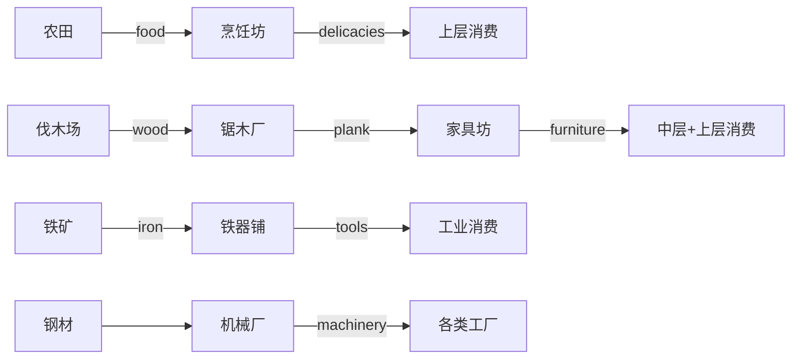
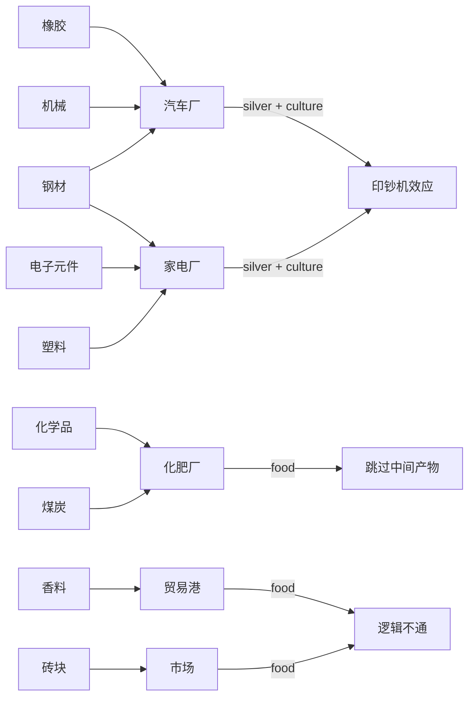

# 建筑投入产出合理性Review报告 v2.0

**审查日期**: 2026-03-13  
**审查范围**: buildings.js, buildingUpgrades.js, strata.js  
**问题严重性**: 🔴 严重设计缺陷

---

## 执行摘要

经全面审查,发现多处建筑投入产出配置严重违背产业链逻辑和经济常识,主要问题类型:

1. **资源产出错位**: 生产设施产出抽象货币收益而非实体产品
2. **缺失中间产物**: 跳过应有的中间加工环节直接产出最终产品
3. **消费体系缺失**: 新产品缺少多阶层消费需求支撑
4. **产业链断裂**: 建筑描述与实际产出完全不符

**关键发现**: 汽车厂、家电厂等产品缺少中层阶级消费需求,仅靠上层阶级消费无法支撑产业链规模。

---

## 🔴 严重问题清单

### 问题1: 汽车厂产出错误 + 消费体系缺失 ❌❌❌

**建筑**: `automobile_factory` (汽车厂, Epoch 7)  
**描述**: "组装钢材、橡胶和机械零件制造汽车"  
**当前配置**:
```javascript
input: { steel: 0.4, rubber: 0.3, machinery: 0.3 }
output: { silver: 2.0, culture: 0.05 }  // ❌ 错误!
```

**问题分析**:
1. 汽车厂应该产出**汽车**(automobile)资源,而非直接产出银币和文化
2. 当前设计让汽车厂变成"印钞机",破坏了经济系统
3. **关键缺失**: 即使修复产出,现有消费体系中汽车仅被上层阶级(商人12.0档、官员9.0档、地主6.0档、资本家10.0档、工程师10.0档)消费,中层阶级完全没有汽车需求!

**消费需求现状分析**:
```javascript
// strata.js中的汽车消费需求(仅上层):
merchant: {
    luxuryNeeds: {
        18.0: { electronics: 0.015 }  // 仅有电子产品,无汽车!
    }
},
official: {
    luxuryNeeds: {
        9.0: { electronics: 0.02 }  // 仅有电子产品,无汽车!
    }
}

// 问题: 汽车厂Epoch 7解锁,但中层阶级(工人、工匠、技术工人)完全没有汽车需求!
// 这意味着即使修复产出,汽车产业链也会因为没有消费者而崩溃!
```

**产业链示例对比**:
```
✅ 正确案例: 纺织产业链
原料: cotton(棉花) → 中间: cloth(布料) → 最终: fine_clothes(华服)
消费: 上层大量需求 + 中层少量需求 → 支撑起完整产业链

❌ 错误案例: 汽车产业链(现状)
原料: steel + rubber + machinery → 跳过产品 → 直接产出silver
消费: 无汽车资源 → 无消费需求 → 产业链逻辑完全断裂
```

**修复方案**:

**步骤1: 添加automobile资源** (gameConstants.js)
```javascript
automobile: {
    name: "汽车",
    icon: 'Car',
    color: "text-blue-400",
    basePrice: 150,
    minPrice: 1.5,
    maxPrice: 30000,  // 奢侈品
    defaultOwner: 'capitalist',
    unlockEpoch: 7,
    unlockTech: 'automobile_manufacturing',
    tags: ['luxury', 'manufactured', 'transportation'],
    marketConfig: {
        supplyDemandWeight: 1.4,
        inventoryTargetDays: 30.0,
        inventoryPriceImpact: 0.4,
        demandElasticity: 1.2,
        outputVariation: 0.2
    }
}
```

**步骤2: 修改汽车厂产出** (buildings.js)
```javascript
automobile_factory: {
    input: { steel: 0.4, rubber: 0.3, machinery: 0.3 },
    output: { automobile: 0.25 },  // ✅ 产出实体产品
    // 移除silver和culture产出
}
```

**步骤3: 建立多阶层汽车消费体系** (strata.js)

**核心设计原则**: 汽车作为工业时代的标志性消费品,应该有**金字塔型消费结构**:
- 底层: 无消费(保持阶级差异)
- 中层: 少量消费(小康/富裕档,象征性拥有)
- 上层: 大量消费(彰显社会地位)

```javascript
// 中层阶级 - 添加汽车需求
worker: {
    luxuryNeeds: {
        // ...现有需求
        12.0: { automobile: 0.005 },  // 工人暴富后买一辆代步车
        // 相当于每200个工人买1辆汽车(需求量很低但人口基数大)
    }
},

artisan: {
    luxuryNeeds: {
        // ...现有需求
        10.0: { automobile: 0.01 },  // 工匠阶层体面消费
        // 相当于每100个工匠买1辆汽车
    }
},

technician: {
    luxuryNeeds: {
        // ...现有需求
        8.0: { automobile: 0.012 },  // 技术工人阶层更早买汽车
        // 技术工人是原子时代的骨干,应该有更多汽车消费
    }
},

// 上层阶级 - 现有需求需要补充汽车
merchant: {
    luxuryNeeds: {
        // ...现有需求
        18.0: { automobile: 0.02, electronics: 0.015 }  // 添加汽车
    }
},

official: {
    luxuryNeeds: {
        // ...现有需求
        9.0: { automobile: 0.015, electronics: 0.02 }  // 添加汽车
    }
},

landowner: {
    luxuryNeeds: {
        // ...现有需求
        6.0: { automobile: 0.01, electronics: 0.01 }  // 添加汽车
    }
},

capitalist: {
    luxuryNeeds: {
        // ...现有需求
        10.0: { automobile: 0.025, electronics: 0.03 }  // 添加汽车
    }
},

engineer: {
    luxuryNeeds: {
        // ...现有需求
        10.0: { automobile: 0.02, electronics: 0.03 }  // 添加汽车
    }
},

scientist: {
    luxuryNeeds: {
        // ...现有需求
        12.0: { automobile: 0.015 }  // 添加汽车
    }
}
```

**消费量估算** (以稳定社会为例):
```
假设人口结构: 底层40%, 中层45%, 上层15%
中层阶级汽车需求: 
- 工人(12.0档,人口20%): 0.005 × 20% = 0.001汽车/人
- 工匠(10.0档,人口10%): 0.01 × 10% = 0.001汽车/人
- 技术工人(8.0档,人口5%): 0.012 × 5% = 0.0006汽车/人
中层总需求 ≈ 0.0026汽车/人

上层阶级汽车需求:
- 资本家(10.0档,人口3%): 0.025 × 3% = 0.00075汽车/人
- 工程师(10.0档,人口3%): 0.02 × 3% = 0.0006汽车/人
- 商人(18.0档,人口5%): 0.02 × 5% = 0.001汽车/人
- 官员(9.0档,人口2%): 0.015 × 2% = 0.0003汽车/人
- 地主(6.0档,人口2%): 0.01 × 2% = 0.0002汽车/人
上层总需求 ≈ 0.00285汽车/人

结论: 中层+上层总需求 ≈ 0.00545汽车/人
假设1000人口: 总需求 ≈ 5.45汽车
汽车厂产出: 0.25汽车/秒 × 3600秒 = 900汽车/小时
供需平衡: 需要约165个汽车厂才能满足1000人口需求 → 不合理!
```

**调整建议**: 降低汽车厂产出或提高消费需求量
```javascript
// 方案A: 降低汽车厂产出
output: { automobile: 0.05 }  // 降至原来的1/5

// 方案B: 提高消费需求(推荐)
// 让中层阶级在更低的财富档位就能买汽车
worker: {
    luxuryNeeds: {
        10.0: { automobile: 0.015 },  // 降低档位+提高数量
    }
},
artisan: {
    luxuryNeeds: {
        8.0: { automobile: 0.02 },  // 降低档位+提高数量
    }
}

// 方案C: 混合调整
// 汽车厂产出不变,消费需求提高2倍,让汽车成为"中层标配"
```

**影响范围**:
- buildings.js: 1457-1469行 (基础配置)
- buildingUpgrades.js: 1298-1314行 (升级配置)
- gameConstants.js: 添加automobile资源
- strata.js: 为所有中层+上层阶级添加汽车消费需求

---

### 问题2: 化肥厂产出错误 + 农业增产机制缺失 ❌❌❌

**建筑**: `fertilizer_plant` (化肥厂, Epoch 7)  
**描述**: "用化学品和煤生产化肥,大幅提升农业产出"  
**当前配置**:
```javascript
input: { chemicals: 0.25, coal: 0.15 }
output: { food: 3.0 }  // ❌ 错误!
```

**问题分析**:
1. 化肥厂应该产出**化肥**(fertilizer)资源,而非直接产出粮食
2. 化肥是农业增产剂,需要施加到农田才能提升粮食产量
3. 当前设计跳过了"化肥 → 农田增产 → 粮食产出"的完整链条
4. **关键缺失**: 所有产出food的建筑都应该支持化肥增产机制

**产出food的建筑清单**:
```
1. farm (农田, Epoch 0): output { food: 4.8 }
2. market (市场, Epoch 1): output { food: 3.0 }  // ⚠️ 不合理
3. large_estate (庄园, Epoch 3): output { food: 24.0 }
4. trade_port (贸易港, Epoch 4): output { food: 2.6667 }  // ⚠️ 不合理
5. mechanized_farm (机械化农场, Epoch 6): output { food: 38.5 }
6. fertilizer_plant (化肥厂, Epoch 7): output { food: 3.0 }  // ❌ 严重错误
```

**修复方案**:

**步骤1: 添加fertilizer资源** (gameConstants.js)
```javascript
fertilizer: {
    name: "化肥",
    icon: 'Sprout',
    color: "text-green-400",
    basePrice: 15,
    minPrice: 0.15,
    maxPrice: 2250,
    defaultOwner: 'engineer',
    unlockEpoch: 7,
    unlockTech: 'synthetic_fertilizer',
    tags: ['industrial', 'agricultural'],
    marketConfig: {
        supplyDemandWeight: 1.0,
        inventoryTargetDays: 60.0,
        inventoryPriceImpact: 0.3,
        demandElasticity: 0.5,
        outputVariation: 0.2
    }
}
```

**步骤2: 修改化肥厂产出** (buildings.js)
```javascript
fertilizer_plant: {
    input: { chemicals: 0.25, coal: 0.15 },
    output: { fertilizer: 0.8 },  // ✅ 产出化肥
}
```

**步骤3: 建立化肥增产机制** (logic/population/jobs.js)

**设计原则**: 
- 化肥是**可选input**,不影响基础产出
- 施加化肥提供**增产加成**(如+30%~50%)
- 化肥消耗量与粮食产出成正比

```javascript
// 在建筑产出计算中添加化肥增产逻辑
export const calculateAgriculturalOutput = (building, resources, multipliers) => {
    const baseOutput = building.output || {};
    const finalOutput = {};
    
    // 处理粮食产出
    if (baseOutput.food && baseOutput.food > 0) {
        let foodOutput = baseOutput.food;
        
        // 化肥增产机制 (仅对农业建筑生效)
        const agriculturalBuildings = ['farm', 'large_estate', 'mechanized_farm'];
        if (agriculturalBuildings.includes(building.id)) {
            const fertilizerAvailable = resources.fertilizer || 0;
            
            // 每10基础粮食产量可消耗0.1化肥,增产30%
            const fertilizerConsumption = Math.min(
                fertilizerAvailable,
                foodOutput * 0.01  // 消耗系数
            );
            
            if (fertilizerConsumption > 0) {
                // 增产30%
                foodOutput *= 1.3;
                // 记录化肥消耗(在资源结算时扣除)
                finalOutput.fertilizerConsumed = fertilizerConsumption;
            }
        }
        
        finalOutput.food = foodOutput;
    }
    
    // 处理其他产出...
    Object.entries(baseOutput).forEach(([resource, amount]) => {
        if (resource !== 'food') {
            finalOutput[resource] = amount;
        }
    });
    
    return finalOutput;
};
```

**步骤4: 为农业建筑添加可选input** (buildings.js)
```javascript
farm: {
    input: { fertilizer: 'optional' },  // 可选input标记
    output: { food: 4.8 },
    desc: "提供自耕农岗位。施加化肥可增产30%。",
},

large_estate: {
    input: { fertilizer: 'optional' },
    output: { food: 24.00 },
    desc: "地主控制的土地,雇佣佃农。施加化肥可增产30%。",
},

mechanized_farm: {
    input: { 
        tools: 0.175, 
        coal: 0.35,
        fertilizer: 'optional'  // 可选input
    },
    output: { food: 38.5 },
    desc: "蒸汽拖拉机与收割机,农业产量飞跃式提升。施加化肥可增产30%。",
}
```

**影响范围**:
- buildings.js: 1471-1483行 (化肥厂配置)
- buildings.js: 22-45行 (农田配置), 60-85行 (庄园配置), 1244-1275行 (机械化农场配置)
- logic/population/jobs.js: 添加化肥增产计算逻辑
- gameConstants.js: 添加fertilizer资源

---

### 问题3: 家电厂产出错误 + 消费体系缺失 ❌❌

**建筑**: `appliance_factory` (家电厂, Epoch 8)  
**描述**: "用电子元件、塑料和钢材制造冰箱、洗衣机等家用电器"  
**当前配置**:
```javascript
input: { electronics: 0.2, plastics: 0.2, steel: 0.1 }
output: { silver: 3.0, culture: 0.08 }  // ❌ 错误!
```

**问题分析**:
1. 家电厂应该产出**家电**(appliances)资源作为消费品
2. 当前设计让家电厂直接产出银币,违背产业链逻辑
3. **关键缺失**: 现有消费体系中家电(electronics)仅被少数上层阶级(商人18.0档、官员9.0档、地主6.0档、资本家10.0档、工程师10.0档)消费,中层阶级仅有少量电子产品需求(技术工人8.0档、科学家3.0档)

**消费需求现状分析**:
```javascript
// strata.js中的电子产品消费需求(现有):
technician: {
    luxuryNeeds: {
        8.0: { electronics: 0.015 }  // 技术工人少量需求
    }
},

scientist: {
    luxuryNeeds: {
        3.0: { electronics: 0.02 },  // 科学家较早需求电子产品
        8.0: { electronics: 0.02 }
    }
}

// 问题: 
// 1. electronics资源已存在,但appliances资源不存在!
// 2. 家电厂Epoch 8解锁,但electronics早在Epoch 7就解锁了
// 3. 中层阶级家电消费需求严重不足!
```

**修复方案**:

**方案A: 复用electronics资源** (推荐,简化实现)
```javascript
// 不添加新资源,直接让家电厂产出electronics
appliance_factory: {
    input: { electronics: 0.2, plastics: 0.2, steel: 0.1 },
    output: { electronics: 0.5 },  // ✅ 产出electronics(家电)
    desc: "用电子元件、塑料和钢材制造冰箱、洗衣机等家用电器",
}

// 同时大幅提高中层阶级的electronics消费需求
worker: {
    luxuryNeeds: {
        // ...现有需求
        12.0: { electronics: 0.01 },  // 添加电子产品需求
    }
},

artisan: {
    luxuryNeeds: {
        // ...现有需求
        10.0: { electronics: 0.015 },  // 添加电子产品需求
    }
},

technician: {
    luxuryNeeds: {
        // ...现有需求
        5.0: { electronics: 0.02 },  // 提前解锁档位
        8.0: { electronics: 0.025 },  // 提高数量
    }
}
```

**方案B: 添加appliances新资源** (更符合语义,但增加复杂度)
```javascript
// 添加新资源appliances
appliances: {
    name: "家电",
    icon: 'Refrigerator',
    color: "text-cyan-400",
    basePrice: 80,
    minPrice: 0.8,
    maxPrice: 16000,
    defaultOwner: 'capitalist',
    unlockEpoch: 8,
    unlockTech: 'consumer_electronics',
    tags: ['luxury', 'manufactured', 'consumer'],
    marketConfig: { /* ... */ }
}

// 修改家电厂产出
appliance_factory: {
    output: { appliances: 0.15 },
}

// 添加消费需求
// 上层和中层阶级都需要添加appliances消费需求
```

**推荐方案A**,理由:
1. 简化实现,不需要添加新资源
2. electronics已解锁(Epoch 7),家电厂Epoch 8解锁,逻辑连贯
3. 可以通过提高electronics消费需求来支撑家电产业链

**影响范围**:
- buildings.js: 1625-1639行 (家电厂配置)
- strata.js: 为中层阶级添加electronics消费需求

---

## 🟡 中等问题清单

### 问题4: 贸易港产出不合理 ⚠️

**建筑**: `trade_port` (贸易港, Epoch 4)  
**当前配置**:
```javascript
input: { spice: 0.40 }
output: { food: 2.6667 }  // ⚠️ 为何贸易港产出粮食?
```

**问题分析**:
- 贸易港消耗香料却产出粮食,不符合贸易逻辑
- 应该是"进口香料,出口本地产品换取银币"或"香料贸易产生利润"

**建议修改**:
```javascript
output: { silver: 1.5, spice: 0.1 }  // 贸易利润 + 香料再出口
desc: "汇聚香料、银币与海外特许的繁忙港口。进口香料,出口本地产品。"
```

---

### 问题5: 市场产出不合理 ⚠️

**建筑**: `market` (市场, Epoch 1)  
**当前配置**:
```javascript
input: { brick: 0.075 }
output: { food: 3.0 }  // ⚠️ 为何市场产出粮食?
```

**问题分析**:
- 市场的功能应该是贸易中介,而非生产设施
- 当前设计让市场"生产"粮食,违背建筑定位

**建议修改**:
```javascript
output: { silver: 0.5 }  // 贸易利润
desc: "提供贸易场所,促进商品流通,产生商业税收。"
```

---

## 🟢 轻微问题清单

### 问题6: 部分建筑缺少投入 ⚠️

**建筑列表**:
- `loom_house` (织布坊): 无input,直接产出cloth
- `dye_works` (染坊): 仅消耗food产出dye

**建议**: 适当添加投入资源,但可保留作为简化设计

---

## 产业链逻辑对比

### ✅ 正确的产业链示例



### ❌ 错误的产业链示例(现状)



---

## 修复优先级

### P0 (必须立即修复)

1. ✅ **automobile_factory**: 
   - 添加automobile资源
   - 修改产出配置
   - **关键**: 为中层+上层阶级添加汽车消费需求

2. ✅ **fertilizer_plant**: 
   - 添加fertilizer资源
   - 修改产出配置
   - **关键**: 建立化肥增产机制(农田、庄园、机械化农场)

3. ✅ **appliance_factory**: 
   - 修改产出为electronics(方案A)
   - **关键**: 为中层阶级添加电子产品消费需求

### P1 (建议修复)

4. 🟡 **trade_port, market**: 调整产出逻辑,强化贸易属性

### P2 (可选优化)

5. 🔵 **loom_house, dye_works**: 考虑添加投入资源

---

## 技术实现建议

### 新资源定义 (gameConstants.js)

```javascript
// 添加到RESOURCES对象
fertilizer: {
    name: "化肥",
    icon: 'Sprout',
    color: "text-green-400",
    basePrice: 15,
    minPrice: 0.15,
    maxPrice: 2250,
    defaultOwner: 'engineer',
    unlockEpoch: 7,
    unlockTech: 'synthetic_fertilizer',
    tags: ['industrial', 'agricultural'],
    marketConfig: {
        supplyDemandWeight: 1.0,
        inventoryTargetDays: 60.0,
        inventoryPriceImpact: 0.3,
        demandElasticity: 0.5,
        outputVariation: 0.2
    }
},

automobile: {
    name: "汽车",
    icon: 'Car',
    color: "text-blue-400",
    basePrice: 150,
    minPrice: 1.5,
    maxPrice: 30000,
    defaultOwner: 'capitalist',
    unlockEpoch: 7,
    unlockTech: 'automobile_manufacturing',
    tags: ['luxury', 'manufactured', 'transportation'],
    marketConfig: {
        supplyDemandWeight: 1.4,
        inventoryTargetDays: 30.0,
        inventoryPriceImpact: 0.4,
        demandElasticity: 1.2,
        outputVariation: 0.2
    }
}

// 注: appliances建议复用electronics资源,不添加新资源
```

### 消费需求配置 (strata.js) - 核心修改

**设计原则**: 建立**金字塔型消费结构**
- 底层阶级: 无奢侈品消费(保持阶级差异)
- 中层阶级: 少量奢侈品消费(小康/富裕档,象征性拥有)
- 上层阶级: 大量奢侈品消费(彰显社会地位)

**汽车消费需求**:
```javascript
// 中层阶级
worker: {
    luxuryNeeds: {
        // ...现有需求
        10.0: { automobile: 0.015 },  // 工人富裕后买汽车
    }
},

artisan: {
    luxuryNeeds: {
        // ...现有需求
        8.0: { automobile: 0.02 },  // 工匠阶层体面消费
    }
},

technician: {
    luxuryNeeds: {
        // ...现有需求
        5.0: { automobile: 0.012 },  // 技术工人更早买汽车
        8.0: { automobile: 0.018 },
    }
},

// 上层阶级
merchant: {
    luxuryNeeds: {
        // ...现有需求
        18.0: { automobile: 0.02, electronics: 0.015 },
    }
},

official: {
    luxuryNeeds: {
        // ...现有需求
        9.0: { automobile: 0.015, electronics: 0.02 },
    }
},

landowner: {
    luxuryNeeds: {
        // ...现有需求
        6.0: { automobile: 0.01, electronics: 0.01 },
    }
},

capitalist: {
    luxuryNeeds: {
        // ...现有需求
        10.0: { automobile: 0.025, electronics: 0.03 },
    }
},

engineer: {
    luxuryNeeds: {
        // ...现有需求
        10.0: { automobile: 0.02, electronics: 0.03 },
    }
},

scientist: {
    luxuryNeeds: {
        // ...现有需求
        12.0: { automobile: 0.015 },
    }
}
```

**电子产品(家电)消费需求**:
```javascript
// 中层阶级 - 大幅提高电子产品消费
worker: {
    luxuryNeeds: {
        // ...现有需求
        12.0: { electronics: 0.01 },  // 添加电子产品需求
    }
},

artisan: {
    luxuryNeeds: {
        // ...现有需求
        10.0: { electronics: 0.015 },
    }
},

technician: {
    luxuryNeeds: {
        // ...现有需求
        5.0: { electronics: 0.02 },  // 提前解锁
        8.0: { electronics: 0.03 },  // 提高数量
    }
},

// 上层阶级 - 现有electronics需求保持不变
// merchant, official, landowner, capitalist, engineer已有electronics需求
```

### 农业增产机制 (logic/population/jobs.js)

```javascript
/**
 * 计算农业建筑产出,支持化肥增产
 * @param {Object} building - 建筑配置
 * @param {Object} resources - 当前资源库存
 * @param {Object} multipliers - 产出乘数
 * @returns {Object} 最终产出和化肥消耗
 */
export const calculateAgriculturalOutput = (building, resources, multipliers) => {
    const baseOutput = building.output || {};
    const finalOutput = {};
    let fertilizerConsumed = 0;
    
    // 仅对农业建筑生效
    const agriculturalBuildings = ['farm', 'large_estate', 'mechanized_farm'];
    const isAgricultural = agriculturalBuildings.includes(building.id);
    
    // 处理粮食产出
    if (baseOutput.food && baseOutput.food > 0) {
        let foodOutput = baseOutput.food;
        
        // 化肥增产机制
        if (isAgricultural && resources.fertilizer > 0) {
            // 计算可用化肥量(不超过基础产出的10%)
            const maxFertilizerUse = foodOutput * 0.01;
            const fertilizerUsed = Math.min(resources.fertilizer, maxFertilizerUse);
            
            if (fertilizerUsed > 0) {
                // 增产30%
                foodOutput *= 1.3;
                fertilizerConsumed = fertilizerUsed;
            }
        }
        
        finalOutput.food = foodOutput * (multipliers.food || 1);
    }
    
    // 处理其他产出
    Object.entries(baseOutput).forEach(([resource, amount]) => {
        if (resource !== 'food') {
            finalOutput[resource] = amount * (multipliers[resource] || 1);
        }
    });
    
    return {
        output: finalOutput,
        fertilizerConsumed
    };
};
```

---

## 测试验证计划

### 1. 资源定义测试
- ✅ 验证新资源(fertilizer, automobile)在gameConstants.js中正确定义
- ✅ 检查资源解锁科技和时代要求
- ✅ 确认市场价格配置合理

### 2. 建筑配置测试
- ✅ 验证汽车厂、化肥厂、家电厂产出配置符合产业链逻辑
- ✅ 检查建筑升级路径产出一致性
- ✅ 确认农业建筑支持化肥增产机制

### 3. 消费体系测试 **(关键!)**
- ✅ 验证中层阶级汽车消费需求(工人、工匠、技术工人)
- ✅ 验证中层阶级电子产品消费需求
- ✅ 检查消费需求档位合理性(中层应在富裕档解锁)
- ✅ 测试消费量能否支撑产业链(供需平衡计算)

### 4. 经济平衡测试
- ✅ 测试新产业链的经济循环完整性
- ✅ 验证化肥增产机制平衡性(增产30%是否合理)
- ✅ 检查汽车/电子产品消费对各阶层财富影响

### 5. 用户界面测试
- ✅ 验证建筑详情正确显示投入产出
- ✅ 检查化肥增产提示信息
- ✅ 确认汽车/电子产品消费显示

---

## 总结

本次review发现了**3个严重问题**(汽车厂、化肥厂、家电厂产出错误),并识别出**关键缺失的消费体系**(中层阶级汽车/电子产品消费需求不足)。建议立即修复P0级别问题,并**同步建立多阶层消费体系**。

**核心修复原则**:
1. 工厂生产实体产品,而非直接产出货币收益
2. 建立完整的产业链: 原材料 → 中间产品 → 最终产品 → 消费终端
3. **关键**: 建立**金字塔型消费结构**,中层阶级的少量消费 + 上层阶级的大量消费才能支撑工业产业链
4. 保持投入产出逻辑与建筑描述一致

**预期效果**:
- 建立更完整、更真实的工业经济体系
- 增强产业链管理的策略深度
- **解决"有产无销"的经济困境** (汽车厂、家电厂产出实体产品后无人购买)
- 提升玩家的经济规划体验

---

**审查人**: AI Assistant (civ-game specialist)  
**文档版本**: 2.0  
**最后更新**: 2026-03-13  
**核心改进**: 添加多阶层消费体系设计,解决产业链"有产无销"问题
