# 外交系统深度扩展设计方案

## 概述

基于对现有代码库的深入研究，本方案设计一套完整的外交系统扩展，旨在显著提升游戏的P社感、键政感、代入感、策略性和可玩性。

### 现有系统分析

通过代码研究，确认当前游戏已具备以下核心机制：

| 系统 | 现有实现 | 关键文件 |
|------|----------|----------|
| 国家关系 | 0-100关系值，好感度衰减，AI-AI关系 | `nations.js`, `aiDiplomacy.js` |
| 联盟系统 | 玩家-AI联盟(`alliedWithPlayer`)，AI-AI联盟(`allies[]`) | `aiDiplomacy.js` |
| 战争系统 | 战争分数、突袭、和平谈判、分期赔款、割地 | `aiWar.js`, `diplomaticEvents.js` |
| 贸易系统 | 商人派驻、进出口关税、外国库存模拟 | `trading.js`, `aiEconomy.js` |
| 叛乱系统 | 组织度、阶层起义、叛军政权 | `organizationSystem.js`, `rebellionSystem.js` |
| 国家配置 | 30+国家，时代限制，经济偏好，侵略性 | `countries.js` |

> [!IMPORTANT]
> 本设计方案所有内容均基于现有机制扩展，不会新增游戏中不存在的系统（如领地系统、宗教系统等）。

---

## 零、时代解锁系统

> [!IMPORTANT]
> 外交机制随时代逐步解锁，这符合历史发展逻辑，也为游戏增加进度感和战略规划维度。

### 0.1 时代解锁总览

```mermaid
timeline
    title 外交机制时代解锁路线图
    section 石器时代 (Era 0)
        无外交 : 部落战争
    section 青铜时代 (Era 1)
        基础外交 : 和平条约
                 : 基础关系系统
    section 古典时代 (Era 2)
        安全外交 : 互不侵犯条约
                 : 贸易协定
                 : 保护国
    section 封建时代 (Era 3)
        部落联盟 : 朝贡国
                 : 军事联盟
                 : 商人派驻
    section 探索时代 (Era 4)
        殖民体系 : 自由贸易协定
                 : 投资协议
                 : 殖民地
                 : 海外建筑
    section 启蒙时代 (Era 5)
        国际秩序 : 经济共同体
                 : 自贸区
                 : 多轮谈判
    section 工业时代 (Era 6)
        帝国主义 : 傀儡国
                 : 市场价格联动
                 : 复杂国际组织
    section 信息时代 (Era 7)
        全球化 : 所有机制完全开放
               : 高级外交策略
```



### 0.2 详细解锁表

| 时代 | ID | 解锁机制 | 设计理由 |
|------|----|----------|----------|
| **石器时代** | 0 | 无外交系统 | 部落社会尚无国家概念 |
| **青铜时代** | 1 | 和平条约、基础关系 | 城邦出现，开始有国家间交往 |
| **古典时代** | 2 | 互不侵犯条约、贸易协定、保护国 | 文明交流增加，条约概念出现 |
| **封建时代** | 3 | 朝贡国、军事联盟、商人派驻系统 | 封建宗藩体系、骑士团联盟 |
| **探索时代** | 4 | 自由贸易协定、投资协议、殖民地、海外建筑 | 大航海时代、殖民扩张 |
| **启蒙时代** | 5 | 经济共同体、自贸区、多轮谈判 | 国际法萌芽，外交职业化 |
| **工业时代** | 6 | 傀儡国、市场价格联动、复杂国际组织 | 帝国主义、全球市场 |
| **信息时代** | 7 | 全部解锁 | 现代全球化外交体系 |

### 0.3 时代解锁配置

```javascript
// 外交机制时代解锁配置
export const DIPLOMACY_ERA_UNLOCK = {
    // 条约类型解锁
    treaties: {
        peace_treaty: { minEra: 1, name: '和平条约' },
        non_aggression: { minEra: 2, name: '互不侵犯条约' },
        trade_agreement: { minEra: 2, name: '贸易协定' },
        free_trade: { minEra: 4, name: '自由贸易协定' },
        investment_pact: { minEra: 4, name: '投资协议' },
    },
    
    // 附庸关系解锁
    sovereignty: {
        protectorate: { minEra: 2, name: '保护国' },
        tributary: { minEra: 3, name: '朝贡国' },
        puppet: { minEra: 6, name: '傀儡国' },
        colony: { minEra: 4, name: '殖民地' },
    },
    
    // 国际组织解锁
    organizations: {
        military_alliance: { minEra: 3, name: '军事联盟' },
        economic_bloc: { minEra: 5, name: '经济共同体' },
        trade_zone: { minEra: 5, name: '自贸区' },
    },
    
    // 经济机制解锁
    economy: {
        merchant_stationing: { minEra: 3, name: '商人派驻' },
        overseas_building: { minEra: 4, name: '海外建筑' },
        price_convergence: { minEra: 6, name: '市场价格联动' },
        multi_round_negotiation: { minEra: 5, name: '多轮谈判' },
    },
    
    // 人口流动解锁
    migration: {
        economic_migration: { minEra: 3, name: '经济移民' },
        war_refugees: { minEra: 2, name: '战争难民' },
        political_exile: { minEra: 4, name: '政治流亡' },
    },
};

// 检查机制是否解锁
export const isDiplomacyUnlocked = (category, mechanismId, currentEra) => {
    const config = DIPLOMACY_ERA_UNLOCK[category]?.[mechanismId];
    return config ? currentEra >= config.minEra : false;
};
```

### 0.4 时代演进效果

> [!TIP]
> 同一机制在不同时代具有不同参数，体现技术和制度进步。

#### 0.4.1 条约期限演进

| 条约类型 | 早期时代期限 | 标准期限 | 晚期时代期限 |
|----------|------------|----------|-------------|
| 和平条约 | 180天 (Era 1-2) | 365天 (Era 3-4) | 730天 (Era 5+) |
| 互不侵犯条约 | 365天 (Era 2-3) | 730天 (Era 4-5) | 1095天 (Era 6+) |
| 贸易协定 | 365天 (Era 2-3) | 1095天 (Era 4-5) | 永久 (Era 6+) |
| 投资协议 | 730天 (Era 4) | 1825天 (Era 5-6) | 永久 (Era 7) |

```javascript
// 条约期限根据时代调整
const getTreatyDuration = (treatyType, currentEra) => {
    const baseConfig = TREATY_CONFIGS[treatyType];
    const unlockEra = DIPLOMACY_ERA_UNLOCK.treaties[treatyType].minEra;
    const eraAdvantage = currentEra - unlockEra;
    
    // 每超过解锁时代1级，期限+50%
    return Math.floor(baseConfig.baseDuration * (1 + eraAdvantage * 0.5));
};
```

#### 0.4.2 条约违约惩罚演进

| 时代阶段 | 违约关系惩罚 | 违约冷却期 | 其他国家反应 |
|----------|------------|-----------|-------------|
| 早期 (Era 1-3) | -20 | 90天 | 无连锁反应 |
| 中期 (Era 4-5) | -35 | 180天 | 同盟国关系-10 |
| 晚期 (Era 6-7) | -50 | 365天 | 全球声誉系统影响 |

#### 0.4.3 商人派驻效率演进

```javascript
// 商人派驻效率随时代提升
const getMerchantEfficiency = (currentEra) => ({
    tradeVolume: 1 + (currentEra - 3) * 0.15,     // 每时代+15%交易量
    priceAccuracy: 0.7 + currentEra * 0.05,       // 价格信息更准确
    travelSpeed: 1 + Math.max(0, currentEra - 4) * 0.2, // 探索时代后+20%/时代
});
```

#### 0.4.4 殖民/附庸控制力演进

| 时代 | 最大附庸数 | 殖民地上限 | 独立倾向基础值 |
|------|-----------|-----------|---------------|
| 古典 (Era 2) | 1 | 0 | +10%/年 |
| 封建 (Era 3) | 2 | 0 | +5%/年 |
| 探索 (Era 4) | 3 | 2 | +3%/年 |
| 启蒙 (Era 5) | 4 | 4 | +2%/年 |
| 工业 (Era 6) | 5 | 6 | +1%/年 |
| 信息 (Era 7) | 无限 | 8 | ±0%/年 |

```javascript
// 附庸控制力配置
const getVassalLimits = (currentEra) => ({
    maxVassals: currentEra >= 7 ? Infinity : Math.max(0, currentEra - 1),
    maxColonies: currentEra >= 4 ? (currentEra - 2) * 2 : 0,
    independenceBaseRate: 0.10 - (currentEra * 0.015),
});
```

### 0.5 未解锁机制的UI处理

> [!NOTE]
> 未解锁的机制应在UI中显示但灰化标注，让玩家了解未来可解锁的内容。

```javascript
// UI显示逻辑
const renderDiplomacyOption = (option, currentEra) => {
    const unlockEra = DIPLOMACY_ERA_UNLOCK[option.category]?.[option.id]?.minEra || 0;
    const isUnlocked = currentEra >= unlockEra;
    
    if (isUnlocked) {
        return <Button onClick={option.action}>{option.name}</Button>;
    } else {
        const eraName = EPOCHS[unlockEra].name;
        return (
            <Button disabled className="opacity-50">
                🔒 {option.name}
                <span className="text-xs">(需要{eraName})</span>
            </Button>
        );
    }
};
```

**UI示例**：
```
┌────────────────────────────────────────────────────────────────┐
│ 📜 可签署条约                                                   │
├────────────────────────────────────────────────────────────────┤
│ ✅ 和平条约        关系≥30                                     │
│ ✅ 互不侵犯条约    关系≥40                                     │
│ ✅ 贸易协定        关系≥50                                     │
│ 🔒 自由贸易协定    关系≥70  (需要探索时代)                     │
│ 🔒 投资协议        关系≥60  (需要探索时代)                     │
└────────────────────────────────────────────────────────────────┘
```

### 0.6 时代解锁与AI行为

> [!IMPORTANT]
> AI国家也受时代解锁限制，确保公平性。

```javascript
// AI外交决策时检查时代解锁
const aiConsiderTreaty = (aiNation, targetNation, treatyType) => {
    const currentEra = gameState.era;
    
    // 检查时代解锁
    if (!isDiplomacyUnlocked('treaties', treatyType, currentEra)) {
        return { canPropose: false, reason: 'era_locked' };
    }
    
    // AI提前1个时代"发现"这些机制（模拟AI国家的独立发展）
    const aiMinEra = DIPLOMACY_ERA_UNLOCK.treaties[treatyType].minEra;
    if (aiNation.techLevel > currentEra && currentEra >= aiMinEra - 1) {
        // 先进AI可以提前接触新机制
        return evaluateTreatyNormally(aiNation, targetNation, treatyType);
    }
    
    return evaluateTreatyNormally(aiNation, targetNation, treatyType);
};
```

### 0.7 时代解锁事件

当玩家进入新时代时，触发外交机制解锁通知：

```javascript
// 时代升级时的解锁通知
const notifyDiplomacyUnlocks = (newEra) => {
    const newUnlocks = [];
    
    for (const [category, mechanisms] of Object.entries(DIPLOMACY_ERA_UNLOCK)) {
        for (const [id, config] of Object.entries(mechanisms)) {
            if (config.minEra === newEra) {
                newUnlocks.push({
                    category,
                    id,
                    name: config.name,
                });
            }
        }
    }
    
    if (newUnlocks.length > 0) {
        addLog(`✨ 进入${EPOCHS[newEra].name}！解锁新外交机制：`);
        newUnlocks.forEach(u => addLog(`  • ${u.name}`));
        
        // 触发外交解锁事件
        triggerEvent({
            id: 'diplomacy_unlock',
            title: `外交革新：${EPOCHS[newEra].name}`,
            description: `随着文明进入${EPOCHS[newEra].name}，新的外交手段已可使用。`,
            options: [
                { text: '查看新机制', action: () => openDiplomacyTab() },
                { text: '知道了', action: null },
            ],
        });
    }
};
```

---

## 一、外交条约体系

### 1.1 设计理念

扩展现有的`peaceTreatyUntil`机制，建立多元化的条约体系，让玩家能与AI国家进行更丰富的利益交换和博弈。

### 1.2 条约类型

```mermaid
graph TD
    A[条约体系] --> B[安全类条约]
    A --> C[经济类条约]
    A --> D[合作类条约]
    
    B --> B1[互不侵犯条约]
    B --> B2[和平条约]
    
    C --> C1[贸易协定]
    C --> C2[关税同盟]
    C --> C3[投资协议]
    
    D --> D1[学术交流]
    D --> D2[军事合作]
```



#### 1.2.1 互不侵犯条约 (Non-Aggression Pact)

> [!NOTE]
> 🔓 **解锁时代**：古典时代 (Era 2) | 随封建宗藩体系成熟而普及

| 属性 | 值 |
|------|-----|
| 类型ID | `non_aggression` |
| 解锁时代 | **古典时代 (Era 2)** |
| 最低关系 | 40 |
| 期限 | 365天 (Era 2-3) → 730天 (Era 4-5) → 1095天 (Era 6+) |
| 签约成本 | 双方财富最小值 × 0.5% |

**与经济系统联动**：
- 双方不可宣战 → 商人派驻安全性+100%（减少战争风险贴水）
- 关系衰减速度-50% → 长期贸易关系更稳定
- 违约方：关系-50，所有商人被驱逐，贸易中断90天

---

#### 1.2.2 贸易协定 (Trade Agreement)

> [!IMPORTANT]
> 贸易协定直接影响`trading.js`中的商人派驻上限和关税计算。

> [!NOTE]
> 🔓 **解锁时代**：古典时代 (Era 2) | 丝绸之路时代的正式贸易条约

| 属性 | 值 |
|------|-----|
| 类型ID | `trade_agreement` |
| 解锁时代 | **古典时代 (Era 2)** |
| 最低关系 | 50 |
| 期限 | 365天 (Era 2-3) → 1095天 (Era 4-5) → 永久 (Era 6+) |
| 签约成本 | 双方财富最小值 × 1% |

**与现有贸易系统联动**：

```javascript
// 贸易协定效果
const TRADE_AGREEMENT_EFFECTS = {
    // 商人派驻（联动 getMaxTradeRoutesForRelation）
    merchantSlots: {
        type: 'additive',
        value: 3,  // 额外3个商人派驻槽位
    },
    
    // 关税计算（联动 trading.js 的 getImportTaxRate/getExportTaxRate）
    tariffModifier: {
        type: 'multiplicative',
        importTariff: 0.75,   // 进口关税减免25%
        exportTariff: 0.80,   // 出口关税减免20%
    },
    
    // 贸易效率（联动 simulateMerchantTrade 的利润计算）
    tradeEfficiency: {
        type: 'multiplicative',
        value: 1.15,  // 贸易利润+15%
    },
    
    // 价格信息（减少价格估算误差）
    priceTransparency: {
        type: 'additive',
        value: 0.3,  // 价格估算误差-30%
    },
};
```

**实现逻辑**：
```javascript
// 在 trading.js calculateImportProfitability 中应用
const hasTreaty = nation.treaties?.trade_agreement?.status === 'active';
if (hasTreaty) {
    effectiveTariff *= TRADE_AGREEMENT_EFFECTS.tariffModifier.importTariff;
    profitMargin *= TRADE_AGREEMENT_EFFECTS.tradeEfficiency.value;
}
```

---

#### 1.2.3 自由贸易协定 (Free Trade Agreement)

> [!IMPORTANT]
> 自贸协定是贸易协定的升级版，实现关税归零和市场价格联动。

> [!NOTE]
> 🔓 **解锁时代**：探索时代 (Era 4) | 大航海时代的全球贸易网络

| 属性 | 值 |
|------|-----|
| 类型ID | `free_trade` |
| 解锁时代 | **探索时代 (Era 4)** |
| 最低关系 | 70 |
| 期限 | 永久（需双方同意解除） |
| 签约成本 | 双方财富最小值 × 3% |
| 前置条件 | 需先签署贸易协定满1年 |

**与现有贸易系统联动**：

```javascript
const FREE_TRADE_EFFECTS = {
    // 关税归零
    tariffModifier: {
        importTariff: 0,     // 进口关税0%
        exportTariff: 0,     // 出口关税0%
    },
    
    // 商人派驻无上限
    merchantSlots: {
        type: 'unlimited',   // 商人派驻不受关系限制
        baseSlots: 10,       // 基础10个槽位
    },
    
    // 市场价格联动（核心机制）
    priceConvergence: {
        enabled: true,
        convergenceRate: 0.1, // 每日价格差距缩小10%
        // 实现：min(本国价格, 对方价格×1.1) ≤ 实际价格 ≤ max(本国价格, 对方价格×0.9)
    },
    
    // 资源共享优先
    tradeRoutePreference: {
        importPriority: 1.5,  // 从自贸伙伴进口优先级+50%
        exportPriority: 1.5,  // 向自贸伙伴出口优先级+50%
    },
};
```

**市场价格联动机制**：
```javascript
// 每日价格收敛计算
const processFreeTradePriceConvergence = (nation) => {
    if (!nation.treaties?.free_trade?.status === 'active') return;
    
    for (const resourceKey of Object.keys(marketPrices)) {
        const localPrice = marketPrices[resourceKey];
        const foreignPrice = nation.prices?.[resourceKey] || localPrice;
        
        // 价格向中间值收敛
        const targetPrice = (localPrice + foreignPrice) / 2;
        const convergence = FREE_TRADE_EFFECTS.priceConvergence.convergenceRate;
        
        marketPrices[resourceKey] = localPrice + (targetPrice - localPrice) * convergence;
    }
};
```

**经济影响**：
- 本国过剩资源会流向自贸伙伴 → 本国价格上涨
- 本国短缺资源从伙伴流入 → 本国价格下跌
- 商人阶层获利（套利空间大）
- 工匠/工人可能受冲击（外国廉价品涌入）

---

#### 1.2.4 投资协议 (Investment Agreement)

> [!IMPORTANT]
> 投资协议允许玩家阶层在外国**建造建筑**，与海外建筑系统联动。

> [!NOTE]
> 🔓 **解锁时代**：探索时代 (Era 4) | 殖民时代的资本输出制度化

| 属性 | 值 |
|------|-----|
| 类型ID | `investment_pact` |
| 解锁时代 | **探索时代 (Era 4)** |
| 最低关系 | 60 |
| 期限 | 730天 (Era 4) → 1825天 (Era 5-6) → 永久 (Era 7) |
| 签约成本 | 双方财富最小值 × 2% |

**与海外建筑系统联动**：

```javascript
const INVESTMENT_AGREEMENT_EFFECTS = {
    // 解锁海外建筑权限
    overseasBuildingAccess: {
        enabled: true,
        allowedBuildingTypes: ['trade', 'extraction', 'processing'],
        // 无协议：只能建 trading_post
        // 有协议：可建任意采集+加工建筑
    },
    
    // 投资保护
    investmentProtection: {
        nationalizationRisk: -0.5,   // 国有化风险-50%
        profitRepatriationRate: 1.0, // 利润100%可汇回
        // 无协议：利润20%被当地政府抽成
    },
    
    // 劳动力成本
    laborCostModifier: {
        type: 'multiplicative',
        value: 0.85,  // 当地工资成本-15%（政府补贴）
    },
    
    // 双向投资
    mutualInvestment: {
        enabled: true,
        aiCanBuildInPlayer: true,  // AI也可在玩家国建造
        aiInvestmentCap: 0.1,      // AI投资上限为玩家GDP 10%
    },
};
```

**实现逻辑**：
```javascript
// 在 buildOverseasBuilding 中检查
const canInvest = (buildingId, targetNation) => {
    const hasInvestmentPact = targetNation.treaties?.investment_pact?.status === 'active';
    
    if (!hasInvestmentPact) {
        // 无协议只能建贸易站
        return buildingId === 'trading_post';
    }
    
    // 有协议检查建筑类型
    const config = BUILDINGS.find(b => b.id === buildingId);
    return INVESTMENT_AGREEMENT_EFFECTS.overseasBuildingAccess.allowedBuildingTypes
        .includes(config.cat);
};
```

**阶层影响**：
- `capitalist`/`merchant`/`landowner`可在外国建造建筑
- 利润回流进入对应`classWealth`
- 协议到期时，建筑保留但利润汇回受限（20%抽成）

---

### 1.3 条约与经济系统联动总览

```mermaid
graph TD
    A[外交条约] --> B[贸易协定]
    A --> C[自贸协定]
    A --> D[投资协议]
    
    B --> B1["getMaxTradeRoutesForRelation()+3"]
    B --> B2["tariff × 0.75"]
    B --> B3["tradeProfit × 1.15"]
    
    C --> C1["tariff = 0"]
    C --> C2["merchantSlots = unlimited"]
    C --> C3["市场价格收敛"]
    
    D --> D1["解锁海外建筑"]
    D --> D2["利润汇回100%"]
    D --> D3["laborCost × 0.85"]
```



---

## 补充设计：用户反馈回应

### 补充一：动态成本机制（解决后期通胀问题）

> [!IMPORTANT]
> 用户指出游戏后期玩家资源可达数亿甚至数兆，固定成本会变得微不足道。

#### 成本计算原则

所有外交成本采用**动态比例制**，而非固定数值：

```javascript
// 核心公式：成本 = 基础比例 × 财富基数 × 条约倍率
const calculateDynamicCost = (playerWealth, baseRatio, treatyMultiplier) => {
    const wealthBase = Math.max(playerWealth, aiNationWealth);
    return Math.floor(wealthBase * baseRatio * treatyMultiplier);
};
```

#### 条约维护费调整

| 条约类型 | 原设计(固定) | 新设计(比例) | 后期示例(10亿财富) |
|---------|-------------|-------------|-------------------|
| 互不侵犯 | 无 | 双方财富0.01%/天 | 10万/天 |
| 贸易协定 | 1-5/天 | 双方财富0.02%/天 | 20万/天 |
| 自贸协定 | 3-10/天 | 双方财富0.05%/天 | 50万/天 |
| 投资协议 | 初始500-2000 | 双方财富5%×期限系数 | 5000万起投 |
| 军事联盟成员费 | 无 | 联盟总财富0.1%/月 | 按比例分摊 |

#### 签约一次性成本

| 条约类型 | 签约成本 |
|---------|---------|
| 互不侵犯 | 双方财富最小值 × 1% |
| 贸易协定 | 双方财富最小值 × 2% |
| 自贸协定 | 双方财富最小值 × 5% |
| 共同防御 | 双方财富最小值 × 8% |

#### 附庸朝贡调整

| 附庸类型 | 朝贡比例 |
|---------|---------|
| 保护国 | 年收入8%（非财富存量） |
| 朝贡国 | 年收入15% |
| 傀儡国 | 年收入25% |
| 殖民地 | 年收入35% + 资源配额 |

> [!NOTE]
> "年收入"指该国当年GDP增量，而非财富存量。这避免一次性搜刮导致附庸秒破产。

---

### 补充二：外国阶层模拟（设计权衡）

> [!CAUTION]
> 这是一个重要的设计决策，需要权衡复杂度与收益。

#### 方案对比

| 方案 | 优点 | 缺点 |
|------|------|------|
| **A. 不模拟阶层** | 简单、性能好 | 外国叛乱缺少来源 |
| **B. 简化阶层** | 平衡复杂度 | 需要新增数据结构 |
| **C. 完整阶层** | 最真实 | 性能开销大、复杂 |

#### 推荐方案：B. 简化阶层模型

为AI国家添加**3个抽象阶层**（而非17个完整阶层）：

```javascript
// AI国家简化阶层
nation.socialStructure = {
    elites: {          // 精英阶层（贵族+商人+官员）
        ratio: 0.15,   // 占比15%
        satisfaction: 70,
        influence: 0.4,
    },
    commoners: {       // 平民阶层（工人+农民+工匠）
        ratio: 0.75,
        satisfaction: 55,
        influence: 0.35,
    },
    underclass: {      // 底层（佃农+失业者）
        ratio: 0.10,
        satisfaction: 40,
        influence: 0.25,
    },
};
```

#### 简化阶层的作用

1. **外国叛乱来源**：当某阶层satisfaction<30时，组织度增长
2. **外交倾向**：精英主导的国家更倾向贸易，平民主导的更激进
3. **附庸稳定性**：朝贡压力影响平民满意度
4. **政权更迭**：叛乱成功后，新政权阶层比例变化

#### 不需要模拟的内容

- 阶层内部财富分配
- 阶层间人口流动
- 详细的需求满足计算
- 阶层工作分配

---

### 补充三：讨价还价系统

> [!IMPORTANT]
> 玩家需要能与AI进行多轮谈判，而不是简单的接受/拒绝。

#### 谈判流程设计

```mermaid
sequenceDiagram
    participant P as 玩家
    participant AI as AI国家
    
    P->>AI: 提出条约（附条件）
    AI->>P: 反提案 / 接受 / 拒绝
    P->>AI: 修改条件再提
    AI->>P: 最终决定
```



#### 谈判筹码系统

玩家可在谈判中使用以下筹码：

| 筹码类型 | 效果 | 成本 |
|---------|------|------|
| 现金赠礼 | 提升接受率 | 银币 |
| 资源赠礼 | 针对缺货资源更有效 | 资源 |
| 军事威胁 | 强迫弱国接受 | 关系-20 |
| 延长期限 | 对方更愿接受长期利益 | 己方更长承诺 |
| 降低要求 | 提升接受率 | 己方收益减少 |
| 附加条款 | 交换额外条件 | 视条款而定 |

#### UI交互设计

扩展现有`DiplomacyTab.jsx`右键菜单，新增"外交谈判"模态框：

```
┌─────────────────────────────────────────┐
│         与 [国家名] 外交谈判             │
├─────────────────────────────────────────┤
│ 提出条约: [下拉选择条约类型]             │
│                                         │
│ ─────── 我方出价 ───────                │
│ □ 支付签约费: [___] 银币                │
│ □ 年度维护费: [___]% 财富               │
│ □ 赠送资源: [选择] × [数量]             │
│ □ 提供技术: [选择技术]                  │
│                                         │
│ ─────── 要求对方 ───────                │
│ □ 减免关税: [__]%                       │
│ □ 开放市场: [__]条商路                  │
│ □ 军事配合: [具体要求]                  │
│                                         │
│ 预估接受率: 65%  ◉正常 ○威胁 ○讨好      │
│                                         │
│    [发起谈判]  [取消]                   │
└─────────────────────────────────────────┘
```

#### AI反提案机制

当AI拒绝时，有概率提出反提案：

```javascript
const generateCounterProposal = (originalProposal, aiNation) => {
    const counterChance = 0.3 + (aiNation.relation / 200);
    if (Math.random() > counterChance) return null;
    
    return {
        ...originalProposal,
        // AI修改后的条款
        playerPayment: originalProposal.playerPayment * 1.3,  // 要求多付30%
        duration: originalProposal.duration * 1.5,           // 延长期限
        // 或
        aiConcessions: originalProposal.aiConcessions * 0.7, // 减少让步
    };
};
```

#### 谈判事件

```javascript
// 反提案外交事件
createCounterProposalEvent(aiNation, counterProposal, (playerChoice) => {
    // playerChoice: 'accept' | 'counter' | 'reject'
    if (playerChoice === 'accept') {
        // 以AI条件签约
    } else if (playerChoice === 'counter') {
        // 玩家再次出价（最多3轮）
    } else {
        // 谈判破裂
    }
});
```

---


## 二、国际组织系统

### 2.1 设计理念

借鉴P社游戏的"派系"概念，在现有`nation.allies[]`基础上，创建多层级的国际组织系统。

### 2.2 组织类型

```mermaid
graph LR
    A[国际组织] --> B[军事联盟]
    A --> C[经济联盟]
    A --> D[贸易区]
    
    B --> B1["防御同盟<br/>(类似北约)"]
    C --> C1["经济共同体<br/>(类似欧盟)"]
    D --> D1["自贸区<br/>(类似RCEP)"]
```



### 2.3 军事联盟 (Military Alliance)

> [!NOTE]
> 🔓 **解锁时代**：封建时代 (Era 3) | 封建骑士团和宗主联盟的制度化

#### 数据结构

新增`gameState.organizations[]`:

```javascript
{
  id: string,                    // 组织ID
  name: string,                  // 组织名称
  type: 'military_alliance' | 'economic_bloc' | 'trade_zone',
  foundedDay: number,            // 成立日期
  leaderId: string,              // 盟主（国家ID或'player'）
  members: string[],             // 成员国家ID列表
  applicants: string[],          // 申请加入的国家
  charter: {                     // 组织章程
    mutualDefense: boolean,      // 共同防御条款
    votingThreshold: number,     // 表决通过比例
    minimumRelation: number,     // 最低成员关系要求
  },
  warInvolvement: {              // 战争牵连状态
    atWarWith: string[],         // 与组织交战的国家
    warDeclaredDay: number,
  }
}
```

#### 成立条件
- 发起国需与至少1个国家关系≥70
- 发起国需非战争状态
- 每个国家只能加入1个军事联盟

#### 组织效果
- **共同防御**：成员被攻击时，所有成员自动对攻击者宣战
- **军事协调**：成员国`militaryStrength`+10%
- **情报共享**：可查看成员的真实军事力量（无估算误差）

#### 加入/退出机制
- 加入需全体成员同意（基于`foreignRelations`）
- 退出需支付"退盟费"（按成员贡献计算）
- 被攻击时退出视为背叛，关系-30

### 2.4 经济共同体 (Economic Bloc)

> [!NOTE]
> 🔓 **解锁时代**：启蒙时代 (Era 5) | 国际法与多边经济合作的诞生

#### 组织效果
- 成员间贸易关税统一为5%
- 成员`developmentRate`+5%
- 成员间市场价格波动同步

#### 特殊机制：共同市场
- 商人可在任意成员国间自由流动
- 资源短缺时自动从成员国进口（优先级高于非成员）

### 2.5 自由贸易区 (Trade Zone)

> [!NOTE]
> 🔓 **解锁时代**：启蒙时代 (Era 5) | 重商主义与自由贸易理论的发展

最松散的经济组织形式：

| 属性 | 值 |
|------|-----|
| 成员上限 | 无限制 |
| 关税政策 | 区内关税0%，对外各自政策 |
| 加入条件 | 关系≥50，非战争状态 |

**特殊功能**：可针对特定商品建立专门贸易区
- 粮食贸易区：仅food免关税
- 奢侈品贸易区：spice, coffee免关税
- 矿产贸易区：iron, copper, coal免关税

---

## 三、国家关系系统（深化版）

### 3.1 设计理念

在现有`nation.relation`和`nation.alliedWithPlayer`基础上，增加更复杂的国家从属关系，并**深度整合经济与政治系统**。

> [!IMPORTANT]
> 核心原则：所有附庸/殖民关系都必须与现有`市场系统`、`产业链系统`和`阶层系统`产生实际交互。

### 3.2 关系类型层级

```mermaid
graph TD
    A[主权国家] --> B[同盟国]
    A --> C[附庸国]
    C --> D["保护国<br/>(高自主)"]
    C --> E["朝贡国<br/>(中自主)"]
    C --> F["傀儡国<br/>(低自主)"]
    A --> G["殖民地<br/>(无自主)"]
    
    style D fill:#90EE90
    style E fill:#FFD700
    style F fill:#FFA500
    style G fill:#FF6347
```



> [!NOTE]
> 🔓 **附庸/殖民关系时代解锁**

| 关系类型 | 解锁时代 | 设计理由 |
|----------|----------|----------|
| **保护国** | 古典时代 (Era 2) | 希腊城邦同盟、罗马的盟邦体系 |
| **朝贡国** | 封建时代 (Era 3) | 中华朝贡体系、欧洲宗主藩属 |
| **殖民地** | 探索时代 (Era 4) | 大航海时代的殖民扩张 |
| **傀儡国** | 工业时代 (Era 6) | 现代帝国主义与间接统治 |

---

### 3.3 附庸与殖民对本国经济的影响

#### 3.3.1 资源流动总览

| 关系类型 | 朝贡 | 贸易关税 | 资源掠夺 | 市场准入 | 产业控制 |
|---------|------|---------|---------|---------|---------|
| **保护国** | GDP 8% | 减免50% | ❌ | 优先 | ❌ |
| **朝贡国** | GDP 15% | 减免75% | 有限 | 独占 | 部分 |
| **傀儡国** | GDP 25% | 0% | 全面 | 垄断 | 全面 |
| **殖民地** | GDP 35% | 0% | 强制配额 | 强制 | 完全 |

#### 3.3.2 朝贡机制（每30天结算）

```javascript
// 朝贡计算 - 基于GDP增量，非财富存量
const calculateTribute = (vassalNation) => {
    const quarterlyGDP = vassalNation.gdpLastQuarter || vassalNation.wealth * 0.05;
    const tributeBase = quarterlyGDP * vassalNation.tributeRate;
    
    // 调整因子
    const autonomyFactor = vassalNation.autonomy / 100; // 自主度越高，实际缴纳越少
    const resistanceFactor = 1 - (vassalNation.independenceDesire / 200);
    
    return Math.floor(tributeBase * resistanceFactor * (1 - autonomyFactor * 0.3));
};
```

**朝贡分配到阶层**：
- 50% 进入国库（`resources.silver`）
- 30% 分配给贵族阶层（`classWealth.landowner`, `classWealth.official`）
- 20% 分配给商人阶层（`classWealth.merchant`）

这意味着拥有附庸国会**直接增加玩家上层阶级的财富**，影响阶级满意度和影响力分布。

---

### 3.4 玩家国民在附庸地的投资与经济活动

> [!IMPORTANT]
> **核心原则**：海外投资 = 在附庸地**建造建筑**，盈利由`产出×价格 - 投入×价格 - 工资`决定，与本国计算逻辑完全一致。

#### 3.4.1 投资系统概览

```mermaid
graph LR
    A[玩家阶层财富] --> B[建造海外建筑]
    B --> C[建筑运营]
    C --> D{计算盈亏}
    D --> E1[产出×附庸地价格]
    D --> E2[投入×附庸地价格]
    D --> E3[工资×附庸地劳动力成本]
    E1 --> F[净利润回流]
    E2 --> F
    E3 --> F
    F --> G[进入投资者阶层财富]
```



#### 3.4.2 统一海外建筑系统

> [!IMPORTANT]
> **殖民地/附庸建筑与投资协议建筑共用同一套系统**，通过`accessType`字段区分来源和权限。

**统一数据结构**：
```javascript
// 统一的海外建筑记录
gameState.overseasBuildings = [
    {
        id: 'ob_001',
        buildingId: 'large_estate',           // 引用BUILDINGS配置
        nationId: 'nation_1',                 // 所在国家ID
        ownerStratum: 'landowner',            // 业主阶层（本国）
        
        // 核心：来源类型
        accessType: 'vassal' | 'treaty' | 'colony',
        // vassal: 在附庸国（保护国/朝贡国/傀儡国）建造
        // treaty: 通过投资协议在主权国家建造
        // colony: 在殖民地建造
        
        // 运营状态
        status: 'operating' | 'seized' | 'damaged' | 'destroyed',
        
        // 建造信息
        constructionCost: { wood: 100, plank: 25 },
        constructionDay: 1200,
        costInSilver: 5000,  // 等值银币（用于赔偿计算）
        
        // 运营数据
        operatingData: { outputValue: 0, inputCost: 0, wageCost: 0, profit: 0 },
        
        // 风险状态
        riskData: { nationalizationRisk: 0, laborUnrest: 0, warDamage: 0 },
    }
];
```

**来源类型差异**：

| 属性 | 殖民地(colony) | 附庸国(vassal) | 投资协议(treaty) |
|------|--------------|---------------|-----------------|
| **可建建筑** | 仅采集类 | 受附庸等级限制 | 采集+加工类 |
| **工资剥削** | 70%压低 | 30-50%压低 | 15%补贴 |
| **国有化风险** | 极低 | 低 | 中 |
| **战争处理** | 无影响 | 可能被征用 | 被没收 |
| **独立时处理** | 全部没收 | 可能保留 | N/A |

---

### 3.5 战争与海外建筑

> [!WARNING]
> 开战会对海外建筑产生重大影响，玩家需权衡战争收益与海外资产损失。

#### 3.5.1 战争状态转换

```mermaid
stateDiagram-v2
    [*] --> Operating: 和平时期
    Operating --> Seized: 宣战(treaty类型)
    Operating --> Damaged: 战争期间(随机事件)
    Operating --> Operating: 附庸国保持忠诚
    Seized --> Operating: 和谈返还
    Seized --> Nationalized: 战争持续>2年
    Damaged --> Operating: 修复
    Damaged --> Destroyed: 继续受损
    Destroyed --> [*]: 永久损失
```



#### 3.5.2 按来源类型的战争处理

**殖民地建筑 (accessType: 'colony')**：
```javascript
// 殖民地是玩家的领土，战争不影响建筑
const processColonyWarEffect = (colony, building) => {
    // 殖民地叛乱时才受影响
    if (colony.rebellionActive) {
        building.status = 'damaged';
        building.riskData.warDamage += 20;
        addLog(`殖民地 ${colony.name} 叛乱，${building.name} 受损`);
    }
};
```

**附庸国建筑 (accessType: 'vassal')**：
```javascript
const processVassalWarEffect = (vassal, building) => {
    // 情况1：附庸宣布独立
    if (vassal.independenceWar) {
        building.status = 'seized';
        addLog(`${vassal.name} 独立战争，${building.name} 被征用`);
        return;
    }
    
    // 情况2：宗主与第三方交战
    if (playerAtWarWithThirdParty) {
        // 附庸国建筑继续运营，但产出-30%（战争干扰）
        building.operatingData.warPenalty = 0.7;
    }
    
    // 情况3：附庸被第三方攻击
    if (vassal.isAtWar && !vassal.independenceWar) {
        building.riskData.warDamage += 10;  // 可能受损
        if (building.riskData.warDamage > 50) {
            building.status = 'damaged';
        }
    }
};
```

**投资协议建筑 (accessType: 'treaty')**：
```javascript
const processTreatyWarEffect = (nation, building) => {
    // 与建筑所在国开战 = 建筑被没收
    if (nation.isAtWar && nation.warTarget === 'player') {
        building.status = 'seized';
        
        // 计算损失并影响阶层财富
        const loss = building.costInSilver;
        classWealth[building.ownerStratum] -= loss * 0.5; // 资产减值50%
        
        addLog(`⚠️ 与 ${nation.name} 开战，${building.name} 被没收！`);
        addLog(`${STRATA[building.ownerStratum].name}阶层损失 ${loss * 0.5} 银币`);
        
        // 影响该阶层满意度（战争导致海外资产损失）
        stratumApprovalModifiers[building.ownerStratum] -= 10;
        
        return;
    }
    
    // 所在国与第三方交战 = 运营受阻
    if (nation.isAtWar) {
        building.operatingData.warPenalty = 0.5;  // 产出-50%
    }
};
```

#### 3.5.3 战后处理

**和谈条款中的海外建筑**：
```javascript
// 和平协议可包含建筑返还/赔偿条款
const PEACE_TREATY_BUILDING_CLAUSES = {
    // 返还被没收建筑
    return_buildings: {
        warScore: 50,  // 需要战争分数50+
        effect: (nation) => {
            const seized = gameState.overseasBuildings.filter(
                b => b.nationId === nation.id && b.status === 'seized'
            );
            seized.forEach(b => { b.status = 'operating'; });
            addLog(`${nation.name} 归还了 ${seized.length} 座建筑`);
        },
    },
    
    // 赔偿被没收建筑价值
    compensate_buildings: {
        warScore: 30,
        effect: (nation) => {
            const seized = gameState.overseasBuildings.filter(
                b => b.nationId === nation.id && b.status === 'seized'
            );
            const totalValue = seized.reduce((sum, b) => sum + b.costInSilver, 0);
            resources.silver += totalValue;
            addLog(`获得 ${totalValue} 银币作为被没收资产赔偿`);
        },
    },
    
    // 强制开放投资权
    forced_investment_access: {
        warScore: 80,
        effect: (nation) => {
            nation.treaties.investment_pact = {
                status: 'active',
                forced: true,  // 强制签署
                expiresDay: daysElapsed + 1825,
            };
            addLog(`强制 ${nation.name} 开放投资市场`);
        },
    },
};
```

#### 3.5.4 国有化事件详解

> [!IMPORTANT]
> **国有化**是指外国政府将玩家海外建筑收归国有，玩家永久失去该建筑及其资产价值。

**触发条件**（满足任一）：

| 条件 | 说明 |
|------|------|
| 长期战争 | 与该国战争持续>730天（2年） |
| 关系极差 | 关系<10 且 该国aggression>0.6 |
| 政权更迭 | 叛军胜利建立新政权 |
| 民族主义浪潮 | 随机事件（概率基于关系和稳定度） |

**国有化处理流程**：
```javascript
const processNationalization = (nation, building) => {
    // 1. 状态变更
    building.status = 'nationalized';
    
    // 2. 资产损失计算
    const totalLoss = building.costInSilver;
    
    // 3. 阶层财富损失（全部）
    classWealth[building.ownerStratum] -= totalLoss;
    gameState.overseasAssets[building.ownerStratum] -= totalLoss;
    
    // 4. 阶层满意度影响
    stratumApprovalModifiers[building.ownerStratum] -= 15;
    
    // 5. 建筑转归当地政府（不再产生利润）
    building.ownerStratum = 'foreign_government';
    
    // 6. 国际影响
    nation.diplomaticReputation -= 10;  // 国有化损害该国信誉
    
    // 7. 触发外交事件
    triggerNationalizationEvent(nation, building, totalLoss);
};
```

**玩家应对选项**（通过事件呈现）：
| 选项 | 效果 |
|------|------|
| 外交抗议 | 关系-10，有5%概率获得部分赔偿 |
| 经济制裁 | 中断贸易，关税+50% |
| 军事威胁 | 若军事力量>3倍，有概率追回 |
| 武力夺回 | 宣战 |
| 接受现实 | 无后续 |

---

### 3.6 海外建筑详细结算机制

> [!IMPORTANT]
> 海外建筑可选择**运营模式**，决定原材料来源和产品销售市场。

#### 3.6.1 运营模式

玩家可为每座海外建筑选择运营模式：

| 模式 | 原材料来源 | 产品销售 | 适用场景 |
|------|-----------|---------|---------|
| **当地运营** | 当地市场 | 当地市场 | 默认模式，低成本低风险 |
| **倾销模式** | 本国采购 | 当地倾销 | 消化本国过剩产能 |
| **回购模式** | 当地采购 | 本国销售 | 获取当地廉价资源 |

**数据结构扩展**：
```javascript
overseasBuilding.operatingMode = 'local' | 'dumping' | 'buyback';
```

#### 3.6.2 模式详解

**当地运营模式 (local)** - 默认：
```javascript
// 原材料：当地市场价格，当地库存
// 产出：进入当地市场
const processLocalMode = (building, nation) => {
    inputCost = calculateFromLocal(building, nation);  // 当地价格
    outputValue = sellToLocal(building, nation);        // 当地价格
    return outputValue - inputCost - wageCost;
};
```

**倾销模式 (dumping)**：
```javascript
// 原材料：从本国运输（本国价格 + 运费）
// 产出：在当地倾销（当地价格 × 0.8，挤占当地市场）
const processDumpingMode = (building, nation) => {
    // 1. 从本国资源扣除原材料
    for (const [key, amount] of Object.entries(config.input)) {
        resources[key] -= amount;
    }
    
    // 2. 成本 = 本国价格 + 15%运费
    inputCost = calculateFromHome(building) * 1.15;
    
    // 3. 产出进入当地市场（价格压低20%）
    const dumpingPrice = nation.prices[key] * 0.8;
    outputValue = calculateOutput(building) * dumpingPrice;
    
    // 4. 挤占当地市场：降低当地同类建筑利润
    depressLocalIndustry(nation, building.outputType);
    
    // 5. 影响当地阶层满意度（工匠/商人不满）
    nation.socialStructure.commoners.satisfaction -= 3;
    
    return outputValue - inputCost - wageCost;
};
```

**回购模式 (buyback)**：
```javascript
// 原材料：当地采购（当地价格）
// 产出：运回本国销售（本国价格 - 15%运费）
const processBuybackMode = (building, nation) => {
    // 1. 从当地库存采购
    for (const [key, amount] of Object.entries(config.input)) {
        nation.inventories[key] -= amount;
    }
    
    // 2. 成本 = 当地价格
    inputCost = calculateFromLocal(building, nation);
    
    // 3. 产出运回本国
    for (const [key, amount] of Object.entries(config.output)) {
        if (key === 'maxPop') continue;
        resources[key] += amount;  // 进入本国库存
    }
    
    // 4. 价值 = 本国价格 - 15%运费
    outputValue = calculateToHome(building) * 0.85;
    
    return outputValue - inputCost - wageCost;
};
```

#### 3.6.3 模式选择策略

```mermaid
graph TD
    A{选择运营模式} --> B{本国资源过剩?}
    B -->|是| C[倾销模式]
    B -->|否| D{当地资源便宜?}
    D -->|是| E[回购模式]
    D -->|否| F[当地运营]
    
    C --> G[消化产能 + 挤占外国市场]
    E --> H[获取廉价资源 + 减少本国开采]
    F --> I[低风险 + 稳定利润]
```



#### 3.6.4 模式影响对比

| 影响 | 当地运营 | 倾销模式 | 回购模式 |
|------|---------|---------|---------|
| **利润来源** | 当地价差 | 低成本倾销 | 资源价差 |
| **本国资源** | 无影响 | 消耗 | 增加 |
| **当地资源** | 消耗 | 无影响 | 消耗 |
| **当地满意度** | 中立 | 下降 | 中立 |
| **运输成本** | 无 | +15% | +15% |
| **独立倾向** | 无影响 | +5%/年 | +2%/年 |

---

#### 3.6.5 统一结算流程

```javascript
// 根据模式选择结算方式
const processOverseasBuildingProfit = (building, nation) => {
    const mode = building.operatingMode || 'local';
    
    switch (mode) {
        case 'dumping':
            return processDumpingMode(building, nation);
        case 'buyback':
            return processBuybackMode(building, nation);
        default:
            return processLocalMode(building, nation);
    }
};
```

#### 3.6.2 岗位与人口

**原则：岗位由当地人口填充，不消耗本国人口**

```javascript
// 海外建筑岗位结算
const processOverseasBuildingJobs = (building, nation) => {
    const config = BUILDINGS.find(b => b.id === building.buildingId);
    
    // 岗位由当地人口填充
    for (const [stratumKey, count] of Object.entries(config.jobs || {})) {
        // 检查当地是否有足够人口
        const localPopulation = nation.socialStructure?.[mapToSimplifiedStratum(stratumKey)]?.ratio || 0;
        const availableWorkers = Math.floor(nation.population * localPopulation);
        
        if (availableWorkers < count) {
            // 劳动力不足：产出降低
            building.operatingData.laborShortage = 1 - (availableWorkers / count);
        }
        
        // 工资支付给当地（影响当地阶层满意度）
        const wage = calculateVassalWage(nation, stratumKey);
        building.operatingData.wageCost += count * wage;
        
        // 当地工人获得收入 → 满意度变化
        // （低于市场价会降低满意度）
        const marketWage = calculateMarketWage(stratumKey);
        if (wage < marketWage * 0.8) {
            nation.socialStructure[mapToSimplifiedStratum(stratumKey)].satisfaction -= 2;
        }
    }
};

// 阶层映射：详细阶层 → 简化阶层
const mapToSimplifiedStratum = (stratum) => ({
    peasant: 'commoners', serf: 'underclass', worker: 'commoners',
    artisan: 'commoners', miner: 'commoners', lumberjack: 'commoners',
    merchant: 'elites', capitalist: 'elites', landowner: 'elites',
    official: 'elites', engineer: 'elites', scribe: 'elites',
})[stratum] || 'commoners';
```

#### 3.6.3 输入与产出

**原则：使用当地市场价格，资源不跨境流动**

```javascript
// 海外建筑产出结算
const processOverseasBuildingProduction = (building, nation) => {
    const config = BUILDINGS.find(b => b.id === building.buildingId);
    
    // 1. 原材料从当地市场采购
    let inputCost = 0;
    let inputAvailable = true;
    
    for (const [resourceKey, amount] of Object.entries(config.input || {})) {
        const localPrice = nation.prices?.[resourceKey] || getBasePrice(resourceKey);
        const localInventory = nation.inventories?.[resourceKey] || 0;
        
        // 检查当地是否有足够原材料
        if (localInventory < amount) {
            inputAvailable = false;
            building.operatingData.supplyShortage = true;
        }
        
        // 从当地库存扣除
        nation.inventories[resourceKey] = Math.max(0, localInventory - amount);
        inputCost += amount * localPrice;
    }
    
    // 2. 产出进入当地市场
    let outputValue = 0;
    if (inputAvailable) {
        for (const [resourceKey, amount] of Object.entries(config.output || {})) {
            if (resourceKey === 'maxPop') continue;
            
            // 产出乘以劳动力效率
            const effectiveAmount = amount * (1 - (building.operatingData.laborShortage || 0));
            
            // 添加到当地库存
            nation.inventories[resourceKey] = (nation.inventories[resourceKey] || 0) + effectiveAmount;
            
            // 使用当地价格计算价值
            const localPrice = nation.prices?.[resourceKey] || getBasePrice(resourceKey);
            outputValue += effectiveAmount * localPrice;
        }
    }
    
    // 3. 利润计算
    const wageCost = building.operatingData.wageCost;
    const profit = outputValue - inputCost - wageCost;
    
    return { outputValue, inputCost, wageCost, profit };
};
```

#### 3.6.4 利润回流

**原则：利润以银币形式回流本国业主阶层**

```javascript
// 利润回流机制
const repatriateProfit = (building, profit, nation) => {
    // 1. 检查利润汇回限制
    let repatriationRate = 1.0;  // 默认100%可汇回
    
    // 无投资协议：20%被当地政府截留
    if (!nation.treaties?.investment_pact?.status === 'active') {
        repatriationRate = 0.8;
    }
    
    // 战争期间：无法汇回
    if (nation.isAtWar) {
        repatriationRate = 0;
        building.operatingData.frozenProfit = 
            (building.operatingData.frozenProfit || 0) + profit;
        return;
    }
    
    // 2. 利润进入业主阶层财富
    const actualProfit = profit * repatriationRate;
    classWealth[building.ownerStratum] += actualProfit;
    
    // 3. 被截留部分进入当地政府
    const retained = profit * (1 - repatriationRate);
    nation.wealth += retained;
    
    // 4. 记录利润历史
    building.operatingData.profitHistory.push({
        day: daysElapsed,
        gross: profit,
        repatriated: actualProfit,
        retained: retained,
    });
};
```

---

### 3.7 外国投资本国（外资系统）

> [!IMPORTANT]
> **双向性**：如果玩家签署投资协议或成为附庸，AI国家也可以在玩家国建造建筑。

#### 3.7.1 外资触发条件

| 条件 | 说明 |
|------|------|
| 签署投资协议 | AI可在玩家国建造建筑（上限为玩家GDP 10%） |
| 成为附庸 | 宗主可在玩家国自由建造 |
| 战争失败 | 被迫开放市场 |

#### 3.7.2 外资建筑数据结构

```javascript
// 外资建筑记录
gameState.foreignInvestments = [
    {
        id: 'fi_001',
        buildingId: 'factory',            // 建筑类型
        ownerNationId: 'nation_1',        // 外国业主
        investorStratum: 'capitalist',    // 外国业主阶层（用于AI计算）
        
        // 运营数据
        operatingData: {
            outputValue: 0,
            inputCost: 0,
            wageCost: 0,
            profit: 0,
        },
        
        status: 'operating' | 'nationalized',
    }
];
```

#### 3.7.3 外资建筑结算

**岗位：由本国人口填充**
```javascript
// 外资建筑提供本国岗位
const processInwardFDIJobs = (building) => {
    const config = BUILDINGS.find(b => b.id === building.buildingId);
    
    for (const [stratumKey, count] of Object.entries(config.jobs || {})) {
        // 岗位计入本国就业
        gameState.foreignInvestmentJobs[stratumKey] = 
            (gameState.foreignInvestmentJobs[stratumKey] || 0) + count;
        
        // 工资从外资利润支付，进入本国阶层财富
        const wage = calculateWage(stratumKey); // 使用本国工资标准
        classWealth[stratumKey] += count * wage;
    }
};
```

**输入输出：使用本国市场**
```javascript
const processInwardFDIProduction = (building) => {
    const config = BUILDINGS.find(b => b.id === building.buildingId);
    
    // 1. 原材料从本国市场采购（消耗本国资源）
    let inputCost = 0;
    for (const [resourceKey, amount] of Object.entries(config.input || {})) {
        resources[resourceKey] -= amount;
        inputCost += amount * marketPrices[resourceKey];
    }
    
    // 2. 产出进入本国市场（增加本国资源）
    let outputValue = 0;
    for (const [resourceKey, amount] of Object.entries(config.output || {})) {
        if (resourceKey === 'maxPop') continue;
        resources[resourceKey] += amount;
        outputValue += amount * marketPrices[resourceKey];
    }
    
    // 3. 利润流向外国（减少本国财富流量）
    const wage = building.operatingData.wageCost;
    const profit = outputValue - inputCost - wage;
    
    // 利润流出本国
    if (profit > 0) {
        // 这部分财富不进入本国阶层
        gameState.capitalOutflow += profit;
    }
    
    return { outputValue, inputCost, wage, profit };
};
```

#### 3.7.4 外资的影响

**经济影响**：

| 影响 | 说明 |
|------|------|
| ➕ 增加就业 | 外资建筑提供岗位，工资进入本国阶层 |
| ➕ 增加产出 | 产出进入本国市场，增加供给 |
| ➕ 技术溢出 | 部分建筑提供科技加成 |
| ➖ 利润外流 | 利润不进入本国阶层财富 |
| ➖ 资源消耗 | 消耗本国原材料 |
| ➖ 市场竞争 | 挤压本国同类产业 |

**阶层态度**：

```javascript
const STRATUM_INWARD_FDI_ATTITUDE = {
    worker: { support: 0.7, reason: '外资带来就业' },
    artisan: { support: 0.3, reason: '外资竞争压力' },
    merchant: { support: 0.5, reason: '贸易机会vs竞争' },
    capitalist: { support: 0.2, reason: '本国资本被挤压' },
    official: { support: 0.6, reason: '税收增加' },
    peasant: { support: 0.5, reason: '影响有限' },
};
```

#### 3.7.5 玩家应对外资选项

| 行动 | 效果 | 代价 |
|------|------|------|
| **国有化** | 收归国有，获得建筑 | 关系-50，可能引发战争 |
| **限制新投资** | 禁止新建外资建筑 | 违反投资协议，关系-20 |
| **提高税率** | 外资利润抽成增加 | 减少外资建设意愿 |
| **驱逐外资** | 所有外资建筑关闭 | 关系-30，失去就业岗位 |

```javascript
// 国有化外资建筑
const nationalizeInwardFDI = (building) => {
    const ownerNation = nations.find(n => n.id === building.ownerNationId);
    
    // 1. 建筑转为本国建筑
    gameState.buildings[building.buildingId] = 
        (gameState.buildings[building.buildingId] || 0) + 1;
    
    // 2. 从外资列表移除
    gameState.foreignInvestments = gameState.foreignInvestments
        .filter(b => b.id !== building.id);
    
    // 3. 外交影响
    ownerNation.relation -= 50;
    ownerNation.diplomaticMemory.push({
        type: 'nationalization',
        day: daysElapsed,
        impact: -50,
    });
    
    // 4. 本国阶层态度
    stratumApprovalModifiers.capitalist += 10;  // 本国资本家满意
    stratumApprovalModifiers.worker -= 5;       // 工人担心就业
    
    addLog(`将 ${ownerNation.name} 的 ${building.name} 国有化！`);
};
```

---
```

---

#### 3.4.3 海外建筑盈利计算

**与本国建筑完全一致的计算逻辑**：

```javascript
// 计算海外建筑利润（每日调用）
const calculateOverseasBuildingProfit = (overseasBuilding, vassalNation) => {
    const buildingConfig = BUILDINGS.find(b => b.id === overseasBuilding.buildingId);
    
    // 1. 计算产出价值（使用附庸地市场价格）
    let outputValue = 0;
    for (const [resourceKey, amount] of Object.entries(buildingConfig.output || {})) {
        const localPrice = vassalNation.prices?.[resourceKey] || getBasePrice(resourceKey);
        outputValue += amount * localPrice;
    }
    
    // 2. 计算投入成本（使用附庸地市场价格）
    let inputCost = 0;
    for (const [resourceKey, amount] of Object.entries(buildingConfig.input || {})) {
        const localPrice = vassalNation.prices?.[resourceKey] || getBasePrice(resourceKey);
        inputCost += amount * localPrice;
    }
    
    // 3. 计算工资成本（基于附庸地劳动力成本）
    let wageCost = 0;
    for (const [stratumKey, count] of Object.entries(buildingConfig.jobs || {})) {
        // 附庸地工资 = 本地生活成本 × 殖民剥削系数
        const localLivingCost = calculateVassalLivingCost(vassalNation, stratumKey);
        const exploitationFactor = getExploitationFactor(vassalNation.sovereigntyStatus);
        wageCost += count * localLivingCost * exploitationFactor;
    }
    
    // 4. 计算净利润
    const profit = outputValue - inputCost - wageCost;
    
    return { outputValue, inputCost, wageCost, profit };
};

// 殖民剥削系数（工资压低程度）
const getExploitationFactor = (status) => ({
    'protectorate': 0.9,   // 保护国：工资接近市场价
    'tributary': 0.7,      // 朝贡国：工资压低30%
    'puppet': 0.5,         // 傀儡国：工资压低50%
    'colony': 0.3,         // 殖民地：工资压低70%
})[status] || 1.0;
```

#### 3.4.4 海外建筑建造

**建造流程**：
1. 玩家选择附庸/殖民地
2. 选择可建造的建筑类型（受限于殖民等级）
3. 从本国资源支付建造成本
4. 建造成本计入对应阶层的"海外资产"

```javascript
// 建造海外建筑
const buildOverseasBuilding = (buildingId, nationId, investorStratum) => {
    const buildingConfig = BUILDINGS.find(b => b.id === buildingId);
    const targetNation = nations.find(n => n.id === nationId);
    
    // 1. 检查建造权限
    if (!canBuildOverseas(buildingId, targetNation)) {
        throw new Error('该附庸地不允许建造此类建筑');
    }
    
    // 2. 从本国资源扣除建造成本
    for (const [resourceKey, amount] of Object.entries(buildingConfig.baseCost)) {
        resources[resourceKey] -= amount;
    }
    
    // 3. 从投资者阶层财富扣除等值银币（作为资本投入）
    const costInSilver = calculateBuildingCostInSilver(buildingConfig);
    classWealth[investorStratum] -= costInSilver;
    
    // 4. 记录海外建筑资产
    gameState.overseasAssets[investorStratum] = 
        (gameState.overseasAssets[investorStratum] || 0) + costInSilver;
    
    // 5. 创建海外建筑记录
    gameState.overseasBuildings.push({
        id: `ob_${Date.now()}`,
        buildingId,
        nationId,
        ownerStratum: investorStratum,
        constructionCost: { ...buildingConfig.baseCost },
        constructionDay: daysElapsed,
        // ... 初始化运营数据
    });
    
    addLog(`${STRATA[investorStratum].name}阶层在 ${targetNation.name} 建造了 ${buildingConfig.name}`);
};
```

#### 3.4.5 利润回流与阶层财富

**每日利润结算**：
```javascript
// 每日处理海外建筑利润
const processOverseasBuildingProfits = () => {
    for (const ob of gameState.overseasBuildings) {
        const nation = nations.find(n => n.id === ob.nationId);
        if (!nation || nation.isAtWar) continue; // 战争期间利润中断
        
        const { profit } = calculateOverseasBuildingProfit(ob, nation);
        
        // 利润直接进入业主阶层财富
        classWealth[ob.ownerStratum] += profit;
        
        // 记录利润历史
        ob.operatingData.profitHistory.push({ day: daysElapsed, profit });
        
        // 如果持续亏损，影响该阶层满意度
        if (profit < 0) {
            stratumApprovalModifiers[ob.ownerStratum] -= 0.5;
        }
    }
};
```

**阶层财富影响链**：
```
海外建筑利润 → classWealth[ownerStratum] 
    → 阶层满意度
    → 阶层消费能力
    → 阶层政治影响力
```

#### 3.4.6 殖民地建筑限制

**按附庸等级限制可建造的建筑类型**：

```javascript
// 海外建筑许可
const OVERSEAS_BUILDING_PERMISSIONS = {
    // 保护国：只能建贸易设施
    protectorate: {
        allowed: ['trading_post', 'market', 'dockyard'],
        prohibited: ['*'],  // 其他全部禁止
    },
    
    // 朝贡国：可建采集+贸易
    tributary: {
        allowed: [
            'trading_post', 'market', 'dockyard',
            'farm', 'lumber_camp', 'quarry', 'copper_mine', 'mine',
        ],
        prohibited: ['factory', 'steel_foundry', 'printing_house'], // 禁止高级加工
    },
    
    // 傀儡国：可建大部分建筑
    puppet: {
        allowed: ['*'],  // 大部分允许
        prohibited: ['university', 'library', 'coffee_house'], // 禁止文化教育
    },
    
    // 殖民地：只能建原材料提取
    colony: {
        allowed: [
            'farm', 'large_estate', 'lumber_camp', 'quarry', 
            'copper_mine', 'mine', 'coal_mine', 
            'coffee_plantation', 'dockyard',
        ],
        prohibited: ['*'],  // 禁止所有加工和文化建筑
        maxLevel: 1,        // 所有建筑不能升级
    },
};
```

**这意味着**：
- 殖民地只能采集原材料
- 原材料必须运回本国加工
- 本国工匠/工人获得更多就业
- 殖民地工匠失业 → 满意度下降 → 叛乱风险上升

#### 3.4.7 资源掠夺与倾销

**掠夺机制**（使用建筑产出）：

```javascript
// 殖民地资源配额
const processColonyResourceQuota = (colony) => {
    // 计算殖民地全部海外建筑的产出
    const totalOutput = {};
    for (const ob of gameState.overseasBuildings.filter(b => b.nationId === colony.id)) {
        const config = BUILDINGS.find(b => b.id === ob.buildingId);
        for (const [key, amount] of Object.entries(config.output || {})) {
            totalOutput[key] = (totalOutput[key] || 0) + amount;
        }
    }
    
    // 按配额比例直接获取（不支付）
    const quotaRate = colony.vassalPolicy?.resourceQuota || 0.15;
    for (const [key, amount] of Object.entries(totalOutput)) {
        if (key === 'maxPop') continue; // 跳过人口上限
        const quotaAmount = amount * quotaRate;
        resources[key] = (resources[key] || 0) + quotaAmount;
        
        // 降低殖民地工人/农民满意度
        colony.socialStructure.commoners.satisfaction -= 2;
    }
};
```

**倾销机制**（使用建筑消耗）：

```javascript
// 强制殖民地购买本国产品
const processDumpingToColony = (colony, resourceKey, amount) => {
    // 从本国库存扣除
    resources[resourceKey] -= amount;
    
    // 获得银币（按本国价格的70%）
    const dumpingPrice = marketPrices[resourceKey] * 0.7;
    resources.silver += amount * dumpingPrice;
    
    // 殖民地商人/工匠阶层受损
    colony.socialStructure.elites.satisfaction -= 5;
    colony.socialStructure.commoners.satisfaction -= 3;
    
    // 倾销收益归商人阶层
    classWealth.merchant += amount * dumpingPrice * 0.3;
};
```

---

### 3.5 附庸控制机制

#### 3.5.1 自主度系统

```javascript
nation.autonomy = 0-100; // 自主度

// 自主度影响：
const getAutonomyEffects = (autonomy) => ({
    canDeclareWar: autonomy > 70,           // 可自主宣战
    canSignTreaties: autonomy > 50,         // 可签署条约
    canSetTariffs: autonomy > 40,           // 可设置关税
    tributeReduction: 1 - (autonomy / 200), // 减少实际朝贡
    investmentShield: autonomy / 100,       // 抵抗玩家投资控制
});
```

#### 3.5.2 控制手段

| 行动 | 成本 | 效果 | 适用对象 |
|------|------|------|---------|
| **派遣总督** | 500银币/年 | 自主度-10，监控效率+20% | 朝贡国+ |
| **驻军占领** | 军队维护费 | 自主度-20，叛乱抑制+30% | 傀儡国+ |
| **扶植傀儡** | 关系+特工成本 | 扶植亲玩家派系 | 所有附庸 |
| **经济控制** | 投资资本 | 控制关键产业链 | 朝贡国+ |
| **文化同化** | 文化资源 | 长期降低独立倾向 | 所有附庸 |

#### 3.5.3 附庸外交控制

```javascript
// 玩家可设置的附庸外交政策
nation.vassalPolicy = {
    diplomaticControl: 'puppet' | 'guided' | 'autonomous',
    tradePolicy: 'monopoly' | 'preferential' | 'free',
    resourceQuota: {
        food: 0.05,   // 强制提供5%粮食产出
        iron: 0.10,   // 强制提供10%铁矿产出
        // ...
    },
    investmentAccess: 'exclusive' | 'preferred' | 'open',
};
```

---

### 3.6 独立与叛乱

#### 3.6.1 独立倾向计算

```javascript
const calculateIndependenceDesire = (vassalNation) => {
    let desire = 0;
    
    // 经济因素
    desire += vassalNation.tributeRate * 100;           // 朝贡率
    desire += (100 - vassalNation.autonomy) * 0.3;      // 自主度
    desire -= vassalNation.socialStructure.elites.satisfaction * 0.2;
    
    // 政治因素
    desire += vassalNation.dissidentOrganization * 0.5; // 反对派组织度
    desire -= overlordMilitaryAdvantage * 0.2;          // 宗主军事优势
    
    // 文化因素（未来可扩展）
    // desire += culturalDifference * 0.1;
    
    return Math.min(100, Math.max(0, desire));
};
```

#### 3.6.2 独立战争触发

当`independenceDesire > 80`且以下任一条件满足：
- 宗主处于战争状态
- 宗主稳定度 < 40
- 附庸`dissidentOrganization > 70`
- 有外国支持（关系 > 60的第三方国家）

**独立战争处理**：
```javascript
// 附庸宣布独立
const declareIndependence = (vassalNation) => {
    vassalNation.isAtWar = true;
    vassalNation.warTarget = 'player';  // 对宗主作战
    vassalNation.independenceWar = true;
    
    // 所有投资冻结
    freezeOverseasInvestments(vassalNation.id);
    
    // 朝贡停止
    vassalNation.tributeRate = 0;
    
    // 影响玩家阶层财富
    const lostInvestments = calculateLostInvestments(vassalNation.id);
    distributeInvestmentLosses(lostInvestments);
    
    // 触发外交事件
    triggerIndependenceWarEvent(vassalNation);
};
```

---

### 3.7 殖民地专题

#### 3.7.1 殖民地特殊机制

**最强控制，最高风险**：

| 机制 | 效果 |
|------|------|
| 完全关税控制 | 所有贸易0关税，利润归宗主 |
| 产业链从属 | 殖民地产业链升级受限（max lv3） |
| 人口政策 | 可调整阶层比例（强制劳动） |
| 资源配额 | 强制缴纳15-25%所有资源产出 |
| 市场封锁 | 只能与宗主贸易 |

#### 3.7.2 殖民地产业链

殖民地产业被限制在**原材料提取阶段**：

```javascript
// 殖民地产业链限制
const COLONY_INDUSTRY_LIMITS = {
    food_chain: { maxStage: 'extraction' },      // 只能种粮，不能加工
    wood_chain: { maxStage: 'extraction' },      // 只能伐木
    mining_chain: { maxStage: 'extraction' },    // 只能采矿
    textile_chain: { maxStage: 'extraction' },   // 只能种棉
    luxury_chain: { maxStage: 'extraction' },    // 只能采集原料
    knowledge_chain: { prohibited: true },       // 禁止发展
    military_chain: { prohibited: true },        // 禁止发展
};
```

这意味着：
- 殖民地只能提供**原材料**
- 加工产业必须在本国进行
- 本国`artisan`、`worker`获得更多就业机会
- 殖民地`artisan`失业，满意度极低

#### 3.7.3 殖民者迁移

玩家国民可**迁移**到殖民地：

```javascript
// 殖民者迁移
const migrateColonists = (stratumKey, count, colonyId) => {
    // 从本国人口扣除
    popStructure[stratumKey] -= count;
    
    // 添加到殖民地（作为特权阶层）
    colony.colonistPopulation[stratumKey] += count;
    
    // 殖民者享受特权
    colony.colonistPrivileges = {
        taxExempt: true,           // 免税
        landOwnership: true,       // 可拥有土地
        politicalRights: true,     // 政治权利
    };
    
    // 本地人（natives）满意度下降
    colony.socialStructure.commoners.satisfaction -= 5;
    colony.socialStructure.underclass.satisfaction -= 10;
};
```

---

### 3.8 与阶层系统的深度联动

#### 3.8.1 阶层利益分配

| 阶层 | 从附庸获益途径 | 利益分配 |
|------|---------------|---------|
| **资本家** | 海外投资回报、工厂产出 | 投资收益100% |
| **地主** | 殖民地土地、朝贡分成 | 朝贡30%分成 |
| **商人** | 垄断贸易、倾销收益 | 贸易利润+50% |
| **官员** | 总督薪酬、税收截留 | 固定薪酬 |
| **工匠** | 加工订单增加 | 满意度+10% |
| **工人** | 工厂就业、原材料供应 | 工资稳定 |
| **农民** | 粮食配额（竞争） | 满意度-5% |

#### 3.8.2 阶层态度

```javascript
// 不同阶层对殖民扩张的态度
const STRATUM_COLONIAL_ATTITUDE = {
    capitalist: { support: 0.9, reason: '海外投资机会' },
    merchant: { support: 0.85, reason: '垄断贸易路线' },
    landowner: { support: 0.7, reason: '土地扩张' },
    official: { support: 0.6, reason: '官僚职位' },
    artisan: { support: 0.5, reason: '原材料供应' },
    worker: { support: 0.3, reason: '担心本地失业' },
    peasant: { support: 0.2, reason: '担心粮食竞争' },
    serf: { support: 0.1, reason: '担心被征调' },
};
```

当玩家建立附庸/殖民时，各阶层满意度按上表调整：
- 支持度高的阶层：满意度 + (support × 10)
- 支持度低的阶层：满意度 - ((1 - support) × 5)

---

### 3.9 UI设计

#### 3.9.1 附庸管理面板

扩展`DiplomacyTab.jsx`，为附庸国家添加专门的管理标签：

```
┌─────────────────────────────────────────────────────────┐
│ 🏴 [附庸国名称]              类型: 朝贡国  自主度: 45%  │
├─────────────────────────────────────────────────────────┤
│ 📊 经济状况                                              │
│   GDP: 50,000/季度    朝贡: 7,500/季度    投资回报: 2,100│
│                                                         │
│ 💰 海外投资                          [新增投资]          │
│   ├─ 香料种植园 (商人) - 回报率 12%/年 - 风险:低        │
│   └─ 铁矿开发权 (资本家) - 回报率 18%/年 - 风险:中      │
│                                                         │
│ 📦 资源配额                          [调整配额]          │
│   粮食 5% | 铁矿 10% | 木材 5%                          │
│                                                         │
│ 🔒 控制措施                                              │
│   [派遣总督✓] [驻军占领] [经济制裁] [文化同化]          │
│                                                         │
│ ⚠️ 风险指标                                             │
│   独立倾向: 35%  叛乱风险: 低  精英满意度: 65%          │
└─────────────────────────────────────────────────────────┘
```

---

## 四、外国市场与产业模拟

### 4.1 设计理念

改进现有`aiEconomy.js`的`updateAINationInventory`，使AI国家的经济发展更加独立和真实。

### 4.2 独立经济模型

#### 4.2.1 扩展现有系统

```mermaid
flowchart TD
    A[AI经济更新] --> B[生产计算]
    A --> C[消费计算]
    A --> D[贸易计算]
    A --> E[财富变化]
    
    B --> B1["基于resourceBias的资源产出"]
    B --> B2["新增: 产业发展等级"]
    B --> B3["新增: 技术水平"]
    
    C --> C1["人口消费"]
    C --> C2["新增: 内需市场规模"]
    
    D --> D1["与玩家贸易"]
    D --> D2["新增: AI-AI贸易活跃度"]
    
    E --> E1["现有: wealth漂移机制"]
    E --> E2["新增: GDP计算"]
```



#### 4.2.2 产业发展等级

扩展`nation.economyTraits`：
```javascript
{
  // 现有属性...
  resourceBias: { food: 1.5, iron: 0.8, ... },
  ownBasePopulation: number,
  ownBaseWealth: number,
  developmentRate: number,
  
  // 新增属性
  industryLevels: {
    agriculture: number,      // 农业等级 1-10
    mining: number,           // 采矿等级 1-10
    manufacturing: number,    // 制造业等级 1-10
    commerce: number,         // 商业等级 1-10
  },
  techLevel: number,          // 整体技术水平 1-10
  infrastructureLevel: number, // 基础设施等级 1-10
  gdpLastYear: number,        // 上年GDP（用于增长计算）
}
```

#### 4.2.3 独立增长机制

修改`processAIIndependentGrowth`：

```javascript
// 增长概率不再固定，而是基于多因素
const growthFactors = {
  stability: nationStability > 60 ? 1.0 : 0.7,    // 稳定性
  peace: nation.isAtWar ? 0.5 : 1.0,              // 和平红利
  trade: calculateTradeOpenness(nation) * 0.2,    // 贸易开放度
  investment: foreignInvestment * 0.3,            // 外国投资
  technology: nation.techLevel / 10,              // 技术水平
};

const finalGrowthRate = baseGrowthRate * 
  Object.values(growthFactors).reduce((a, b) => a * b, 1);
```

### 4.3 外国市场供需模拟

#### 4.3.1 供需动态系统

扩展`calculateTradeStatus`：

```javascript
// 现有逻辑基础上添加
const domesticDemand = calculateDomesticDemand(nation, resourceKey);
const domesticSupply = calculateDomesticSupply(nation, resourceKey);

// 供需比决定价格趋势
const supplyDemandRatio = domesticSupply / Math.max(1, domesticDemand);

// 价格调整
const priceAdjustment = 
  supplyDemandRatio > 1.5 ? -0.1 :  // 供过于求，价格下跌
  supplyDemandRatio < 0.5 ? 0.15 :  // 供不应求，价格上涨
  0;
```

#### 4.3.2 市场周期

为每个AI国家添加经济周期：
```javascript
{
  economyCycle: {
    phase: 'expansion' | 'peak' | 'contraction' | 'trough',
    phaseStartDay: number,
    cyclePeriod: 365 * 2,  // 2年一个周期
  }
}
```

周期影响：
- **扩张期**：产出+15%，消费+20%，贸易活跃
- **顶峰期**：产出稳定，价格上涨
- **收缩期**：产出-10%，消费-15%
- **低谷期**：价格低，投资机会

---

## 五、外国叛乱与政权更迭

### 5.1 设计理念

将现有的`rebellionSystem.js`和`organizationSystem.js`逻辑应用到AI国家，让外国也可能出现动荡。

### 5.2 AI国家稳定度

#### 扩展国家数据

```javascript
{
  // 现有属性...
  
  // 新增稳定度系统
  stability: number,              // 0-100 稳定度
  stabilityFactors: {
    warExhaustion: number,        // 战争疲劳 (-30 ~ 0)
    economicStress: number,       // 经济压力 (-20 ~ 0)
    socialUnrest: number,         // 社会动荡 (-25 ~ 0)
    legitimacy: number,           // 政权合法性 (0 ~ +20)
  },
  dissidentOrganization: number,  // 反对派组织度 0-100
  civilWarRisk: number,           // 内战风险 0-100
}
```

### 5.3 叛乱触发机制

#### 阈值系统

| 条件 | 触发效果 |
|------|----------|
| `stability < 30` 持续30天 | 出现反对派（组织度开始积累） |
| `dissidentOrganization > 50` | 政局动荡事件 |
| `dissidentOrganization > 80` | 可能爆发内战 |
| `dissidentOrganization > 95` | 自动爆发内战 |

#### 内战处理

```javascript
// 当AI国家爆发内战
const createAICivilWar = (nation) => {
  // 创建叛军政权（类似现有createRebelNation）
  const rebellGovernment = {
    id: `${nation.id}_rebel_${Date.now()}`,
    name: `${nation.name}临时政府`,
    isRebelNation: true,
    parentNationId: nation.id,
    
    // 继承部分国家属性
    population: Math.floor(nation.population * 0.4),
    wealth: Math.floor(nation.wealth * 0.3),
    militaryStrength: nation.militaryStrength * 0.5,
    
    // 与玩家的关系
    relation: calculateRebelRelation(nation),
  };
  
  return rebellGovernment;
};
```

### 5.4 政权更迭

#### 更迭情景

1. **叛军胜利**：
   - 原政权被推翻
   - 叛军成为新政权
   - 所有条约作废
   - 与玩家关系重置

2. **政府军胜利**：
   - 叛军被消灭
   - 国家进入"战后恢复期"（3年）
   - 稳定度逐渐恢复

3. **外国干预**：
   - 玩家可选择支持任一方
   - 支持方胜利后，关系+40
   - 可要求成为附庸作为回报

### 5.5 玩家干预系统

新增外交行动：

| 行动 | 成本 | 效果 |
|------|------|------|
| 资助反对派 | 500银币 | 目标国组织度+10 |
| 支持政府 | 300银币 | 目标国稳定度+5 |
| 武装干预 | 宣战 | 直接参与内战 |
| 调停斡旋 | 关系>60 | 可能结束内战 |

---

## 六、人口流动机制

### 6.1 设计理念

在现有人口系统（`popStructure`）基础上，添加国家间的人口迁移机制。

### 6.2 移民系统

#### 移民动因

```javascript
const calculateEmigrationPressure = (nation) => {
  const factors = {
    warPressure: nation.isAtWar ? 0.3 : 0,
    economicPressure: Math.max(0, (500 - nation.wealth) / 1000),
    stabilityPressure: Math.max(0, (50 - nation.stability) / 100),
    tributePressure: nation.tributeRate * 2,
  };
  
  return Object.values(factors).reduce((sum, f) => sum + f, 0);
};
```

#### 移民目的地选择

```javascript
const calculateImmigrationAttraction = (targetNation) => {
  const factors = {
    peace: !targetNation.isAtWar ? 0.2 : 0,
    wealth: targetNation.wealth / 2000,
    stability: targetNation.stability / 200,
    freedom: 1 - targetNation.tributeRate,
    openBorders: targetNation.openBordersTreaty ? 0.3 : 0,
  };
  
  return Object.values(factors).reduce((sum, f) => sum + f, 0);
};
```

### 6.3 移民类型

#### 经济移民

| 属性 | 值 |
|------|-----|
| 触发条件 | 源国贫困，目标国富裕 |
| 影响阶层 | 工人、商人 |
| 规模 | 每季度1-5人 |
| 效果 | 带走部分财富 |

#### 战争难民

| 属性 | 值 |
|------|-----|
| 触发条件 | 源国处于战争状态 |
| 影响阶层 | 所有阶层 |
| 规模 | 每月5-20人 |
| 效果 | 带走少量财富，可能带来技术 |

#### 政治流亡

| 属性 | 值 |
|------|-----|
| 触发条件 | 源国政权更迭/叛乱 |
| 影响阶层 | 贵族、官员、商人 |
| 规模 | 一次性10-50人 |
| 效果 | 带走大量财富 |

### 6.4 移民影响

#### 对源国
- 人口减少
- 特定阶层流失
- 财富外流
- 可能导致劳动力短缺

#### 对目标国（玩家）
- 人口增加（直接加入`popStructure`对应阶层）
- 财富增加
- 可能带来新技术（科技点）
- 可能带来社会问题（需要住房、工作）

### 6.5 边境政策

玩家可设置移民政策：

| 政策 | 效果 |
|------|------|
| 开放边境 | 移民+100%，外交+10 |
| 选择性接收 | 只接收特定阶层 |
| 限制移民 | 移民-50% |
| 闭关锁国 | 无移民，外交-10 |

---

## 七、实施计划

### 7.1 实施优先级

| 优先级 | 模块 | 复杂度 | 依赖 |
|--------|------|--------|------|
| P0 | 条约体系 | 中 | 现有外交事件系统 |
| P1 | 附庸与殖民 | 高 | 战争系统、条约体系 |
| P1 | 外国叛乱 | 中 | 现有叛乱系统 |
| P2 | 国际组织 | 高 | 条约体系 |
| P2 | 经济深化 | 中 | 现有AI经济系统 |
| P3 | 人口流动 | 中 | 附庸系统 |

### 7.2 文件修改清单

#### 核心逻辑层

| 文件 | 修改类型 | 说明 |
|------|----------|------|
| [nations.js](file:///c:/Users/hkinghuang/Documents/GitHub/simple_nation_game/civ-game/src/logic/diplomacy/nations.js) | 扩展 | 添加附庸、条约处理 |
| [aiDiplomacy.js](file:///c:/Users/hkinghuang/Documents/GitHub/simple_nation_game/civ-game/src/logic/diplomacy/aiDiplomacy.js) | 扩展 | 条约签署/违约逻辑 |
| [aiEconomy.js](file:///c:/Users/hkinghuang/Documents/GitHub/simple_nation_game/civ-game/src/logic/diplomacy/aiEconomy.js) | 重构 | 独立经济模型 |
| [NEW] `src/logic/diplomacy/treaties.js` | 新增 | 条约逻辑 |
| [NEW] `src/logic/diplomacy/organizations.js` | 新增 | 国际组织逻辑 |
| [NEW] `src/logic/diplomacy/vassalage.js` | 新增 | 附庸系统 |
| [NEW] `src/logic/diplomacy/migration.js` | 新增 | 人口流动 |
| [NEW] `src/logic/diplomacy/aiRebellion.js` | 新增 | 外国叛乱 |

#### 配置层

| 文件 | 修改类型 | 说明 |
|------|----------|------|
| [countries.js](file:///c:/Users/hkinghuang/Documents/GitHub/simple_nation_game/civ-game/src/config/countries.js) | 扩展 | 添加稳定度、产业等级初值 |
| [NEW] `src/config/treaties.js` | 新增 | 条约类型配置 |
| [NEW] `src/config/organizations.js` | 新增 | 组织类型配置 |

#### UI层

| 文件 | 修改类型 | 说明 |
|------|----------|------|
| [DiplomacyTab.jsx](file:///c:/Users/hkinghuang/Documents/GitHub/simple_nation_game/civ-game/src/components/tabs/DiplomacyTab.jsx) | 扩展 | 条约、组织UI |
| [NEW] `src/components/modals/TreatyModal.jsx` | 新增 | 条约签署模态框 |
| [NEW] `src/components/modals/OrganizationModal.jsx` | 新增 | 组织管理模态框 |

#### 事件层

| 文件 | 修改类型 | 说明 |
|------|----------|------|
| [diplomaticEvents.js](file:///c:/Users/hkinghuang/Documents/GitHub/simple_nation_game/civ-game/src/config/events/diplomaticEvents.js) | 扩展 | 条约事件、政变事件 |

---

## UI设计

### UI.1 外交标签页重构

扩展现有`DiplomacyTab.jsx`，添加子标签页导航：

```
┌────────────────────────────────────────────────────────────────────┐
│ 🌍 外交                                                            │
├────────────────────────────────────────────────────────────────────┤
│ [国家列表] [我的条约] [附庸管理] [海外建筑] [国际组织]              │
├────────────────────────────────────────────────────────────────────┤
```

---

### UI.2 国家列表（扩展）

**国家卡片新增信息**：

```
┌──────────────────────────────────────────────────────────────┐
│ 🏴 [国家名称]                           关系: ██████░░ 72    │
│ ─────────────────────────────────────────────────────────────│
│ 状态: 主权国家 | 财富: 1.2M | 军队: 5,000                    │
│                                                               │
│ 📜 条约: 贸易协定(还剩890天) | 互不侵犯(还剩450天)           │
│ 💰 海外建筑: 3座 | 月利润: +2,400                            │
│                                                               │
│ [礼物] [索要] [挑拨] [结盟] [条约▼] [投资▼]                   │
│                                ├─ 互不侵犯                    │
│                                ├─ 贸易协定                    │
│                                ├─ 自由贸易                    │
│                                └─ 投资协议                    │
└──────────────────────────────────────────────────────────────┘
```

---

### UI.3 条约签署模态框

**新增 `TreatyModal.jsx`**：

```
┌────────────────────────────────────────────────────────────────┐
│ 📜 签署条约：贸易协定                                    [✕]  │
├────────────────────────────────────────────────────────────────┤
│                                                                │
│  与 [国家名称] 签署贸易协定                                   │
│                                                                │
│  ┌──────────────────────────────────────────────────────────┐ │
│  │ 📊 条约效果                                               │ │
│  │                                                          │ │
│  │ • 商人派驻槽位: 当前5 → 签后8 (+3)                       │ │
│  │ • 进口关税: 当前20% → 签后15% (-25%)                     │ │
│  │ • 贸易利润: +15%                                         │ │
│  │ • 期限: 3年 (1095天)                                     │ │
│  └──────────────────────────────────────────────────────────┘ │
│                                                                │
│  ┌──────────────────────────────────────────────────────────┐ │
│  │ 💰 签约成本                                               │ │
│  │                                                          │ │
│  │ • 费用: 12,000 银币 (双方财富1%×最小值)                   │ │
│  │ • 当前银币: 150,000                                      │ │
│  └──────────────────────────────────────────────────────────┘ │
│                                                                │
│  ┌──────────────────────────────────────────────────────────┐ │
│  │ 🎯 接受概率: ████████░░ 78%                              │ │
│  │                                                          │ │
│  │ 影响因素:                                                │ │
│  │  + 关系良好 (+25%)                                       │ │
│  │  + 已签互不侵犯 (+10%)                                   │ │
│  │  - 对方侵略性高 (-15%)                                   │ │
│  └──────────────────────────────────────────────────────────┘ │
│                                                                │
│           [取消]                    [提出条约]                 │
└────────────────────────────────────────────────────────────────┘
```

---

### UI.4 附庸管理面板

**新增附庸管理子标签**：

```
┌────────────────────────────────────────────────────────────────┐
│ 👑 附庸管理                              总朝贡: 15,000/月     │
├────────────────────────────────────────────────────────────────┤
│                                                                │
│ ┌────────────────────────────────────────────────────────────┐ │
│ │ 🏴 [附庸国名称]                  类型: 朝贡国  自主度: 45%  │ │
│ ├────────────────────────────────────────────────────────────┤ │
│ │                                                            │ │
│ │ 📊 经济状况                                                │ │
│ │   GDP: 50,000/季度  朝贡: 7,500/季度  投资回报: 2,100      │ │
│ │                                                            │ │
│ │ ⚠️ 风险指标                                               │ │
│ │   独立倾向: ████░░░░░░ 35%                                │ │
│ │   叛乱风险: 低  精英满意度: 65%                           │ │
│ │                                                            │ │
│ │ [管理] [投资] [调整政策]                                  │ │
│ └────────────────────────────────────────────────────────────┘ │
│                                                                │
│ ┌────────────────────────────────────────────────────────────┐ │
│ │ 🏴 [殖民地名称]                  类型: 殖民地  自主度: 0%   │ │
│ │ ...                                                        │ │
│ └────────────────────────────────────────────────────────────┘ │
└────────────────────────────────────────────────────────────────┘
```

---

### UI.5 附庸政策设置模态框

**点击"调整政策"打开**：

```
┌────────────────────────────────────────────────────────────────┐
│ ⚙️ 附庸政策: [附庸国名称]                                [✕]  │
├────────────────────────────────────────────────────────────────┤
│                                                                │
│ 📋 外交控制                                                    │
│ ┌──────────────────────────────────────────────────────────┐  │
│ │ ○ 自主外交 (自主度+10/年)                                │  │
│ │ ● 引导外交 (默认)                                        │  │
│ │ ○ 傀儡外交 (自主度-5/年, 独立倾向+3/年)                  │  │
│ └──────────────────────────────────────────────────────────┘  │
│                                                                │
│ 💰 贸易政策                                                    │
│ ┌──────────────────────────────────────────────────────────┐  │
│ │ ○ 自由贸易                                               │  │
│ │ ● 优惠准入 (默认)                                        │  │
│ │ ○ 垄断贸易 (利润+30%, 满意度-10)                         │  │
│ └──────────────────────────────────────────────────────────┘  │
│                                                                │
│ 📦 资源配额                           [编辑配额]               │
│ ┌──────────────────────────────────────────────────────────┐  │
│ │ 粮食: [█████░░░░░] 5%                                    │  │
│ │ 铁矿: [██████████] 10%                                   │  │
│ │ 木材: [█████░░░░░] 5%                                    │  │
│ └──────────────────────────────────────────────────────────┘  │
│                                                                │
│ 🔒 控制措施                                                    │
│ ┌──────────────────────────────────────────────────────────┐  │
│ │ ☑ 派遣总督 (500银/年, 自主度-10)                         │  │
│ │ ☐ 驻军占领 (需军队, 自主度-20)                           │  │
│ │ ☐ 文化同化 (消耗文化, 独立倾向-2/年)                     │  │
│ └──────────────────────────────────────────────────────────┘  │
│                                                                │
│              [取消]                    [应用]                  │
└────────────────────────────────────────────────────────────────┘
```

---

### UI.6 海外建筑管理面板

**新增 `OverseasBuildingsTab`**：

```
┌────────────────────────────────────────────────────────────────┐
│ 🏗️ 海外建筑                    总资产: 85,000  月利润: +3,200 │
├────────────────────────────────────────────────────────────────┤
│ 筛选: [所有国家▼] [所有类型▼] [所有模式▼]    [新建海外建筑]   │
├────────────────────────────────────────────────────────────────┤
│                                                                │
│ ┌────────────────────────────────────────────────────────────┐ │
│ │ 🏭 庄园 @ [附庸国名称]                         状态: 运营中 │ │
│ ├────────────────────────────────────────────────────────────┤ │
│ │ 业主: 地主阶层  投资: 8,000银  建造日: 1200天             │ │
│ │                                                            │ │
│ │ 📊 本月运营                                                │ │
│ │   产出价值: 2,400  投入成本: 800  工资: 600               │ │
│ │   净利润: +1,000 ✅                                        │ │
│ │                                                            │ │
│ │ ⚙️ 运营模式: [当地运营 ▼]                                 │ │
│ │               ├─ 当地运营 (当地采购+当地销售)              │ │
│ │               ├─ 倾销模式 (本国采购+当地销售)              │ │
│ │               └─ 回购模式 (当地采购+本国销售)              │ │
│ │                                                            │ │
│ │ ⚠️ 风险: 国有化风险 5%  供应稳定                          │ │
│ │                                                            │ │
│ │ [详情] [切换模式] [出售]                                   │ │
│ └────────────────────────────────────────────────────────────┘ │
│                                                                │
│ ┌────────────────────────────────────────────────────────────┐ │
│ │ ⛏️ 铁矿井 @ [殖民地名称]                      状态: 运营中 │ │
│ │ ...                                                        │ │
│ └────────────────────────────────────────────────────────────┘ │
└────────────────────────────────────────────────────────────────┘
```

---

### UI.7 新建海外建筑模态框

```
┌────────────────────────────────────────────────────────────────┐
│ 🏗️ 新建海外建筑                                          [✕]  │
├────────────────────────────────────────────────────────────────┤
│                                                                │
│ 📍 选择位置                                                    │
│ ┌──────────────────────────────────────────────────────────┐  │
│ │ [附庸国A ▼]                                              │  │
│ │  类型: 朝贡国 | 可建: 采集+贸易 | 投资保护: ✅            │  │
│ └──────────────────────────────────────────────────────────┘  │
│                                                                │
│ 🏭 选择建筑                                                    │
│ ┌──────────────────────────────────────────────────────────┐  │
│ │ [选择建筑类型 ▼]                                         │  │
│ │  ├─ 🌾 农田 (采集)                                       │  │
│ │  ├─ 🏰 庄园 (采集)                                       │  │
│ │  ├─ ⛏️ 铁矿井 (采集)                                     │  │
│ │  ├─ 🪵 伐木场 (采集)                                     │  │
│ │  └─ 🏪 贸易站 (贸易)                                     │  │
│ └──────────────────────────────────────────────────────────┘  │
│                                                                │
│ 👤 投资阶层                                                    │
│ ┌──────────────────────────────────────────────────────────┐  │
│ │ ● 地主 (可用财富: 50,000)                                │  │
│ │ ○ 商人 (可用财富: 80,000)                                │  │
│ │ ○ 资本家 (可用财富: 120,000)                             │  │
│ └──────────────────────────────────────────────────────────┘  │
│                                                                │
│ 💰 建造成本                                                    │
│ ┌──────────────────────────────────────────────────────────┐  │
│ │ 资源: 木材 100 ✅ | 板材 25 ✅                            │  │
│ │ 银币: 8,000 (从地主阶层扣除)                             │  │
│ │                                                          │  │
│ │ 预计回报率: 12%/年 (基于当地价格)                        │  │
│ └──────────────────────────────────────────────────────────┘  │
│                                                                │
│              [取消]                    [建造]                  │
└────────────────────────────────────────────────────────────────┘
```

---

### UI.8 外资管理面板

**本国外资建筑展示**：

```
┌────────────────────────────────────────────────────────────────┐
│ 🏦 外资情况                     外资建筑: 2座  月利润外流: 800 │
├────────────────────────────────────────────────────────────────┤
│                                                                │
│ ┌────────────────────────────────────────────────────────────┐ │
│ │ 🏭 工厂 (外资)                         所有者: [外国名称]  │ │
│ ├────────────────────────────────────────────────────────────┤ │
│ │ 提供岗位: 工人×20  工程师×4                               │ │
│ │ 本月产出: 工具×72 (+进入本国市场)                         │ │
│ │ 利润外流: -1,200银/月                                     │ │
│ │                                                            │ │
│ │ [详情] [国有化⚠️] [提高税率]                              │ │
│ └────────────────────────────────────────────────────────────┘ │
│                                                                │
│ ⚖️ 外资政策                                                   │
│ ┌──────────────────────────────────────────────────────────┐  │
│ │ 外资利润税率: [███████░░░] 20%                           │  │
│ │ 新建限制: ☐ 禁止新建外资                                 │  │
│ └──────────────────────────────────────────────────────────┘  │
└────────────────────────────────────────────────────────────────┘
```

---

### UI.9 运营模式切换确认

**点击"切换模式"弹出**：

```
┌────────────────────────────────────────────────────────────────┐
│ ⚙️ 切换运营模式                                          [✕]  │
├────────────────────────────────────────────────────────────────┤
│                                                                │
│ 当前模式: 当地运营                                             │
│ 切换至: ● 倾销模式                                             │
│                                                                │
│ ┌──────────────────────────────────────────────────────────┐  │
│ │ 📊 模式对比                                               │  │
│ │                                                          │  │
│ │           当地运营        →      倾销模式                │  │
│ │ ─────────────────────────────────────────────────────── │  │
│ │ 原材料    当地市场               本国采购                │  │
│ │ 产品销售  当地市场               当地倾销                │  │
│ │ 运输成本  无                     +15%                    │  │
│ │ 本国资源  无影响                 消耗                    │  │
│ │ 当地满意  中立                   下降⚠️                  │  │
│ │ 独立倾向  无影响                 +5%/年⚠️                │  │
│ └──────────────────────────────────────────────────────────┘  │
│                                                                │
│ ⚠️ 警告：倾销模式会增加附庸国独立倾向                         │
│                                                                │
│              [取消]                    [确认切换]              │
└────────────────────────────────────────────────────────────────┘
```

---

### UI.10 谈判模态框

**多轮谈判界面**：

```
┌────────────────────────────────────────────────────────────────┐
│ 🤝 谈判: 与 [国家名称] 签署贸易协定                       [✕]  │
├─────────────────────────────────────────────────────────────────┤
│ 第 2/3 轮                                                      │
├────────────────────────────────────────────────────────────────┤
│                                                                │
│ 📜 当前提案                                                    │
│ ┌──────────────────────────────────────────────────────────┐  │
│ │ 贸易协定 (3年)                                           │  │
│ │ • 商人派驻+3  • 关税-25%  • 贸易利润+15%                 │  │
│ └──────────────────────────────────────────────────────────┘  │
│                                                                │
│ 🎯 当前接受概率: ████░░░░░░ 38%                               │
│                                                                │
│ 💰 添加筹码 (提高接受率)                                       │
│ ┌──────────────────────────────────────────────────────────┐  │
│ │ ☐ 现金赠礼: [______] 银币 (每1000银+2%)                  │  │
│ │ ☐ 资源赠礼: [食物▼] [______] 单位                        │  │
│ │ ☐ 延长期限: [5年▼] (+5%)                                 │  │
│ │ ☐ 军事保护: 承诺协防 (+15%)                              │  │
│ └──────────────────────────────────────────────────────────┘  │
│                                                                │
│ 📨 对方态度                                                    │
│ ┌──────────────────────────────────────────────────────────┐  │
│ │ "我们对贸易有兴趣，但希望能获得更多好处..."             │  │
│ │ 上轮反提案: 要求签约费+50%                               │  │
│ └──────────────────────────────────────────────────────────┘  │
│                                                                │
│  [放弃谈判]        [接受反提案]        [提出新方案]           │
└────────────────────────────────────────────────────────────────┘
```

---

## 八、验证方案

### 自动化测试

1. **条约逻辑测试**
   - 签约条件验证
   - 违约惩罚验证
   - 到期处理验证

2. **组织机制测试**
   - 成员管理测试
   - 共同防御触发测试
   - 退出机制测试

3. **附庸系统测试**
   - 朝贡计算测试
   - 独立倾向测试
   - 独立战争触发测试

4. **经济模拟测试**
   - 独立增长验证
   - 周期波动验证
   - 贸易平衡验证

### 人工验证

1. 游戏体验测试：验证P社感、策略深度
2. 平衡性测试：确保无过强/过弱的机制
3. UI/UX测试：确保界面清晰易用

---

## 总结

本设计方案通过六大模块的扩展，将显著提升游戏的外交深度：

| 模块 | 核心价值 |
|------|----------|
| 条约体系 | 丰富的利益交换和博弈 |
| 国际组织 | 多边外交和集体安全 |
| 附庸殖民 | 帝国扩张和统治艺术 |
| 经济深化 | 真实的国际市场模拟 |
| 外国叛乱 | 动态的国际格局变化 |
| 人口流动 | 战争与和平的人文影响 |

所有设计均基于现有代码机制扩展，确保实现可行且风格统一。
