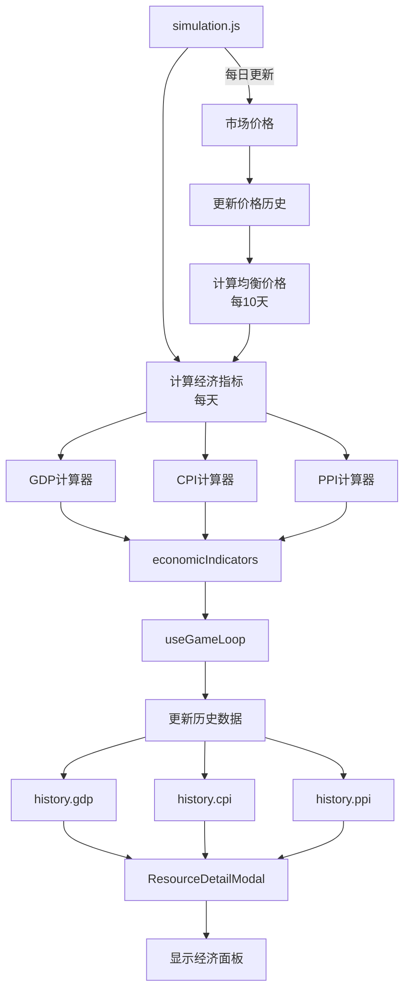

# 经济指标系统设计文档

## 📋 文档信息

- **创建日期**: 2026-02-04
- **版本**: v1.0
- **状态**: 设计阶段 → 实施中
- **负责人**: AI + 用户协作

---

## 一、需求背景

### 1.1 用户需求

**原始需求**：
> 点击国库银币区域后，显示更详细的经济数据面板，除了国库数据，还想看GDP、CPI、PPI等经济数据

**需求分析**：
- **目标**: 扩展现有的银币详情面板，增加宏观经济指标
- **场景**: 玩家点击顶部国库银币区域时使用
- **用户**: 所有玩家
- **当前状态**: 已有 `ResourceDetailModal` 组件显示国库银币和每日收入

### 1.2 功能要求

1. ✅ 保留现有的国库银币和每日收入展示
2. ✅ 新增 GDP（国内生产总值）指标
3. ✅ 新增 CPI（消费者物价指数）指标
4. ✅ 新增 PPI（生产者物价指数）指标
5. ✅ 提供历史趋势图表（100天）
6. ✅ 数据需要准确反映游戏经济状态
7. ✅ 支持可折叠的详细面板
8. ❌ 不需要导出功能

### 1.3 验收标准

- [ ] 面板能正确显示 GDP、CPI、PPI 数据
- [ ] 数据计算逻辑合理且准确
- [ ] 历史数据能正确记录和展示（100天）
- [ ] UI 美观且与现有风格一致
- [ ] 性能良好，不影响游戏流畅度
- [ ] 可折叠功能正常工作

---

## 二、核心概念

### 2.1 长期均衡价格 (Long-term Equilibrium Price)

**定义**：基于过去一段时间的市场价格滚动平均，反映供需关系的长期趋势

**核心特性**：
- 📊 **动态基准**: 自动适应游戏经济发展
- 🔄 **滚动平均**: 使用90天滚动平均平滑短期波动
- 🎯 **科学准确**: 基于真实市场数据，而非静态配置
- ⚡ **性能友好**: 每10天更新一次，开销可控

**优势对比**：

| 维度 | 静态 basePrice | 长期均衡价格 |
|------|---------------|-------------|
| **适应性** | ❌ 固定不变 | ✅ 动态调整 |
| **准确性** | ⚠️ 可能偏离实际 | ✅ 反映真实供需 |
| **时代适应** | ❌ 无法反映时代变化 | ✅ 自动适应 |
| **玩家理解** | ✅ 简单直观 | ⚠️ 需要解释 |
| **计算成本** | ✅ 零成本 | ⚠️ 需要维护历史 |

**实际效果示例**：

```
场景1：工业革命后铁矿价格下降
游戏初期（农业时代）：
- 铁矿市场价: 8.0
- 均衡价格: 6.0 (basePrice)
- CPI贡献: +33% (铁矿贵)

工业时代后：
- 铁矿市场价: 4.0 (大量生产)
- 均衡价格: 5.0 (90天平均，逐渐下降)
- CPI贡献: -20% (铁矿便宜了)

场景2：战争导致粮食短缺
和平时期：
- 粮食市场价: 1.2
- 均衡价格: 1.0
- CPI贡献: +20%

战争期间：
- 粮食市场价: 3.0 (短缺)
- 均衡价格: 1.5 (90天平均，逐渐上升)
- CPI贡献: +100% (严重通胀)
```

---

## 三、经济指标定义

### 3.1 GDP (Gross Domestic Product - 国内生产总值)

**定义**：一定时期内国家生产的所有最终商品和服务的市场价值总和

**计算方法**（支出法）：
```
GDP = 消费(C) + 投资(I) + 政府支出(G) + 净出口(NX)
```

**游戏中的映射**：

#### 3.1.1 消费 (Consumption - C)

**数据来源**: `classFinancialData`

```javascript
消费 = Σ(所有阶层的基础需求消费) + Σ(所有阶层的奢侈需求消费)

// 详细计算
consumption = Object.values(classFinancialData).reduce((sum, classData) => {
  // 基础需求消费
  const essentialConsumption = Object.values(classData.essentialNeeds || {})
    .reduce((total, need) => total + (need.totalCost || 0), 0);
  
  // 奢侈需求消费
  const luxuryConsumption = Object.values(classData.luxuryNeeds || {})
    .reduce((total, need) => total + (need.totalCost || 0), 0);
  
  return sum + essentialConsumption + luxuryConsumption;
}, 0);
```

**数据结构示例**：
```javascript
classFinancialData = {
  farmer: {
    essentialNeeds: {
      food: { quantity: 100, price: 1.2, totalCost: 120 },
      cloth: { quantity: 10, price: 3.0, totalCost: 30 },
    },
    luxuryNeeds: {
      wine: { quantity: 5, price: 8.0, totalCost: 40 },
    }
  },
  // ... 其他阶层
}
```

#### 3.1.2 投资 (Investment - I)

**数据来源**: `buildingFinancialData`

```javascript
投资 = 新建建筑成本 + 建筑升级成本

// 详细计算
investment = Object.values(buildingFinancialData).reduce((sum, building) => {
  // 建造成本（当日新建的建筑）
  const constructionCost = building.constructionCost || 0;
  
  // 升级成本（当日升级的建筑）
  const upgradeCost = building.upgradeCost || 0;
  
  return sum + constructionCost + upgradeCost;
}, 0);
```

#### 3.1.3 政府支出 (Government Spending - G)

**数据来源**: `dailyMilitaryExpense`, `officials`, `taxBreakdown`

```javascript
政府支出 = 军队维护费 + 官员薪水 + 政府补贴

// 详细计算
government = 
  dailyMilitaryExpense +                           // 军队维护
  officials.reduce((sum, o) => sum + o.salary, 0) + // 官员薪水
  Math.abs(taxBreakdown.subsidy || 0);             // 政府补贴（取绝对值）
```

#### 3.1.4 净出口 (Net Exports - NX)

**数据来源**: `demandBreakdown`, `marketPrices`

```javascript
净出口 = 出口额 - 进口额

// 详细计算
const exports = Object.entries(demandBreakdown.exports || {})
  .reduce((sum, [resource, quantity]) => {
    return sum + quantity * (marketPrices[resource] || 0);
  }, 0);

const imports = Object.entries(demandBreakdown.imports || {})
  .reduce((sum, [resource, quantity]) => {
    return sum + quantity * (marketPrices[resource] || 0);
  }, 0);

netExports = exports - imports;
```

**GDP 总计**：
```javascript
GDP = {
  total: consumption + investment + government + netExports,
  consumption,
  investment,
  government,
  netExports,
  change: ((current - previous) / previous) * 100, // 增长率
}
```

---

### 3.2 CPI (Consumer Price Index - 消费者物价指数)

**定义**：反映居民购买的一篮子商品和服务价格变化的指数

**计算方法**：
```
CPI = (当期一篮子商品价格 / 基期一篮子商品价格) × 100
```

**消费者篮子权重**：
```javascript
const CPI_BASKET = {
  food: 0.40,      // 权重40% - 生活必需品
  cloth: 0.15,     // 权重15% - 基础衣物
  wood: 0.10,      // 权重10% - 燃料/建材
  iron: 0.10,      // 权重10% - 工具/器具
  luxury: 0.15,    // 权重15% - 奢侈品
  wine: 0.05,      // 权重5% - 娱乐消费
  books: 0.05,     // 权重5% - 文化消费
};
```

**计算公式**：
```javascript
// 当期篮子成本
currentBasketCost = Σ(当前价格[资源] × 权重[资源])

// 基期篮子成本（使用长期均衡价格）
baseBasketCost = Σ(均衡价格[资源] × 权重[资源])

// CPI指数
CPI = (currentBasketCost / baseBasketCost) × 100

// 变化率
change = ((CPI - previousCPI) / previousCPI) × 100
```

**贡献度分解**：
```javascript
breakdown[资源] = {
  weight: 权重,
  currentPrice: 当前价格,
  basePrice: 均衡价格,
  priceChange: (当前价格 / 均衡价格 - 1) × 100,
  contribution: priceChange × weight,
}
```

---

### 3.3 PPI (Producer Price Index - 生产者物价指数)

**定义**：反映生产者出售商品和服务价格变化的指数

**生产者篮子权重**：
```javascript
const PPI_BASKET = {
  food: 0.20,      // 权重20% - 农产品
  wood: 0.25,      // 权重25% - 木材
  stone: 0.15,     // 权重15% - 石材
  iron: 0.20,      // 权重20% - 金属
  coal: 0.15,      // 权重15% - 能源
  cloth: 0.05,     // 权重5% - 纺织品
};
```

**计算方法**：与CPI相同，但使用生产者篮子

---

## 四、技术架构

### 4.1 数据流设计



### 4.2 文件结构

```
src/
├── logic/
│   └── economy/
│       ├── economicIndicators.js    # 新增：经济指标计算器
│       └── README.md                # 新增：经济指标文档
├── hooks/
│   ├── useGameLoop.js              # 修改：添加指标计算和历史记录
│   └── useGameState.js             # 修改：添加历史数据结构
└── components/
    └── modals/
        └── ResourceDetailModal.jsx  # 修改：添加经济指标面板

docs/
└── 经济指标系统设计.md              # 本文档
```

### 4.3 数据结构

#### 4.3.1 价格历史 (priceHistory)

```javascript
priceHistory = {
  food: [1.0, 1.1, 1.2, ...],    // 最近365天的价格
  wood: [2.0, 2.1, 2.0, ...],
  iron: [6.0, 5.8, 5.9, ...],
  // ... 所有资源
}
```

#### 4.3.2 均衡价格 (equilibriumPrices)

```javascript
equilibriumPrices = {
  food: 1.15,    // 90天滚动平均
  wood: 2.05,
  iron: 5.90,
  // ... 所有资源
}
```

#### 4.3.3 经济指标 (economicIndicators)

```javascript
economicIndicators = {
  gdp: {
    total: 50000,
    consumption: 30000,
    investment: 10000,
    government: 8000,
    netExports: 2000,
    change: 2.5,  // 增长率%
  },
  cpi: {
    index: 105.3,
    change: 1.2,  // 变化率%
    breakdown: {
      food: { weight: 0.4, currentPrice: 1.2, basePrice: 1.0, priceChange: 20, contribution: 8 },
      // ...
    },
  },
  ppi: {
    index: 102.1,
    change: 0.8,
    breakdown: { /* ... */ },
  },
}
```

#### 4.3.4 历史数据扩展 (history)

```javascript
history = {
  treasury: [],
  tax: [],
  population: [],
  class: { /* ... */ },
  // 新增
  gdp: [],      // 最近100天的GDP
  cpi: [],      // 最近100天的CPI
  ppi: [],      // 最近100天的PPI
}
```

---

## 五、配置参数

```javascript
// src/logic/economy/economicIndicators.js

export const ECONOMIC_INDICATOR_CONFIG = {
  // 价格历史
  priceHistory: {
    maxLength: 365,           // 最多保留365天
    updateInterval: 1,        // 每天更新
  },
  
  // 均衡价格
  equilibriumPrice: {
    window: 90,               // 90天滚动平均
    updateInterval: 10,       // 每10天重新计算
    minDataPoints: 30,        // 至少30天数据才使用均衡价格
  },
  
  // GDP
  gdp: {
    updateInterval: 1,        // 每天计算
  },
  
  // CPI/PPI
  inflation: {
    updateInterval: 1,        // 每天计算
    historyLength: 100,       // 保留100天历史
  },
  
  // 消费者篮子权重
  cpiBasket: {
    food: 0.40,
    cloth: 0.15,
    wood: 0.10,
    iron: 0.10,
    luxury: 0.15,
    wine: 0.05,
    books: 0.05,
  },
  
  // 生产者篮子权重
  ppiBasket: {
    food: 0.20,
    wood: 0.25,
    stone: 0.15,
    iron: 0.20,
    coal: 0.15,
    cloth: 0.05,
  },
};
```

---

## 六、实施计划

### Phase 1: 基础设施（1-2小时）

**任务**：
- [ ] 创建 `src/logic/economy/economicIndicators.js` 模块
- [ ] 实现价格历史记录功能
- [ ] 实现均衡价格计算
- [ ] 编写模块文档

**产出**：
- `economicIndicators.js` 核心模块
- `README.md` 使用文档

**验收**：
- [ ] 价格历史能正确记录和更新
- [ ] 均衡价格计算准确
- [ ] 代码有完整注释

---

### Phase 2: 指标计算（1-2小时）

**任务**：
- [ ] 实现 GDP 计算（支出法）
- [ ] 实现 CPI 计算（使用均衡价格）
- [ ] 实现 PPI 计算（使用均衡价格）
- [ ] 添加数据验证和错误处理

**产出**：
- `calculateGDP()` 函数
- `calculateCPI()` 函数
- `calculatePPI()` 函数

**验收**：
- [ ] GDP 各组成部分计算正确
- [ ] CPI/PPI 指数计算准确
- [ ] 贡献度分解正确

---

### Phase 3: 数据集成（1小时）

**任务**：
- [ ] 在 `useGameState.js` 中添加状态
- [ ] 在 `useGameLoop.js` 中集成计算
- [ ] 添加历史数据记录
- [ ] 实现节流更新机制

**产出**：
- 修改 `useGameState.js`
- 修改 `useGameLoop.js`

**验收**：
- [ ] 状态正确初始化
- [ ] 每日更新正常工作
- [ ] 历史数据正确记录

---

### Phase 4: UI展示（2-3小时）

**任务**：
- [ ] 修改 `ResourceDetailModal.jsx`
- [ ] 添加经济指标面板
- [ ] 实现可折叠功能
- [ ] 添加图表展示
- [ ] 样式优化

**产出**：
- 修改 `ResourceDetailModal.jsx`

**验收**：
- [ ] 面板正确显示所有指标
- [ ] 折叠功能正常工作
- [ ] 图表美观且准确
- [ ] 与现有风格一致

---

### Phase 5: 测试优化（1小时）

**任务**：
- [ ] 功能测试
- [ ] 性能测试
- [ ] 数据验证
- [ ] Bug修复

**验收**：
- [ ] 所有功能正常工作
- [ ] 无明显性能问题
- [ ] 数据准确可靠

---

**总预估时间**: 6-9小时

---

## 七、风险评估

| 风险 | 影响 | 概率 | 缓解措施 |
|------|------|------|----------|
| 数据计算不准确 | 高 | 中 | 详细的数据验证和测试 |
| 性能影响 | 中 | 低 | 使用缓存和节流（每10天更新均衡价格） |
| UI布局问题 | 低 | 中 | 参考现有设计风格 |
| 历史数据过大 | 中 | 低 | 限制历史数据长度（365天价格，100天指标） |
| 均衡价格初期不稳定 | 中 | 中 | 至少30天数据才启用，否则使用basePrice |

---

## 八、UI设计预览

### 8.1 经济指标面板（折叠状态）

```
┌─────────────────────────────────────────┐
│ 宏观经济指标                    [展开] │
├─────────────────────────────────────────┤
│  GDP          CPI          PPI          │
│  50.0千       105.3        102.1        │
│  +2.5%        +1.2%        +0.8%        │
│               基准:90日均价 基准:90日均价│
└─────────────────────────────────────────┘
```

### 8.2 经济指标面板（展开状态）

```
┌─────────────────────────────────────────┐
│ 宏观经济指标                    [收起] │
├─────────────────────────────────────────┤
│  GDP          CPI          PPI          │
│  50.0千       105.3        102.1        │
│  +2.5%        +1.2%        +0.8%        │
│               基准:90日均价 基准:90日均价│
├─────────────────────────────────────────┤
│ GDP构成                                 │
│  消费 (C)              30.0千           │
│  投资 (I)              10.0千           │
│  政府支出 (G)           8.0千           │
│  净出口 (NX)            2.0千           │
├─────────────────────────────────────────┤
│ CPI主要贡献                             │
│  粮食                  +8.0%            │
│  铁矿                  +2.5%            │
│  木材                  -1.2%            │
└─────────────────────────────────────────┘
```

---

## 九、API文档

### 9.1 价格历史管理

```javascript
/**
 * 更新价格历史
 * @param {Object} params
 * @param {Object} params.priceHistory - 当前价格历史
 * @param {Object} params.currentPrices - 当前市场价格
 * @param {number} params.maxLength - 最大保留天数（默认365）
 * @returns {Object} 更新后的价格历史
 */
export function updatePriceHistory({
  priceHistory,
  currentPrices,
  maxLength = 365,
})
```

### 9.2 均衡价格计算

```javascript
/**
 * 计算长期均衡价格
 * @param {Object} params
 * @param {Object} params.priceHistory - 价格历史数据
 * @param {Object} params.basePrices - 基准价格（fallback）
 * @param {number} params.window - 滚动窗口天数（默认90）
 * @returns {Object} 均衡价格
 */
export function calculateEquilibriumPrices({
  priceHistory,
  basePrices,
  window = 90,
})
```

### 9.3 GDP计算

```javascript
/**
 * 计算GDP（支出法）
 * @param {Object} params
 * @param {Object} params.classFinancialData - 阶层财务数据
 * @param {Object} params.buildingFinancialData - 建筑财务数据
 * @param {number} params.dailyMilitaryExpense - 每日军费
 * @param {Array} params.officials - 官员列表
 * @param {Object} params.taxBreakdown - 税收分解
 * @param {Object} params.demandBreakdown - 需求分解
 * @param {Object} params.marketPrices - 市场价格
 * @returns {Object} GDP数据
 */
export function calculateGDP(params)
```

### 9.4 CPI计算

```javascript
/**
 * 计算CPI（使用长期均衡价格作为基准）
 * @param {Object} params
 * @param {Object} params.marketPrices - 当前市场价格
 * @param {Object} params.equilibriumPrices - 长期均衡价格
 * @param {number} params.previousCPI - 上期CPI
 * @returns {Object} CPI数据
 */
export function calculateCPI({
  marketPrices,
  equilibriumPrices,
  previousCPI = 100,
})
```

### 9.5 PPI计算

```javascript
/**
 * 计算PPI（使用长期均衡价格作为基准）
 * @param {Object} params
 * @param {Object} params.marketPrices - 当前市场价格
 * @param {Object} params.equilibriumPrices - 长期均衡价格
 * @param {number} params.previousPPI - 上期PPI
 * @returns {Object} PPI数据
 */
export function calculatePPI({
  marketPrices,
  equilibriumPrices,
  previousPPI = 100,
})
```

---

## 十、测试用例

### 10.1 价格历史测试

```javascript
// TC-ECON-001: 价格历史正确记录
输入: priceHistory={}, currentPrices={food: 1.2}
预期: priceHistory.food = [1.2]

// TC-ECON-002: 价格历史长度限制
输入: priceHistory.food=[...365个], currentPrices={food: 1.3}
预期: priceHistory.food.length = 365, 最新值为1.3
```

### 10.2 均衡价格测试

```javascript
// TC-ECON-003: 数据不足时使用basePrice
输入: priceHistory.food=[1.0, 1.1], basePrices.food=1.0, window=90
预期: equilibriumPrices.food = 1.05 (平均值)

// TC-ECON-004: 正常滚动平均
输入: priceHistory.food=[...100个价格], window=90
预期: equilibriumPrices.food = 最近90天的平均值
```

### 10.3 GDP测试

```javascript
// TC-ECON-005: GDP各组成部分正确
输入: 消费=30000, 投资=10000, 政府=8000, 净出口=2000
预期: GDP.total = 50000

// TC-ECON-006: GDP增长率计算
输入: 当前GDP=50000, 上期GDP=48000
预期: GDP.change = 4.17%
```

### 10.4 CPI/PPI测试

```javascript
// TC-ECON-007: CPI指数计算
输入: 当期篮子成本=105.3, 基期篮子成本=100
预期: CPI.index = 105.3

// TC-ECON-008: CPI贡献度分解
输入: 粮食价格从1.0涨到1.2, 权重0.4
预期: breakdown.food.contribution = 8.0%
```

---

## 十一、已确认决策

### 决策记录

| ID | 决策内容 | 等级 | 日期 | 状态 |
|----|---------|------|------|------|
| DEC-001 | 使用长期均衡价格作为CPI/PPI基准 | A | 2026-02-04 | ✅ CONFIRMED |
| DEC-002 | GDP使用支出法计算 | A | 2026-02-04 | ✅ CONFIRMED |
| DEC-003 | 90天滚动平均计算均衡价格 | B | 2026-02-04 | ✅ CONFIRMED |
| DEC-004 | 每10天更新一次均衡价格 | B | 2026-02-04 | ✅ CONFIRMED |
| DEC-005 | 保留365天价格历史 | B | 2026-02-04 | ✅ CONFIRMED |
| DEC-006 | 保留100天经济指标历史 | B | 2026-02-04 | ✅ CONFIRMED |
| DEC-007 | 集成到ResourceDetailModal而非新建文件 | B | 2026-02-04 | ✅ CONFIRMED |
| DEC-008 | 支持可折叠，不需要导出功能 | C | 2026-02-04 | ✅ CONFIRMED |

---

## 十二、更新日志

| 版本 | 日期 | 变更内容 |
|------|------|---------|
| v1.0 | 2026-02-04 | 初始版本，完整设计方案 |

---

## 十三、参考资料

### 13.1 相关文档

- `docs/CONTEXT.md` - 项目当前上下文
- `docs/AI经济系统重构规划.md` - AI经济系统设计
- `CONTRIBUTING_AI.md` - 开发协作规范

### 13.2 相关代码

- `src/logic/simulation.js` - 游戏主循环
- `src/hooks/useGameLoop.js` - 游戏循环Hook
- `src/hooks/useGameState.js` - 游戏状态管理
- `src/components/modals/ResourceDetailModal.jsx` - 资源详情面板

---

**文档状态**: ✅ 完成，准备实施  
**下一步**: 开始 Phase 1 - 创建 economicIndicators.js 模块
